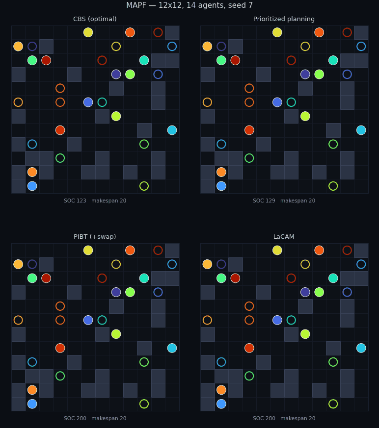
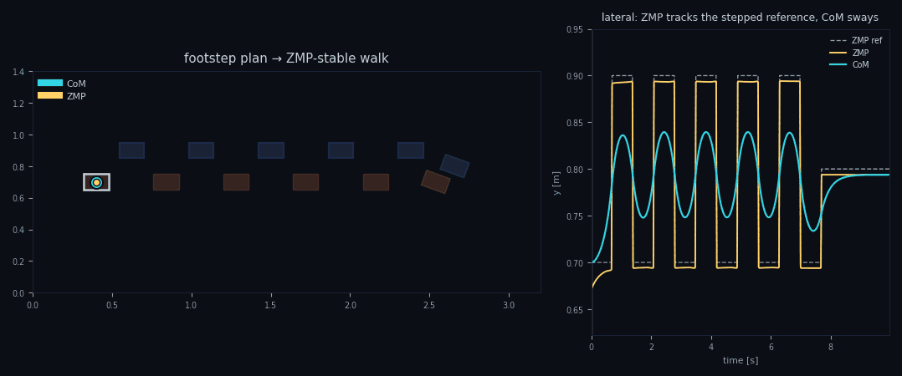
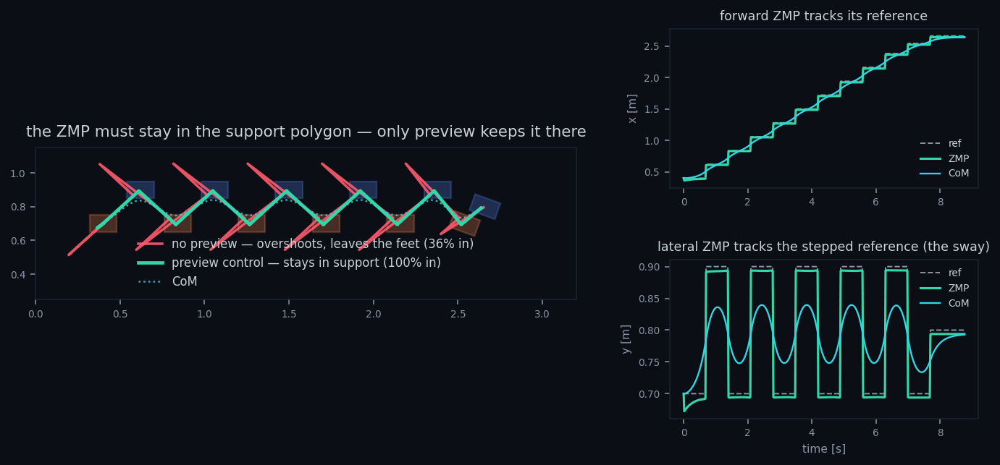
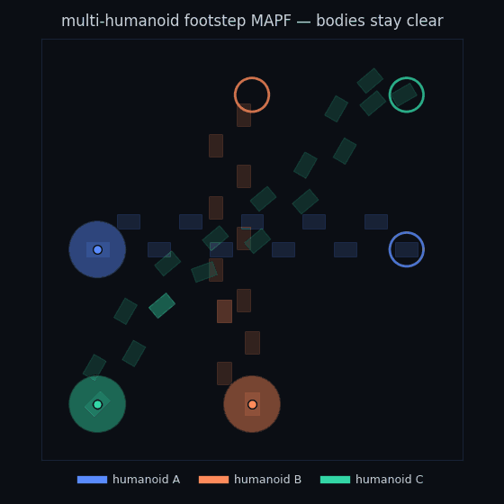
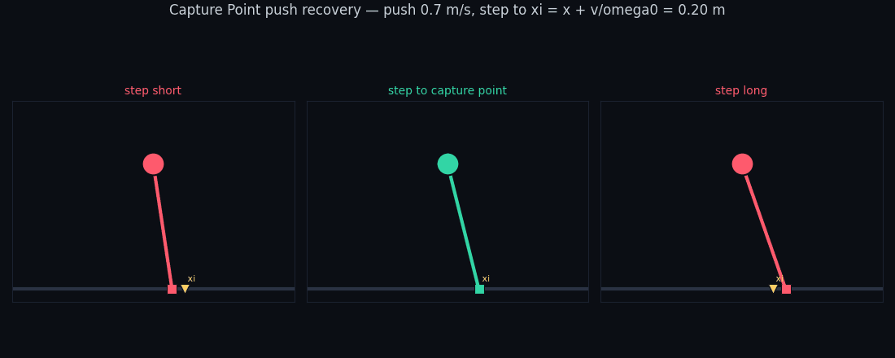
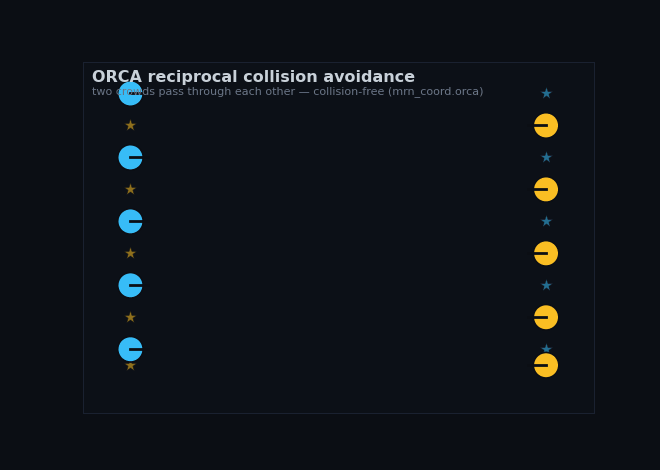
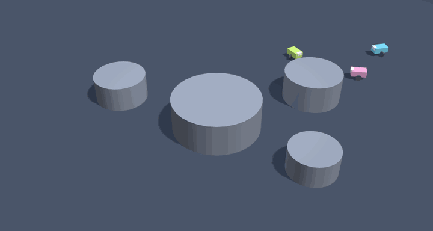
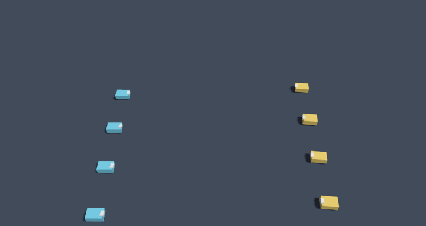
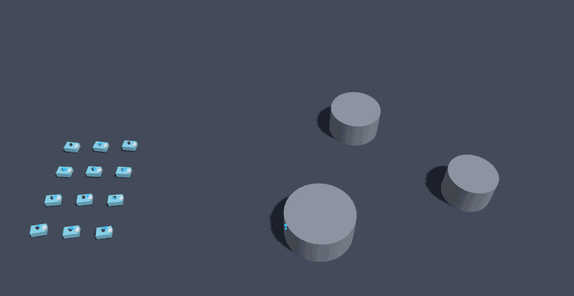
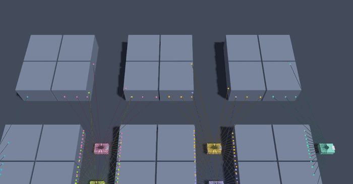

# multirobot-navigation

<p align="center">
  
</p>

<p align="center">
  <em>The same 12×12 instance, 14 agents, solved side by side by four MAPF algorithms — optimal <strong>CBS</strong> finds sum-of-costs 123 while prioritized planning, <strong>PIBT</strong>, and <strong>LaCAM</strong> flow greedily higher. One of <strong>45+ algorithms</strong> in the zoo, each faithfully reproduced from its paper and benchmark-gated.</em>
</p>

[](https://github.com/rsasaki0109/multirobot-navigation/actions/workflows/build_jazzy.yaml)
[](https://github.com/rsasaki0109/multirobot-navigation/actions/workflows/docs.yaml)
[](docs/coordination.md)

## A pip-installable MAPF algorithm zoo

> **45+ Multi-Agent Path Finding algorithms, faithfully reproduced from their
> papers and benchmark-gated — pure Python, ROS-free.**

Most MAPF code online is one algorithm per repo, in C++, wired to a build
system. This is the whole family in one importable package: solve an instance
and compare paradigms in five lines — no ROS and no compiler. Every solver is
reproduced from its source paper and **benchmark-gated** in CI, so each claim
(a WIN, a LOSS, or an equivalence vs. a reference solver) is *measured*.

```bash
# Works today (PyPI release planned):
pip install "git+https://github.com/rsasaki0109/multirobot-navigation"
```

```python
from mrn_coord.mapf import GridWorld, cbs

grid = GridWorld(5, 5)
agents = {"1": ((0, 2), (4, 2)), "2": ((2, 0), (2, 4))}   # two crossing agents

sol = cbs(grid, agents)            # optimal, sum-of-costs Conflict-Based Search
print(sol.cost, sol.makespan)      # -> 9 5  (collision-free, optimal)
```

Swap `cbs` for `ecbs`, `lacam`, `mapf_lns`, `pbs`, `mstar`, … — they share the
same `(grid, agents)` interface. The core has **zero required dependencies**
(only the LP-based `bcp` needs `pip install "...[bcp]"` for numpy/scipy).

> **Try it without installing anything** — [`docs/demo/`](docs/demo/) runs these
> same pure-Python solvers *in your browser* via Pyodide: pick an instance and a
> solver, watch the collision-free paths animate. Serve it with
> `python3 -m http.server` from `docs/demo/` (or host `docs/` on GitHub Pages).

### A taste of the catalogue

A representative slice — the full paper-by-paper catalogue with every solver's
honest gated result is in [`docs/coordination.md`](docs/coordination.md):

| Algorithm | Paper | One-line idea | Gated result |
| --- | --- | --- | --- |
| **CBS** | Sharon et al. 2015 | optimal two-level conflict-based search | the reference optimum |
| **CBSH** | Li et al. 2019 | admissible WDG heuristic + cardinal split | same optimum, **~13× fewer** expansions |
| **ECBS** | Barer et al. 2014 | bounded-suboptimal focal search | cost ≤ `w·opt`, far fewer nodes |
| **EECBS** | Li et al. 2021 | WDG bound + Explicit Estimation Search | **~1.9× fewer** than ECBS at tight `w` |
| **FECBS** | Chan et al. 2021 | lend the unused suboptimality budget | **~9× fewer** than ECBS, dense tight-`w` |
| **EPEA\*** | Goldenberg et al. 2014 | generate only `f`-matching children | **~58× fewer** nodes than joint A\* |
| **M\* / rM\*** | Wagner & Choset 2011 | subdimensional expansion | coupling stays at the irreducible group |
| **ICTS** | Sharon et al. 2013 | increasing-cost tree over MDDs | same optimum, orthogonal to CBS |
| **rectangle** | Li et al. 2019 | barrier constraints break crossing symmetry | **~20×** blowup collapse |
| **BCP** | Lam et al. 2019 | branch-cut-and-price (LP / duality) | LP-certified optimum (gap zero) |
| **LaCAM** | Okumura 2023 | complete config search driven by PIBT | scales to large teams |
| **MAPF-LNS2** | Li et al. 2022 | collision-minimizing anytime repair | feasible where CBS busts its budget |
| **Push-and-Rotate** | de Wilde et al. 2014 | constructive push/swap/rotate primitives | solves packed grids search blows up on |
| **flow** | Yu & LaValle 2013 | anonymous makespan as integer max-flow | polynomial, self-certified optimum |
| **RHCR** | Li et al. 2021 | rolling-horizon lifelong MAPF | sustained warehouse throughput |
| **Footstep + multi-humanoid MAPF** | Hornung et al. 2012 | anytime footstep A\* + body-deconflicted teams | bounded-suboptimal; team body-collision-free |
| **ZMP preview-control walking** | Kajita et al. 2003 | footstep plan → dynamically stable CoM trajectory | ZMP stays in the support foot (preview ~100× tighter) |
| **Capture Point push recovery** | Pratt et al. 2006 | step to ξ = x + ẋ/ω₀ to absorb a push | step there captures; short/long falls; big push N-step |
| **DCM walking control** | Englsberger et al. 2015 | backward-recursion DCM reference + tracking law over a footstep plan | error → 0 at chosen rate k; open-loop blows up at ω |
| **Trajectory-free MPC walking** | Wieber 2006 | constrained-QP MPC: hard ZMP-in-support box + jerk/velocity objective | hard constraint keeps ZMP legal under a push where unconstrained tips over |
| **Auto-footstep MPC walking** | Herdt et al. 2010 | footsteps become QP variables (second change of vars → still a box QP) | capture step recovers a push the fixed-foot MPC falls under; frozen feet ≡ Wieber |
| **Walking stabilizer (LIPM tracking)** | Kajita et al. 2010 | closed-loop ZMP feedback `p = p^ref + k_p e + k_v ė` (k_p>1 beats the LIP instability), ZMP clipped to the foot | open-loop ZMP playback diverges under a push; the stabilizer rejects it — until the ankle saturates and a step is needed |
| **Push recovery (ankle/hip/step)** | Stephens 2007 | decision surfaces on the capture point ξ; a flywheel (hip) widens the foot's capturable interval by Δ_hip, then a step | closed-form Δ_hip matches exact bang-bang LIPPF sim (printed eq. 15 is a typo); ankle ⊂ hip ⊂ step nest |
| **N-step capturability** | Koolen et al. 2012 | N-step capture region `ξ_N = foot + l_max·Σ e^{−kωT}` (geometric series); bounded limit `ξ_∞` past which no number of steps recovers | closed form certified against exact greedy LIPM rollout; point/foot/reaction models = capture_point / push_recovery ankle / hip |
| **Resolved Momentum Control** | Kajita et al. 2003 | whole-body: centroidal momentum matrix `h = A(q)·q̇`, resolve a momentum + foot-constraint command by inertia-matrix pseudo-inverse | first multibody leg; momentum matrix certified vs finite-difference; L=0 ⇒ internal counter-rotation (= reaction-mass/hip); kick with foot pinned |
| **dRRT (discrete RRT)** | Solovey, Salzman & Halperin 2014 | continuous-space multi-robot motion planning: explore the implicit tensor-product roadmap (`∏ \|Vᵢ\|` vertices) with an RRT driven by a direction oracle `O_d` | needle-in-a-haystack: a 3.1M-vertex 4-robot swap solved with a 6-node tree; oracle 10/10 vs random-neighbour 1/10; plans collision-free `≥ 2r` by exact continuous checks |
| **dRRT\*** | Shome, Solovey, Dobson, Halperin & Bekris 2020 | asymptotically-optimal dRRT: keep the explored implicit roadmap as a *graph*, return its Dijkstra shortest path; anytime + informed sampling | converges to the brute optimum over the full composite roadmap (within 2%, exact 9/10), monotone anytime cost, beats plain dRRT every time; informed sampling shrinks the explored graph 186→34 |
| **K-CBS (kinodynamic)** | Kottinger, Almagor & Lahijanian 2022 | CBS with *dynamics*: Dubins-car robots, a kinodynamic RRT low level in state×time, space–time constraint tubes on conflict | first dynamics model in the zoo; trajectories dynamically feasible (`\|ω\|≤ω_max`, exact arc propagation) and collision-free `≥ r_i+r_j`; resolves every crossing where uncoordinated paths collide |
| **Path–velocity decomposition** | Kant & Zucker 1986; O'Donnell & Lozano-Pérez 1989 | fix each robot's geometric path, schedule only *speed* along it: A-star over the coordination space `[0,1]ⁿ` around the collision regions | classic coordination diagram; resolves timing conflicts by velocity tuning (makespan optimal vs brute BFS), collision-free by construction; honestly returns `None` when only rerouting would help |

---

The MAPF zoo is the coordination layer of a larger stack:

ROS 2-native **multi-robot simulation, navigation, and coordination** — a
deterministic, pure-core, CI-tested stack for developing and benchmarking
multi-robot motion algorithms without hardware.

> **Localization lives in a companion repo:** cooperative multi-agent
> localization (rosbag-centric, real-data benchmarks on UTIAS MR.CLAM / KITTI)
> is [**multirobot-localization**](https://github.com/rsasaki0109/multirobot-localization).
> This repo answers *how the robots move*; that one answers *where they are*.
> They meet at the message contract (`mrn_msgs/AgentState`,
> `RelativePoseConstraint`): the simulator here emits them, that repo consumes
> them.

## What It Is

A 2D, deterministic multi-robot world plus the coordination and navigation that
moves robots through it. Every layer is a pure, ROS-free algorithm core
unit-tested in CI, with thin ROS/CLI wiring on top.

- **Simulation** (`mrn_sim`) — a deterministic 2D world: unicycle kinematics,
  circular obstacles with collision, and V2V / GNSS / range-bearing sensor
  models. It emits the localization message contract and accepts `cmd_vel`, so
  it is the plant the rest of the stack drives. An optional **Gazebo** adapter
  (`mrn_gazebo`) runs the same contract on a 3D physics world.
- **Navigation** (`mrn_sim.navigate`, `mrn_sim.kinodynamic`) — point-to-point
  navigation: occupancy grid from the obstacles, grid A* planning, pure-pursuit
  following, with **reciprocal multi-robot collision avoidance** and
  **replanning around dynamic obstacles** — plus a continuous-space
  **Hybrid A\*** kinodynamic planner (bounded turning radius, Dubins curves +
  analytic expansion) for smooth, feasibly-followable paths, **DWA** /
  **MPC (iLQR)** optimizing local controllers for accel-limited tracking, a
  **Control Barrier Function** QP safety filter for provable collision-free
  steering, and a **certified body-true safety shield** whose braking speed cap
  keeps the robot body — not a look-ahead point — collision-free under the accel
  limit, even against moving obstacles, and **reciprocally** for several shielded
  robots in adversarial mutual pursuit with no shared coordination
  (`scripts/certify_shield.py`).
- **Coordination** (`mrn_coord`) — multi-agent path finding (optimal
  Conflict-Based Search, **bounded-suboptimal ECBS**, **complete satisficing
  LaCAM**, and **anytime MAPF-LNS** that scale further, prioritized planning and
  **Priority-Based Search** that reorders to break head-on deadlocks, all over a
  **space-time A\*** or drop-in **SIPP** safe-interval low level,
  plus **lifelong / online MAPF** — stepped by **PIBT** or planned on a
  **rolling horizon (RHCR)** — with **auction / Hungarian** task allocation for
  warehouse-style endless-task throughput), **ORCA** reciprocal
  local collision avoidance, decentralized formation control, cooperative
  coverage (frontier + greedy/Hungarian allocation), and swarm flocking (Boids:
  separation / alignment / cohesion + obstacle avoidance + migration + predator
  evasion + leader following).
- **Benchmark environment** (`mrn_sim.benchmark`) — plug your own multi-robot
  policy into a `Scenario` and get comparable metrics (success, makespan, path
  length, clearance, inter-robot distance, collisions). Five baseline policies
  ship for comparison — grid A* + pursuit, **Hybrid A\*** kinodynamic, **DWA**
  local control, **MPC** (iLQR receding-horizon optimization, space-time
  avoidance), and **ORCA** — and
  and an **end-to-end MAPF executor** (`mrn_sim.mapf_exec`) runs a discrete
  grid plan in the continuous world — exposing where the discrete guarantee
  breaks down and bridging it with a Temporal-Plan-Graph schedule — while a
  **bodied-AMR executor** (`mrn_sim.amr_footprint`) replays the same plan as a
  rectangular differential-drive robot, surfacing the turning cost and the aisle
  width below which the footprint overlaps where the point plan called it safe —
  `scripts/compare_planners.py` tabulates them all across the bundled scenarios
  ([`benchmarks/comparison.md`](benchmarks/comparison.md)). `ros2 run mrn_sim
  mrn_sim_bench crossing` runs a bundled scenario with a baseline policy. MAPF
  also loads the standard **MovingAI** `.map`/`.scen` format
  (`ros2 run mrn_coord mrn_mapf_bench`), so the planners can be evaluated on the
  community benchmark suite.

## Architecture

```
            ┌──────────── mrn_sim — the deterministic world ───────────┐
            │  unicycle kinematics · obstacles · collision · sensors    │
   cmd_vel ─▶  navigate (A* + pursuit + avoidance) / swarm / coordination│
            │  ─▶ AgentState · RelativePoseConstraint · ground truth     │
            └───────────────────────────────┬───────────────────────────┘
                                             │ message contract (mrn_msgs)
                          ▼                                ▼
              localization consumer                  Gazebo (mrn_gazebo)
              (multirobot-localization repo)         3D physics, same contract
```

The layers connect only through message contracts and pure interfaces, so each
is testable and replaceable in isolation. The simulator emits exactly what a
cooperative-localization consumer (the companion repo) ingests.

## Demos

All animations are driven by the real algorithms (no hand-drawn paths) and are
deterministic; regenerate with the matching `scripts/make_*_gif.py`.

**The MAPF algorithm zoo** — `mrn_coord` carries **45+ multi-agent path-finding
algorithms faithfully reproduced from their papers in pure Python**, each
*benchmark-gated* (WIN / LOSS / honest-equivalence checked in CI against pinned
metrics). The clearest way to feel the collection is to watch several of them
solve the **same** instance at once — optimal solvers (CBS) find the cheapest
joint plan while fast greedy ones (prioritized planning, PIBT, LaCAM) flow at a
higher sum-of-costs:

<p align="center">
  
</p>

Render your own with any solver or a side-by-side panel:

```bash
python3 scripts/animate_mapf.py --solver lacam --agents 12 --out out/lacam.gif
python3 scripts/animate_mapf.py --gallery cbs,prioritized,pibt_swap,lacam \
    --width 12 --height 12 --agents 14 --seed 7 --out out/gallery.gif
```

The full catalogue — CBS and its whole family (CBSH, ECBS, EECBS, FECBS, ICBS,
MA-CBS, disjoint, BCP), optimal joint-space search (M\*, rM\*, EPEA\*, ICTS,
Standley), constructive solvers (Push-and-Rotate/Swap, TSWAP, Bibox, flow, DDM),
the LaCAM/PIBT line, lifelong engines (RHCR, Token Passing, TPTS), and execution
layers (k-robust, switchable-ADG) — is documented algorithm-by-algorithm, with the
honest gated result of each, in [`docs/coordination.md`](docs/coordination.md).

**Humanoid footstep planning → dynamically stable walk** — the zoo also drops to
the footstep resolution of a walking humanoid: search-based **footstep planning**
(Hornung et al. 2012) places the feet, then **ZMP preview control** (Kajita et al.
2003) generates the center-of-mass trajectory that walks them — the induced
Zero-Moment Point (orange) stays under each support foot while the CoM (cyan)
sways from foot to foot, the dynamic-stability criterion made visible. Both are
the real `mrn_coord.mapf` code; regenerate with
`python3 scripts/make_footstep_walk_gif.py`:

<p align="center">
  
</p>

Why preview control? The Zero-Moment Point must stay inside the **support
polygon** (the foot on the ground) or the robot tips over. The preview term — a
look-ahead at the *future* footsteps — is exactly what keeps it there: with it,
the ZMP threads every support foot (green, 100% inside); a reactive controller
with no look-ahead overshoots each footfall and leaves the feet (red, 36%) —
same plan, same feet (`python3 scripts/make_zmp_figure.py`):

<p align="center">
  
</p>

And it scales to a **team**: several humanoids plan footsteps to their goals and
**prioritized footstep MAPF** deconflicts their bodies tick by tick, so they
cross a shared area without touching — a lower-priority humanoid waits or detours
(`python3 scripts/make_footstep_mapf_gif.py`):

<p align="center">
  
</p>

And when a standing humanoid is **pushed**, where should it step to not fall? The
**Capture Point** xi = x + v/omega0 (Pratt et al. 2006), on the same inverted
pendulum: step there and the push is absorbed; step short or long and it topples
(`python3 scripts/make_capture_point_gif.py`):

<p align="center">
  
</p>

**Coordination** — MAPF (Conflict-Based Search / prioritized), formation
control, frontier coverage. Each has a CLI demo (`mrn_mapf_demo`,
`mrn_formation_demo`, `mrn_coverage_demo`) and a thin ROS node; the top GIF
shows CBS + formation.

**Simulation & swarm** — the `mrn_sim` 2D world and Boids flocking, the same
foundation from a handful of robots to a swarm:

<p align="center">
  
  
</p>

Flocking *through* the collision-aware world — migrate to a goal, flee a
predator, and a multi-phase mission (regroup → migrate → evade → reach):

<p align="center">
  
  
  
</p>

**Navigation** — grid A* plan + pure-pursuit follow to a goal, with reciprocal
multi-robot avoidance and replanning around a moving obstacle:

<p align="center">
  
  
  
</p>

**ORCA** — Optimal Reciprocal Collision Avoidance: two crowds walk straight at
each other and pass through, collision-free, each picking the velocity closest
to its goal that stays provably safe (`mrn_coord.orca`, regenerate with
`scripts/make_orca_gif.py`). Our port is checked against the reference RVO2
library — same scenarios, same velocity to ~1e-5
([`benchmarks/orca_rvo2.md`](benchmarks/orca_rvo2.md)):

<p align="center">
  
</p>

**Warehouse AMR fleet** — lifelong (online) MAPF: a fleet of autonomous mobile
robots takes an endless stream of pickup/dropoff tasks through a shelf-and-aisle
warehouse, stepped collision-free by **PIBT** with cost-aware task allocation.
The running counter tracks **throughput** (tasks served per timestep) — the
metric a real fleet is judged on (`mrn_coord.lifelong`, regenerate with
`scripts/make_warehouse_gif.py`):

<p align="center">
  
</p>

The same engine scales to a full **fleet system** — **100 AMRs** working a
six-by-nine shelf floor, every per-timestep move still the collision-free PIBT
configuration, the counter climbing past **25 tasks/step**
(`scripts/make_warehouse_gif.py --preset fleet`):

<p align="center">
  
</p>

**3D physics — Gazebo** — the same algorithms run in the `mrn_gazebo`
(`gz sim`, Harmonic) **3D** world: three robots cross the obstacle arena under
the repo's own A\* grid planning + pure-pursuit + reciprocal avoidance, driven
over `cmd_vel`.

<p align="center">
  
</p>
 Each carries a **360° LiDAR** whose live returns
are overlaid on the render, so you can watch the lasers trace the obstacles and
the other robots. It is rendered and recorded **fully offscreen on the GPU** (no
GUI, no desktop window) by `scripts/record_gazebo_gif.py` — the 3D counterpart to
the deterministic 2D demos, driven by the same algorithms.

The same offscreen seam runs the other layers in 3D too — **ORCA** crowds passing
through each other, **Boids** swarming past obstacles (with the flock's LiDAR
point cloud), **CBS + formation** funneling through a doorway, and a **warehouse
AMR fleet** working a lifelong-MAPF schedule around the racking — each driven by
the matching `mrn_coord` algorithm and sharing one recording harness
(`scripts/_gz_record.py`, `scripts/record_gazebo_{orca,swarm,coord,warehouse}_gif.py`):

<p align="center">
  
  
  
  
</p>

## Packages

| Package | Role |
| --- | --- |
| `mrn_msgs` | message contracts (agent state, V2V relative-pose constraints, …) — the interface to the localization consumer |
| `mrn_sim` | deterministic 2D world (kinematics, obstacles, sensors), point-to-point navigation, and the swarm driver; a `mrn_sim_world` ROS node |
| `mrn_coord` | coordination: MAPF (CBS / prioritized), formation control, coverage, swarm flocking — pure cores, CLI demos, and thin ROS nodes |
| `mrn_gazebo` | optional Gazebo (`gz sim`) adapter: bridges model poses into `AgentState` so a 3D physics world can be the plant (requires Gazebo; not in CI) |

## Quick Start

**Just the MAPF zoo, no ROS?** See [the pip quickstart above](#a-pip-installable-mapf-algorithm-zoo)
— `pip install` the pure-Python coordination core and solve an instance in five
lines, no colcon required.

For the full simulation / navigation / Gazebo stack, build with ROS 2 Jazzy:

```bash
source /opt/ros/jazzy/setup.bash
colcon build --symlink-install
source install/setup.bash
```

Run the coordination CLI demos (pure, no ROS daemon):

```bash
ros2 run mrn_coord mrn_mapf_demo            # Conflict-Based Search
ros2 run mrn_coord mrn_formation_demo       # formation control
ros2 run mrn_coord mrn_coverage_demo        # frontier allocation
```

Drive a planned path through the simulator, or close a formation loop in ROS:

```bash
ros2 launch mrn_sim mapf_through_sim.launch.py use_rviz:=true
ros2 launch mrn_coord formation_closed_loop.launch.py use_rviz:=true
```

Regenerate any demo GIF: `python3 scripts/make_<name>_gif.py`.

See [docs/simulation.md](docs/simulation.md), [docs/coordination.md](docs/coordination.md),
and [docs/gazebo.md](docs/gazebo.md).

## Continuous Integration

Every push builds the workspace and runs `colcon test` over all packages (the
pure algorithm cores), then exercises the coordination CLI demos end-to-end. A
final **benchmark gate** (`scripts/benchmark_gate.py`) runs the bundled
scenarios and the MovingAI MAPF example and compares their metrics against
checked-in expectations in `benchmarks/expected_metrics/`, so a regression that
drops a goal, introduces a collision, worsens a makespan / sum-of-costs, or cuts
the 40-AMR fleet's throughput fails the build — the benchmarks are a guarded
contract, not decoration.

Three further jobs check our implementations against the **reference libraries**
they reproduce, each built from source so the core build never depends on it: our
ORCA against [RVO2](https://github.com/snape/RVO2) (same velocity to ~1e-5,
[`benchmarks/orca_rvo2.md`](benchmarks/orca_rvo2.md)); our MAPF search against
[libMultiRobotPlanning](https://github.com/whoenig/libMultiRobotPlanning) — CBS
reproducing its identical optimal sum-of-costs
([`benchmarks/mapf_libmrp.md`](benchmarks/mapf_libmrp.md)) and ECBS honoring the
same `w·optimal` suboptimality bound
([`benchmarks/ecbs_libmrp.md`](benchmarks/ecbs_libmrp.md)); and the **PIBT** core
that steps the warehouse/fleet demos against the paper author's own
[`pypibt`](https://github.com/Kei18/pypibt) — every configuration we emit judged
collision-free by the *reference's own* validator, over the full lifelong run
([`benchmarks/pibt_pypibt.md`](benchmarks/pibt_pypibt.md)). "Faithful port",
"optimal solver", "bounded-suboptimal", and "collision-free PIBT" are measured
contracts, not claims.

## License

Apache-2.0.
