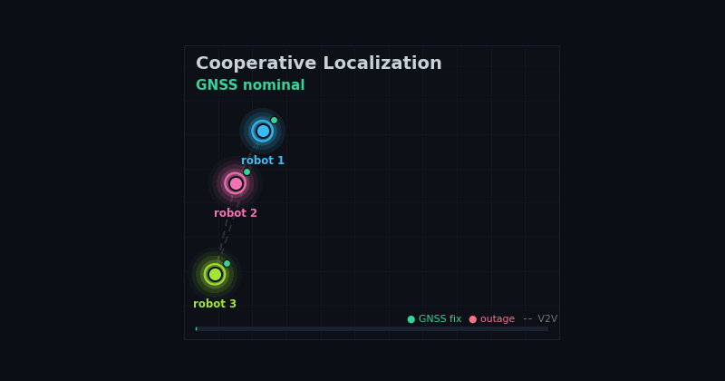

# multirobot-navigation

<p align="center">
  
</p>

<p align="center">
  <em>GNSS outage on robot 2, recovered through V2V relative-pose constraints — a synthetic concept loop, regenerate with <code>scripts/make_hero_gif.py</code>.</em>
</p>

[](https://github.com/rsasaki0109/multirobot-navigation/actions/workflows/build_jazzy.yaml)
[](https://github.com/rsasaki0109/multirobot-navigation/actions/workflows/docs.yaml)

ROS 2-native multi-robot infrastructure: a simulation → cooperative-localization → coordination stack.

This project is not trying to replace Nav2, Autoware, or Open-RMF. It provides the infrastructure layer that sits around them: a deterministic multi-robot world, cooperative pose and constraint exchange, time and frame validation, network fault injection, rosbag replay, evaluation, and the coordination (planning / formation / coverage / swarm) that moves the robots.

## Why This Exists

Single-robot navigation is served well by existing stacks. Real multi-robot autonomy still breaks at the boundaries:

- timestamps and clock drift
- QoS mismatch and stale messages
- packet loss, latency, and jitter
- frame convention drift
- missing or invalid covariance
- non-replayable experiments
- weak diagnostics for cooperative constraints

`multirobot-navigation` focuses on those boundaries.

## What It Is

A full simulation → localization → coordination stack for multi-robot systems,
in three layers that share one set of message contracts:

- **Simulation** (`mrn_sim`) — *the world*: a deterministic 2D true-world model
  (unicycle kinematics, obstacles, collision) with sensor models that emit the
  localization messages (`AgentState`, V2V `RelativePoseConstraint`, ground
  truth) and that accepts `cmd_vel` — so the same world closes the whole loop.
- **Localization** — *where are we, together*: V2V message contracts; the
  cooperative localization graph (factor core, Gauss–Newton / GTSAM backends);
  packet loss, latency, jitter, and clock-drift experiment support; MCAP-first
  rosbag replay and benchmarks; RViz/Foxglove assets; Nav2 & Autoware adapters.
- **Coordination** (`mrn_coord`) — *how do we move, together*: multi-agent path
  finding (Conflict-Based Search / prioritized planning, with a pure-pursuit
  follower), decentralized formation control reusing the V2V relative-pose
  constraints, cooperative coverage (frontier + greedy/Hungarian allocation),
  and swarm flocking (Boids) that scales to tens of agents.

Every layer is a pure, ROS-free algorithm core unit-tested in CI, with thin
ROS/CLI wiring on top.

## Architecture

```
            ┌──────────────── mrn_sim — the world ────────────────┐
            │  unicycle kinematics · obstacles · collision         │
   cmd_vel ─▶  sensor models ─▶ AgentState · RelativePoseConstraint │
            │                    · ground truth                     │
            └───────┬───────────────────────────────────┬──────────┘
                    │ V2V constraints + agent state      │ poses
        🛰️ Localization (mrn_graph)                       │
                    │ cooperative_pose  (rescues a GNSS-denied robot)
        🧭 Coordination (mrn_coord)                        │
                    │ MAPF → Path ─▶[pure pursuit]─▶ cmd_vel ───────┘   (planning → world)
                    │ formation → cmd_vel  ·  coverage → goals  ·  flocking
```

The layers connect only through message contracts (`AgentState`,
`RelativePoseConstraint`, `nav_msgs/Path`, `PoseStamped`), so each is testable
and replaceable in isolation. `ros2 launch mrn_sim sim_localization.launch.py`
runs sim → localization (a GNSS-denied robot rescued by its neighbors); `ros2
launch mrn_sim mapf_through_sim.launch.py` runs planning → world (robots drive
their planned paths through the simulator).

## What It Is Not

- not a Nav2 replacement
- not an Autoware replacement
- not a fleet management dashboard
- not a perception model zoo
- not a simulation-only research repository
- not a distributed SLAM implementation in the MVP

## MVP Goal

Two or three robots share GNSS, odometry, and V2V relative pose constraints. Under packet loss, latency, jitter, and clock drift, the system can replay the experiment from rosbag and report whether cooperative localization improves over local-only localization.

## Demo

The animation at the top of this README is a **synthetic concept loop** —
`scripts/make_hero_gif.py` renders it deterministically from matplotlib, no
running stack required (`python3 scripts/make_hero_gif.py` regenerates both the
GIF and a PNG fallback). It illustrates the project's core story: three robots
in formation, robot 2's GNSS outage, and cooperative recovery via V2V
relative-pose constraints.

A recording of the **live ROS demo** is the separate, higher-fidelity target:
`scripts/make_demo_gif.sh` prints the capture procedure, the storyboard lives
in [docs/demo_storyboard.md](docs/demo_storyboard.md), and
[docs/media/README.md](docs/media/README.md) describes where the recorded file
should land.

### Coordination layer

The other half — *how do we move together* — is the `mrn_coord` coordination
layer. The animation below is **driven by the real algorithms** (not a hand-drawn
loop): Conflict-Based Search plans three robots through a one-cell doorway
without colliding, then the displacement-based consensus controller assembles
them into a formation. Regenerate it with
`python3 scripts/make_coordination_gif.py`.

<p align="center">
  
</p>

See [docs/coordination.md](docs/coordination.md) for the MAPF, formation, and
coverage modules, each with a runnable CLI demo (`mrn_mapf_demo`,
`mrn_formation_demo`, `mrn_coverage_demo`) and a thin ROS node
(`ros2 launch mrn_coord mapf_planner.launch.py` / `formation_controller.launch.py`
/ `coverage_allocator.launch.py`) publishing `nav_msgs/Path`,
`geometry_msgs/Twist`, and `geometry_msgs/PointStamped` goals respectively.
`ros2 launch mrn_coord formation_closed_loop.launch.py use_rviz:=true` closes
the loop in ROS with a kinematic agent simulator so the robots converge into a
formation live in RViz. The two halves meet at `mrn_pose_bridge`:
`ros2 launch mrn_coord estimate_to_formation.launch.py` feeds the synthetic
world's per-agent localization estimate into the formation controller.

### Simulation & swarm

The `mrn_sim` 2D true-world model (left) and `mrn_coord` swarm flocking (right)
— the same foundation from a handful of robots up to a swarm. Both animations
are driven by the real algorithms; regenerate with `scripts/make_sim_gif.py` and
`scripts/make_swarm_gif.py`.

<p align="center">
  
  
</p>

And a flock *migrating* to a goal, or *fleeing a predator* — Boids + obstacle
avoidance + migration / predator-evasion → unicycle via
`mrn_sim.swarm.flock_in_world`, the deterministic, CI-verified twin of the
Gazebo swarm (`scripts/make_swarm_sim_gif.py`, `make_predator_gif.py`):

<p align="center">
  
  
</p>

These terms compose into a multi-phase **mission** — regroup → migrate via
waypoints → evade a predator → reach the goal (`scripts/make_mission_gif.py`;
verified deterministically that the flock completes it):

<p align="center">
  
</p>

And classic point-to-point **navigation** (`mrn_sim.navigate`): discretize the
obstacles into an occupancy grid, plan with grid A*, and follow with pure
pursuit to the goal (`scripts/make_nav_gif.py`):

<p align="center">
  
</p>

…with **reciprocal collision avoidance** for multiple robots — independent
navigators heading to crossing goals sidestep each other (and the obstacles),
verified collision-free (`scripts/make_recip_nav_gif.py`):

<p align="center">
  
</p>

## Quick Start

Build with ROS 2 Jazzy:

```bash
source /opt/ros/jazzy/setup.bash
colcon build --symlink-install
source install/setup.bash
```

Run the synthetic cooperative localization demo:

```bash
ros2 launch mrn_demos cooperative_localization.launch.py scenario:=gnss_outage_3robots.yaml
```

The same launch file can spawn the experimental Nav2 correction broadcaster
for each agent (off by default):

```bash
ros2 launch mrn_demos cooperative_localization.launch.py \
  enable_nav2_correction:=true \
  nav2_correction_agents:=robot_1,robot_2,robot_3
```

See [docs/nav2_adapter.md](docs/nav2_adapter.md) for the full argument list.

In another terminal:

```bash
source /opt/ros/jazzy/setup.bash
source install/setup.bash
ros2 launch mrn_viz rviz_graph.launch.py
```

Generate benchmark artifacts:

```bash
scripts/run_benchmark.sh 25 out/report.md out/metrics.json
sed -n '1,80p' out/report.md
```

Run a replayable experiment YAML:

```bash
ros2 run mrn_eval mrn_experiment run \
  experiments/gnss_outage_packet_loss.yaml \
  --duration 25 \
  --output-dir out/experiments/gnss_outage_packet_loss
```

The experiment runner writes `plan.json`, `report.md`, `metrics.json`,
`acceptance.json`, and `provenance.json`. Acceptance rules live in the YAML so
CI and local replay use the same pass/fail criteria. If the YAML defines
multiple `methods`, each method gets its own report under
`out/experiments/<name>/methods/<method>/`, and the root report includes
acceptance, method, network, and graph status comparison tables. The same output
directory also includes `command.txt`, `git_info.txt`, `ros_distro.txt`,
`dependency_versions.txt`, and `environment.json` for reproducibility.

Run a parameter sweep:

```bash
ros2 run mrn_eval mrn_experiment run \
  experiments/clock_drift_sensitivity.yaml \
  --duration 25 \
  --output-dir out/experiments/clock_drift_sensitivity
```

Sweep reports include generated scenario YAMLs per case and graph rejection
counts, so clock drift above the configured gate shows up as rejected
constraints instead of a silent localization failure.

For a shorter smoke run, select only the cases needed by the acceptance check:

```bash
ros2 run mrn_eval mrn_experiment run \
  experiments/clock_drift_sensitivity.yaml \
  --duration 10 \
  --sweep-case clock_drift_ms_50 \
  --sweep-case clock_drift_ms_100 \
  --output-dir out/experiments/clock_drift_smoke
```

Run the QoS profile comparison:

```bash
ros2 run mrn_eval mrn_experiment run \
  experiments/qos_best_effort_vs_reliable.yaml \
  --duration 25 \
  --output-dir out/experiments/qos_best_effort_vs_reliable
```

This benchmark generates one best-effort-like case and one
reliable-constraint-like case, then checks the observed loss and latency in the
network diagnostics table.

## CI Smoke Artifacts

The Jazzy workflow uploads `jazzy-smoke-artifacts` on every run. Download it
from the workflow run summary to inspect:

- `out/experiments/clock_drift_smoke/report.md`
- `out/experiments/clock_drift_smoke/acceptance.json`
- `out/experiments/qos_smoke/report.md`
- `out/experiments/qos_smoke/acceptance.json`
- `out/smoke_report.md`
- `out/smoke_metrics.json`
- `out/smoke_launch.log`

Use these files to verify the same pass/fail evidence that CI used: clock drift
constraint rejection, QoS loss/latency separation, and cooperative localization
improvement over local-only output.

Beyond the unit tests (every package's pure cores run under `colcon test`), CI
also exercises the coordination layer end-to-end on each push by running the
`mrn_coord` CLI demos (MAPF / formation / coverage), so a regression in the
planning, control, or allocation algorithms fails the build.

Typical synthetic result:

| Agent | Method | ATE RMSE [m] | Improvement vs Local [m] |
| --- | --- | ---: | ---: |
| robot_2 | local_only | 1.076 | |
| robot_2 | cooperative | 0.057 | 1.019 |

The cooperative launch publishes online ATE summaries on `/mrn/eval/summary`.
The current `relative_anchor` backend is a temporary baseline, not a factor graph.

## Where It Sits in the Stack

```text
Application layer
  Nav2 / Autoware / Open-RMF / custom planners
        ^
        | cooperative pose, fleet state, diagnostics
multirobot-navigation core
  cooperative localization, constraints, sync, replay, eval
        ^                         ^
        | local estimates          | V2V constraints
Robot i local stack          Robot j local stack
  GNSS / odom / Nav2          GNSS / odom / Nav2
```

The local estimator remains local. This repository provides the cooperative constraint layer around it.

## Initial Packages

| Package | Role |
| --- | --- |
| `mrn_msgs` | ROS 2 message contracts |
| `mrn_core` | shared frame, covariance, and time utilities |
| `mrn_comm` | V2V message layer and QoS profiles |
| `mrn_sync` | timestamp and clock diagnostics |
| `mrn_graph` | cooperative localization graph backends |
| `mrn_netem` | network fault models and CLI |
| `mrn_eval` | benchmark metrics and reports |
| `mrn_viz` | RViz and Foxglove visualization assets |
| `mrn_demos` | launch files, scenarios, and demo assets |
| `mrn_nav2_adapter` | conservative cooperative-pose to `map->odom` correction broadcaster (experimental) |
| `mrn_autoware_adapter` | conservative cooperative-pose to Autoware-style `PoseWithCovarianceStamped` publisher (experimental, v0.3.0) |
| `mrn_gnss` | WGS84 / local-ENU utilities and NMEA GGA fix-quality covariance (v0.3.0 scaffolding) |
| `mrn_coord` | multi-robot coordination layer: MAPF planning (CBS / prioritized), decentralized formation control, and cooperative coverage (frontier allocation) |
| `mrn_sim` | deterministic 2D multi-robot world simulator: unicycle kinematics, circular obstacles with collision, and V2V / GNSS / range-bearing sensor models |
| `mrn_gazebo` | optional Gazebo (`gz sim`) adapter: bridges model poses into `AgentState` so a 3D physics world can be the plant (requires Gazebo; not in CI) |

## Repository Status

The message, frame, covariance, time, and replay contracts are locked, and the
scaffolding for the v0.2–v0.4 milestones is landed and CI-green. The remaining
work on those milestones is gated on real data (a recorded two-robot bag, an
outdoor RTK dataset) and CI-ops budget, not on new code. See [PLAN.md](PLAN.md)
§11–§13 for the per-milestone checklists.

## Roadmap

Status: ✅ landed & CI-green · 🟡 scaffolding landed, pending real data / CI-ops · ⬜ planned

- ✅ `v0.1.0-alpha`: Jazzy baseline, message contracts, synthetic demo, centralized graph skeleton, network/eval scaffolding
- 🟡 `v0.2.0`: bag capture + manifest validation, bag-replay experiment runner, Nav2 correction adapter, Linux-netns netem path, offline ATE/RPE helper — landed; **pending a recorded two-robot bag**
- 🟡 `v0.3.0`: `mrn_gnss` (WGS84/ENU + fix-quality covariance), RTK/bag/TUM → CSV converters, GNSS quality-transition scenario, Autoware initialpose adapter — landed; **pending an outdoor RTK dataset**
- 🟡 `v0.4.0`: solver-independent factor core, pure-Python Gauss-Newton fixed-lag backend, GTSAM-backed backend (opt-in), three-way backend comparison — landed; **pending a GTSAM CI job / launch-smoke budget**
- ⬜ later: federated graph exchange, shared world model hooks, cooperative perception hooks

See [PLAN.md](PLAN.md) for the long-form execution plan.
See [docs/release_checklist.md](docs/release_checklist.md) for the `v0.1.0-alpha` checklist.
See [docs/release_notes_v0.1.0-alpha.md](docs/release_notes_v0.1.0-alpha.md) for alpha release notes and known limitations.
See [docs/bag_capture.md](docs/bag_capture.md) for the v0.2.0 two-robot bag capture procedure. After recording, `python3 tools/validate_bag.py <bag_dir> --manifest <manifest.yaml>` cross-checks recorded topics and types, then `experiments/bag_replay_smoke.yaml` (see [docs/experiments.md](docs/experiments.md)) feeds the bag through `mrn_experiment run`.
See [docs/nav2_adapter.md](docs/nav2_adapter.md) for the experimental Nav2 correction adapter.
See [docs/netem_netns.md](docs/netem_netns.md) for the Linux network namespace wrapper that brings `mrn_netem` profiles onto real veth pairs with `tc netem`.
See [docs/offline_ate.md](docs/offline_ate.md) for the offline ATE/RPE helper that compares an estimated trajectory CSV against a truth CSV — the post-hoc counterpart to `mrn_online_ate` for bags without an in-bag ground truth topic.
See [docs/gnss.md](docs/gnss.md) for the WGS84 / local-ENU conversion library and the NMEA GGA fix-quality → covariance heuristic in `mrn_gnss` (v0.3.0 scaffolding for outdoor RTK workflows).
See [docs/autoware_adapter.md](docs/autoware_adapter.md) for the experimental Autoware-side adapter that republishes cooperative poses as Autoware initialpose-style `PoseWithCovarianceStamped` after the same SE(2) safety gates as the Nav2 adapter.
See [docs/graph_architecture.md](docs/graph_architecture.md) for the cooperative graph backends: the solver-independent factor core, the pure-Python Gauss-Newton fixed-lag reference backend, and the opt-in GTSAM-backed backend (`graph_executable:=fixed_lag_graph_node.py`, `-p backend:=gtsam`).
See [docs/qos_profiles.md](docs/qos_profiles.md) → "Communication Backend Interface" for the transport abstraction (`comm_backend.py`): the `CommunicationBackend` protocol, the deterministic `LoopbackBackend` reference backend, the trace-driven `ReplayBackend` (with `RecordingBackend` to capture a trace), and `CommStatus` diagnostics that any transport (a future Zenoh backend included) reports without changing message semantics.
See [docs/gazebo.md](docs/gazebo.md) for the optional `mrn_gazebo` adapter — run the robots in a Gazebo (`gz sim`) physics world and bridge their poses into `AgentState`, so the same localization/coordination stack drives them (requires Gazebo; not in CI).
See [docs/simulation.md](docs/simulation.md) for the `mrn_sim` 2D multi-robot world simulator — a deterministic true-world model (unicycle kinematics, obstacles, V2V/GNSS/range-bearing sensors) that both halves plug into (`python3 scripts/make_sim_gif.py`). Its `mrn_sim_world` ROS node emits per-agent `AgentState` and V2V `RelativePoseConstraint` and accepts `cmd_vel`, so it is the plant that closes the loop (`ros2 launch mrn_sim sim_world.launch.py use_rviz:=true`). `ros2 launch mrn_sim sim_localization.launch.py` runs it end-to-end into the cooperative-localization graph — with one robot's GNSS degraded, its estimate is pulled back to near truth by the V2V constraints from its neighbors.
See [docs/coordination.md](docs/coordination.md) for the `mrn_coord` coordination layer — the "navigation" half of the project. It now has MAPF (multi-agent path finding: space-time A*, optimal Conflict-Based Search, prioritized planning; `ros2 run mrn_coord mrn_mapf_demo`), decentralized formation control that reuses the V2V relative-pose constraints (displacement-based consensus; `ros2 run mrn_coord mrn_formation_demo`), and cooperative coverage (frontier detection + greedy/Hungarian task allocation; `ros2 run mrn_coord mrn_coverage_demo`).

## License

Apache-2.0.
