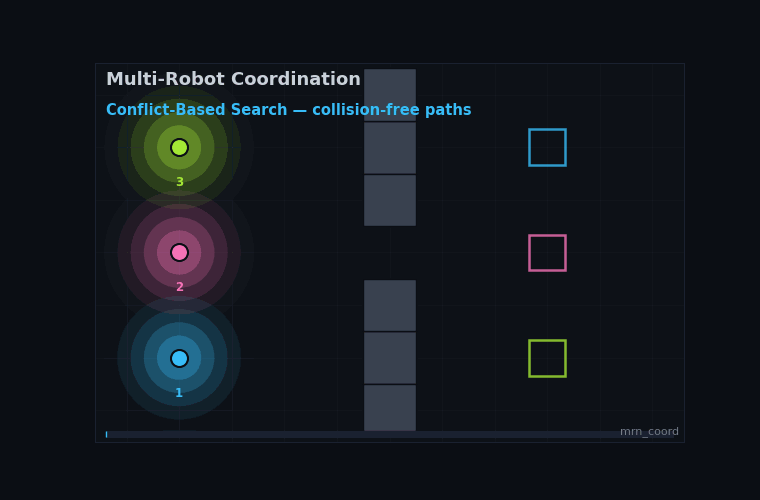

# Coordination Layer (`mrn_coord`)

<p align="center">
  
</p>

<p align="center">
  <em>Driven by the real algorithms: CBS plans the collision-free doorway crossing, then the consensus controller assembles the formation. Regenerate with <code>python3 scripts/make_coordination_gif.py</code>.</em>
</p>

`mrn_coord` is the **coordination / navigation** half of the project — the
counterpart to the cooperative-localization stack. Where localization answers
*where are we*, coordination answers *how do we move and what do we do
together*. It follows the same project pattern as the rest of the repo: pure,
ROS-free algorithm cores that are unit-tested in CI, with thin ROS/CLI wiring
layered on top.

Planned scope, built one module at a time:

1. **MAPF** (`mrn_coord.mapf`) — multi-agent path finding: collision-free
   planning on a shared grid. **Landed.**
2. **Formation** (`mrn_coord.formation`) — decentralized formation control that
   reuses the V2V relative-pose constraints already exchanged by the
   localization stack. **Landed.**
3. **Coverage** (`mrn_coord.coverage`) — cooperative exploration and task
   allocation (frontier detection + auction/Hungarian assignment). **Landed.**

## MAPF — Multi-Agent Path Finding

Given a shared grid, obstacles, and each agent's start and goal, MAPF finds
paths that never put two agents in the same cell at the same time and never let
them swap across an edge. The pieces compose bottom-up.

### The grid (`grid.py`)

`GridWorld(width, height, blocked)` is a 4-connected grid with blocked cells.
Movement is one cell per timestep in a cardinal direction or a **wait** in
place, so `neighbors(cell)` always includes the cell itself. `manhattan` is the
admissible heuristic.

### Low level: space-time A* (`space_time_astar.py`)

`plan_path(grid, start, goal, vertex_constraints, edge_constraints)` plans one
agent over `(cell, time)` states, minimizing arrival time. It honors the two
constraint types the high-level solvers branch on:

- **vertex** `(cell, time)` — may not occupy `cell` at `time`.
- **edge** `(frm, to, time)` — may not move `frm -> to` arriving at `time`
  (this is how swaps are forbidden).

The goal test requires the agent to be at the goal *and* past the last time the
goal is vertex-constrained, so a returned path can be safely held at the goal
forever (an agent waits at its goal after arrival). It returns a list of cells
indexed by timestep, or `None` if no path exists within a finite time horizon.

### Conflicts (`conflicts.py`)

`detect_first_conflict(paths)` returns the earliest **vertex** conflict (same
cell, same time) or **edge** conflict (a swap) between any pair of paths, or
`None`. Paths may differ in length; `cell_at` clamps past the end so an agent
that has reached its goal is treated as staying there.

### High level: Conflict-Based Search (`cbs.py`)

`cbs(grid, agents)` is the optimal (sum-of-costs) solver. It searches a binary
*constraint tree* best-first by cost: each node holds the current per-agent
constraints and paths; on the first conflict it branches into two children that
each add one constraint to one of the two agents and replan only that agent.
The first conflict-free node popped is optimal. Returns a `Solution` or `None`
(infeasible, or the expansion budget is exhausted).

### High level: prioritized planning (`prioritized.py`)

`prioritized_planning(grid, agents, order)` is the fast, **incomplete**
alternative. It plans agents in priority order; each treats higher-priority
paths as moving obstacles (reserving their cells/times, blocking their settled
goals, and forbidding swaps against their moves). Cheap and often good enough,
but a bad order can leave a later agent with no path even when one exists — so
it can return `None` on solvable instances, unlike CBS.

### Solution helpers (`solution.py`)

`Solution(paths, cost)` plus `sum_of_costs`, `makespan`, `pad_paths` (hold the
goal to a common horizon), and `render_ascii(grid, paths, t)` for CLI/test
visualization.

### Try it

```bash
ros2 run mrn_coord mrn_mapf_demo                 # CBS on two built-in scenarios
ros2 run mrn_coord mrn_mapf_demo --solver prioritized
```

The demo solves a crossing and a swap/reorder scenario and prints the
collision-free paths as an ASCII timeline — the runnable counterpart to the
unit tests.

### ROS node

`mrn_mapf_planner` is a thin ROS wrapper around the MAPF core. It reads a
scenario (grid size, obstacles, per-agent start/goal) from parameters, solves it
once with CBS or prioritized planning, and publishes one `nav_msgs/Path` per
agent on `mapf/path/<id>` with a latched (transient-local) QoS so RViz and late
subscribers receive it. The node holds no algorithm logic — planning and
grid-to-world conversion live in the pure, CI-tested
`mrn_coord.mapf.ros_conversion`. In a live system the agent start cells would
come from the cooperative-localization estimate; as parameters they keep the
node self-contained and launch-smoke-testable.

```bash
ros2 launch mrn_coord mapf_planner.launch.py   # the doorway scenario, 3 agents
ros2 topic echo /mapf/path/a_1                  # ids are sanitized to valid tokens
```

(Agent ids that would form an invalid ROS topic token — e.g. the digit `"1"` —
are prefixed, so agent `1` publishes on `mapf/path/a_1`.)

### Path follower (closing planning → world)

A MAPF plan is a path; `pure_pursuit` (in `path_follower.py`, pure and
CI-tested) turns a path plus the robot's current pose into a unicycle command
`(v, omega)` — the non-holonomic-compatible controller the simulator wants.
`mrn_path_follower` wraps it: per agent it subscribes to a `nav_msgs/Path` and a
`geometry_msgs/PoseStamped` and publishes `geometry_msgs/Twist`.

Paired with `mrn_sim_world` (pose in, `cmd_vel` out), it closes planning →
world. The launch `mapf_through_sim.launch.py` (in `mrn_sim`) wires planner →
follower → world on matching agent ids and grid; verified end-to-end, all three
robots track their CBS paths through the doorway and arrive within ~0.3 m of
their goals:

```bash
ros2 launch mrn_sim mapf_through_sim.launch.py use_rviz:=true
```

## Formation — Decentralized Formation Control

This module is the clearest reuse of the localization stack's output: the
cooperative graph already exchanges relative-pose constraints between agents,
and a displacement-based formation controller needs exactly that — the relative
position of each neighbor. Nothing here needs a global frame.

### The control law (`control.py`)

Each agent runs the classic displacement-based consensus law

```
u_i = gain * sum_{j in N(i)} ( r_ij - r*_ij )
```

where `r_ij = p_j - p_i` is the **measured** relative position of neighbor `j`
(what a V2V `RelativePoseConstraint` carries) and `r*_ij` is the **desired**
relative offset from the `FormationSpec`. The command depends only on relative
measurements to neighbors, so the controller is fully decentralized.
`formation_error` is the RMS of `||r_ij - r*_ij||` over the edges — zero exactly
when the shape is achieved, and invariant to a global translation (only
relative offsets are observable from relative measurements).

### The shape (`spec.py`)

`FormationSpec` holds per-agent offsets in an abstract formation frame, used
only through `desired_relative(i, j) = c_j - c_i`. Builders: `line_formation`
(evenly spaced along an axis) and `polygon_formation` (a regular polygon — an
equilateral triangle for three agents).

### Behavior

On a connected graph the law drives the agents into the desired shape. With no
leader the formation centroid is invariant (it converges in place). A `leader`
agent is commanded zero and moves on its own; the rest anchor their shape to it.
Note that tracking a constant-velocity leader leaves a **bounded steady-state
lag** — the expected behavior of a proportional controller following a ramp —
rather than zero error.

### Try it

```bash
ros2 run mrn_coord mrn_formation_demo                 # converge to a triangle
ros2 run mrn_coord mrn_formation_demo --leader 1      # anchor the shape to agent 1
```

The demo pulls three scattered agents into an equilateral triangle and prints
the formation error decaying toward zero.

### ROS node

`mrn_formation_controller` wraps the control law: it subscribes to each agent's
pose on `formation/pose/<id>` (`geometry_msgs/PoseStamped`) and, on a timer,
publishes a `geometry_msgs/Twist` velocity command on `formation/cmd_vel/<id>`
computed from the relative positions of its neighbors. The spec offsets and
edge list come from parameters; the control law is the same pure
`mrn_coord.formation.control` used in the tests.

```bash
ros2 launch mrn_coord formation_controller.launch.py   # waits for pose inputs
```

## Coverage — Cooperative Exploration & Task Allocation

Given a partially-explored map and a team of robots, decide *who explores
where*. Two stages: find the candidate targets, then assign them.

### Occupancy & frontiers (`occupancy.py`, `frontier.py`)

`OccupancyGrid` is a three-state grid — `UNKNOWN`, `FREE`, `OCCUPIED` —
buildable from text rows (`.` free, `#` occupied, `?` unknown). A **frontier
cell** is a free cell adjacent to an unknown cell: the boundary of explored
space, and where moving gains new information. `frontier_cells` lists them and
`cluster_frontiers` groups 4-connected frontiers into clusters, each with a
representative (the medoid, so the target sits inside the frontier).

### Allocation (`allocation.py`)

Travel cost is the shortest distance through known-free space
(`bfs_free_distances`, 4-connected). Two strategies assign frontier targets to
robots:

- **`greedy_auction`** — repeatedly commit the globally cheapest
  `(robot, frontier)` pair. Fast, simple, not always optimal.
- **`hungarian_assignment` / `min_cost_assignment`** — the optimal
  minimum-total-cost assignment (Kuhn–Munkres), handling rectangular cost
  matrices by transposing so rows ≤ cols. The implementation is cross-checked
  against brute-force optimal assignment in the tests.

`allocate_frontiers(grid, robot_positions, frontier_targets, method=...)` ties
them together: BFS cost from each robot to each target, then an assignment;
unreachable pairs are dropped.

### Try it

```bash
ros2 run mrn_coord mrn_coverage_demo                  # optimal (Hungarian)
ros2 run mrn_coord mrn_coverage_demo --method greedy
```

The demo builds a small map with two unknown pockets, detects and clusters the
frontiers, allocates them to two robots by travel cost, and prints the map with
each robot (`R`) and its assigned frontier target (`F`).

### ROS node

`mrn_coverage_allocator` wraps the allocator: it reads the occupancy grid (text
rows) and robot cells from parameters, detects and clusters frontiers, allocates
them, and publishes each robot's assigned frontier as a
`geometry_msgs/PointStamped` goal on `coverage/goal/<id>` (latched). Frontier
detection, clustering, and allocation are the same pure coverage core used in
the tests.

```bash
ros2 launch mrn_coord coverage_allocator.launch.py     # publishes goals
ros2 topic echo /coverage/goal/a_1
```

All three coordination modules now have both a CLI demo and a thin ROS node;
agent ids are sanitized into valid topic tokens (e.g. `1` → `a_1`).

### Driving to the goals (closing coverage → world)

`mrn_goal_follower` drives robots to their allocated frontiers: per agent it
subscribes to a `geometry_msgs/PointStamped` goal (`coverage/goal/<id>`) and the
robot's pose and steers there with the same pure-pursuit core (a single-point
path). Paired with `mrn_sim_world`, `mapf_through_sim`'s sibling
`coverage_through_sim.launch.py` (in `mrn_sim`) runs allocator → follower →
world; verified end-to-end, each robot drives to within ~0.3 m of its assigned
frontier. (This executes one allocation; iterative re-mapping as frontiers are
reached is a larger loop left for later.)

```bash
ros2 launch mrn_sim coverage_through_sim.launch.py use_rviz:=true
```

## Running the loop in ROS

The nodes above publish and subscribe, but to actually *move* something you need
a plant. `mrn_agent_sim` is a minimal single-integrator simulator: it publishes
each agent's pose on `formation/pose/<id>`, integrates the `formation/cmd_vel/<id>`
commands it receives, and publishes a `visualization_msgs/MarkerArray` on
`coordination/markers` for RViz. The integration step is the pure, CI-tested
`mrn_coord.kinematics.euler_step`.

Run it with the formation controller to close the loop entirely inside ROS:

```bash
ros2 launch mrn_coord formation_closed_loop.launch.py             # headless
ros2 launch mrn_coord formation_closed_loop.launch.py use_rviz:=true
```

The sim publishes poses, the controller answers with velocity commands, the sim
integrates them, and the three agents converge into the commanded triangle —
verified end-to-end (the converged relative offsets match the spec). This is the
stand-in plant; in a real system the poses would come from the cooperative
localization estimate instead of `mrn_agent_sim`.

## Connecting to localization

The two halves of the project meet at `mrn_pose_bridge`. The localization stack
publishes a per-agent estimate as `mrn_msgs/AgentState` (the V2V agent state) or
`mrn_msgs/CooperativePose` (the fused estimate); the coordination nodes consume
a plain `geometry_msgs/PoseStamped` on `formation/pose/<id>`. The bridge
subscribes to the former and republishes the latter, so the coordination layer
acts on the live estimate rather than a simulated plant.

```bash
ros2 launch mrn_coord estimate_to_formation.launch.py
```

This runs the synthetic world (publishing `AgentState` per agent), the bridge,
and the formation controller. The controller then publishes
`formation/cmd_vel/<id>` computed from where localization thinks the agents are
— verified end-to-end (with the agents spread out, the controller emits the
expected non-zero formation corrections). The coupling is one-way (estimate →
coordination); acting those commands back on a real plant is a separate
concern.

## Swarm flocking

Beyond small-team coordination, `mrn_coord.flocking` scales to a swarm.
`flock_velocities` is a pure, reactive Boids step — each agent steers from only
its local neighbors via the three classic rules (separation, alignment,
cohesion) — and runs over tens to hundreds of agents.

<p align="center">
  
</p>

The animation above is driven by the real `flock_velocities` rules (70 agents,
seeded, deterministic; regenerate with `python3 scripts/make_swarm_gif.py`). It
shows the same simulation foundation that runs a handful of robots scaling up to
emergent swarm behavior — separation keeps them apart, alignment turns them into
a coherent flow, cohesion holds the group together.
