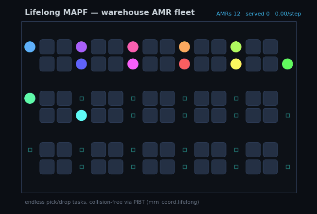
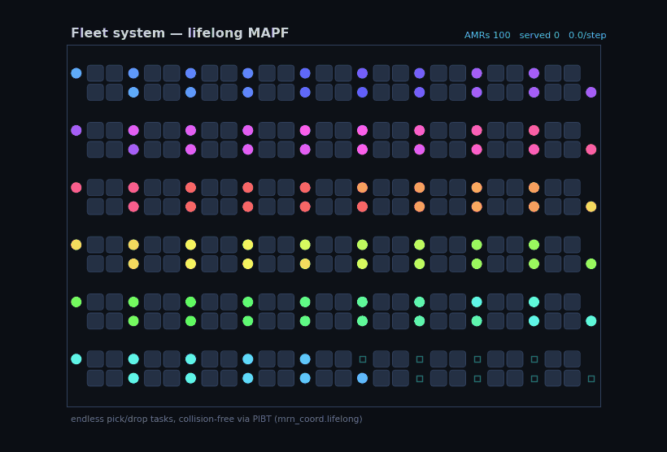
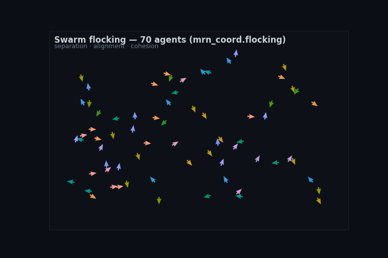

# Coordination Layer (`mrn_coord`)

<p align="center">
  
</p>

<p align="center">
  <em>Driven by the real algorithms in the 3D Gazebo world: CBS plans the collision-free doorway crossing, then the consensus controller assembles the formation, each robot sweeping a 360° LiDAR. Rendered fully offscreen on the GPU; regenerate with <code>python3 scripts/record_gazebo_coord_gif.py</code>.</em>
</p>

`mrn_coord` is the **coordination / navigation** half of the project — the
counterpart to the cooperative-localization stack. Where localization answers
*where are we*, coordination answers *how do we move and what do we do
together*. It follows the same project pattern as the rest of the repo: pure,
ROS-free algorithm cores that are unit-tested in CI, with thin ROS/CLI wiring
layered on top.

Planned scope, built one module at a time:

1. **MAPF** (`mrn_coord.mapf`) — multi-agent path finding: collision-free
   planning on a shared grid. **Landed.**
2. **Formation** (`mrn_coord.formation`) — decentralized formation control that
   reuses the V2V relative-pose constraints already exchanged by the
   localization stack. **Landed.**
3. **Coverage** (`mrn_coord.coverage`) — cooperative exploration and task
   allocation (frontier detection + auction/Hungarian assignment). **Landed.**

## MAPF — Multi-Agent Path Finding

Given a shared grid, obstacles, and each agent's start and goal, MAPF finds
paths that never put two agents in the same cell at the same time and never let
them swap across an edge. The pieces compose bottom-up.

### The grid (`grid.py`)

`GridWorld(width, height, blocked)` is a 4-connected grid with blocked cells.
Movement is one cell per timestep in a cardinal direction or a **wait** in
place, so `neighbors(cell)` always includes the cell itself. `manhattan` is the
admissible heuristic.

### Low level: space-time A* (`space_time_astar.py`)

`plan_path(grid, start, goal, vertex_constraints, edge_constraints)` plans one
agent over `(cell, time)` states, minimizing arrival time. It honors the two
constraint types the high-level solvers branch on:

- **vertex** `(cell, time)` — may not occupy `cell` at `time`.
- **edge** `(frm, to, time)` — may not move `frm -> to` arriving at `time`
  (this is how swaps are forbidden).

The goal test requires the agent to be at the goal *and* past the last time the
goal is vertex-constrained, so a returned path can be safely held at the goal
forever (an agent waits at its goal after arrival). It returns a list of cells
indexed by timestep, or `None` if no path exists within a finite time horizon.

### Low level alternative: SIPP (`sipp.py`)

`plan_sipp(grid, start, goal, vertex_constraints, edge_constraints)` is a
**drop-in** for `plan_path` with the same signature, the same constraint
vocabulary, and the same minimal-time path — but a much smaller search space.
Time-expanded A* keeps one state per `(cell, time)`, so an agent forced to wait
out a long reservation re-expands a near-identical state every tick. **Safe
Interval Path Planning** (Phillips & Likhachev 2011) instead partitions each
cell's timeline into *safe intervals* — maximal runs of collision-free
timesteps — and keeps one state per `(cell, interval)`, letting the agent wait
*anywhere* in an interval for free. A chokepoint reserved for 200 ticks costs
SIPP one state, not 200 (`benchmarks/comparison.md` sweeps this: A* expansions
grow with the wait, SIPP's stay flat). Pass it as the `low_level` of
`prioritized_planning`, or run `mrn_mapf_bench --solver prioritized_sipp`; it
finds equal-cost solutions. Edge (swap) constraints are handled by skipping the
single forbidden arrival time into a successor interval.

### Conflicts (`conflicts.py`)

`detect_first_conflict(paths)` returns the earliest **vertex** conflict (same
cell, same time) or **edge** conflict (a swap) between any pair of paths, or
`None`. Paths may differ in length; `cell_at` clamps past the end so an agent
that has reached its goal is treated as staying there.

### High level: Conflict-Based Search (`cbs.py`)

`cbs(grid, agents)` is the optimal (sum-of-costs) solver. It searches a binary
*constraint tree* best-first by cost: each node holds the current per-agent
constraints and paths; on the first conflict it branches into two children that
each add one constraint to one of the two agents and replan only that agent.
The first conflict-free node popped is optimal. Returns a `Solution` or `None`
(infeasible, or the expansion budget is exhausted).

#### Validated against the reference libMultiRobotPlanning

"Optimal" is a strong word, so we hold it to the canonical reference:
`scripts/compare_mapf_libmrp.py` solves identical instances with our `cbs.py`
and with Wolfgang Hönig's [`libMultiRobotPlanning`](https://github.com/whoenig/libMultiRobotPlanning)
C++ `cbs`, then checks they agree. Both run the same discrete model (4-connected
grid, wait actions, unit cost, vertex + edge-swap conflicts, no
`--disappear-at-goal`) and minimize **sum-of-costs** — whose optimum is a single
number, so a correct optimal solver must reproduce the reference's value
*exactly*, with no tolerance. The checked-in numbers (and why `makespan` is
reported but not gated — many solutions share the optimal cost) live in
[`benchmarks/mapf_libmrp.md`](../benchmarks/mapf_libmrp.md).

The reference is an *optional* dependency built from source — the core build and
test suite never touch it (the equivalence test skips cleanly when the binary is
absent). To run the check locally (needs `cmake`, a C++ compiler, Boost
program-options, and yaml-cpp):

```bash
git clone https://github.com/whoenig/libMultiRobotPlanning.git /tmp/libMultiRobotPlanning
cmake -S /tmp/libMultiRobotPlanning -B /tmp/libMultiRobotPlanning/build -DCMAKE_BUILD_TYPE=Release
cmake --build /tmp/libMultiRobotPlanning/build --target cbs ecbs
export LIBMRP_CBS=/tmp/libMultiRobotPlanning/build/cbs
export LIBMRP_ECBS=/tmp/libMultiRobotPlanning/build/ecbs
python3 scripts/compare_mapf_libmrp.py --check       # gated equivalence contract
python3 scripts/compare_mapf_libmrp.py --write        # refresh benchmarks/mapf_libmrp.md
```

The `mapf-libmrp-equivalence` CI job does exactly this on every push, so CBS
computing the true optimum is a guarded contract, not a claim.

#### Disjoint splitting (`cbs(disjoint=True)`)

A Python reproduction of Li, Harabor, Stuckey, Ma & Koenig's
[*"Disjoint Splitting for Multi-Agent Path Finding with Conflict-Based
Search"*](https://ojs.aaai.org/index.php/ICAPS/article/view/3487) (ICAPS 2019).

Standard CBS resolves a vertex conflict `(a1, a2, v, t)` by giving each child one
**negative** constraint: child 1 forbids `a1` from `v` at `t`, child 2 forbids
`a2`. The catch is that the two subtrees **overlap** — any solution in which
*neither* agent sits on `v` at `t` satisfies both children, so CBS re-searches it
in both. That redundancy compounds with every split.

**Disjoint splitting** removes it. It picks *one* agent `ai` from the conflict
and branches on a yes/no question about that single agent:

- **positive child** — `ai` *is* at `v` at `t` (a **positive**, must-occupy
  constraint). Because vertex occupancy is exclusive, "ai is here" implies *no
  other agent* is, so this child also pins every other agent **off** `v` at `t` —
  without dropping a single valid solution.
- **negative child** — `ai` is *not* at `v` at `t` (the usual negative
  constraint).

Every solution answers that question exactly one way, so the children
**partition** the solution space instead of overlapping it. Same optimal
sum-of-costs, fewer high-level expansions — the saving grows with congestion,
where the redundant subtrees are largest.

The positive half rides on the low level: `plan_path` gained
`positive_vertex` / `positive_edge` (must-occupy) constraints that prune every
successor violating them and hold the agent past the pinned timestep before it
may settle at its goal — *except* when the pin is on the goal itself, which
stay-at-goal semantics satisfy for free (a subtle case: forcing the path to the
pin time there would overcount the cost). A must-occupy `(v, t)` path is verified
to equal the path found by forbidding every *other* cell at `t`.

**Honest scope:** disjoint splitting is applied to **vertex** conflicts; the rare
swap (edge) conflicts keep the standard split — the positive-edge derivation for
all other agents is finicky and contributes little redundancy. Mixing is still
sound and optimal because each individual split fully covers the solution space.
The `disjoint_vs_standard` gate pins the win on a congested battery: the same
optimum on every instance (`opt_match == instances`), every solution
collision-free, and the aggregate high-level expansions cut **2325 → 1726**
(≈1.35×, rising to ≈3× on the densest `8×8` config). `disjoint` defaults **off**,
so the plain `cbs` path — and the libMultiRobotPlanning equivalence contract
above — is byte-identical.

#### Meta-Agent CBS (`macbs.py`)

`macbs(grid, agents, merge_bound=B)` is a Python reproduction of the *meta-agent*
extension in Sharon, Stern, Felner & Sturtevant,
[*"Conflict-based search for optimal multi-agent pathfinding"*](https://doi.org/10.1016/j.artint.2014.11.006)
(AAAI 2012; AIJ 2015). Plain `cbs` is **fully decoupled** — it plans each agent
alone and branches one constraint per conflict. That is ideal when agents barely
interact, but on a tight bottleneck two agents collide again and again and CBS
pays by re-splitting the same conflict deep into the constraint tree (an
exponential blow-up). A **fully coupled** joint search (`joint_astar`) never blows
up on conflicts but its state space is the product of all agents'.

MA-CBS interpolates between the two with one knob, the **conflict bound `B`**:

- The high level is CBS, but its "agents" are **meta-agents** — groups of one or
  more original agents. A constraint on a meta-agent forbids the cell/edge to
  *every* member.
- A global counter `CM[i][j]` tallies how often agents `i` and `j` have conflicted
  across the whole search. When the two meta-agents owning a fresh conflict have
  conflicted more than `B` times, instead of splitting they are **merged** into
  one meta-agent.
- A meta-agent is planned by a **coupled** low level — a time-expanded joint A\*
  over the group's configuration space, internally collision-free, honouring every
  external constraint, with the same stay-at-goal sum-of-costs as `cbs` (the
  `settled`-bit cost model of `mstar`). Conflicts *between* meta-agents are still
  resolved by CBS branching.

`B = ∞` never merges, so MA-CBS **is** standard CBS; `B = 0` merges on the first
conflict, collapsing toward a single coupled search. Every `B` returns the **same
optimal sum-of-costs** — what changes is *where* the work happens. The
`mapf_macbs` gate pins: **(1) optimality for every `B`** — on a random battery,
`macbs(B)` matches the `cbs` optimum and is collision-free for `B ∈ {∞, 2, 1, 0}`
(120/120), and `B = ∞` performs zero merges with all-singleton groups (it *is*
CBS); **(2) merging cuts the search** — on a 3-agent symmetry bottleneck the
high-level expansions collapse **71 → 11 → 3** as `B` drops ∞→1→0 for the same
optimum, the conflicting agents absorbed into one coupled meta-agent (final group
size 3); a corridor swap collapses **16 → 2**. This is the optimal-MAPF cousin of
`mstar`'s subdimensional merging and Standley's independence detection — but it
merges by conflict *frequency*, not a single collision.

**Pitfalls worth recording.** Two bugs cost real time. (a) On a merge the combined
constraints must **drop the ones that came from conflicts between the merged
agents** (internal) — keeping them over-constrains the meta-agent and silently
loses the optimum (corridor came out 13 instead of 11); each constraint is tagged
with its opponent so a merge can tell internal from external. (b) The coupled low
level must **not let an agent settle for free on arrival** at its goal — only by
*staying* on a goal already reached; settling on arrival lets one agent freeze
early and block another into a detour, overshooting the optimum by one. Both are
covered by the `B ∈ {∞,2,1,0}` × random-battery optimality check (3750 solves, 0
mismatches).

### High level: CBS with improved heuristics (`cbsh.py`)

`cbsh(grid, agents, heuristic="wdg")` returns the **same optimum** as `cbs` but
expands far fewer high-level nodes — a Python reproduction of Li et al.,
*"Improved Heuristics for Multi-Agent Path Finding with Conflict-Based Search"*
(IJCAI 2019), with the conflict prioritization of Boyarski et al.'s ICBS (2015).
Plain CBS orders its constraint tree by `g` (sum-of-costs) alone; CBSH adds an
admissible `h` read off the *structure* of the conflicts, so nodes that cannot
beat the incumbent sink in OPEN instead of being expanded.

The unit of structure is the **MDD** (`mdd.py`): the union of all of an agent's
cost-optimal paths, laid out by timestep. Its **width** at a level — how many
cells the agent could occupy there without lengthening its path — says how
expensive a conflict is. A conflict where both agents have width 1 is
**cardinal**: every resolution must increase cost. From that, three admissible
heuristics of increasing strength:

- **CG** — an edge per pair with a cardinal conflict; `h` = minimum vertex cover.
- **DG** — an edge per *dependent* pair (their joint MDD has no conflict-free
  pair of optimal paths); `h` = minimum vertex cover.
- **WDG** (default) — edges weighted by the true pairwise cost increase (a small
  two-agent CBS); `h` = weighted minimum vertex cover. The tightest.

Plus **conflict prioritization**: split a cardinal conflict first (both children
then provably gain cost), else semi-cardinal, else any. `heuristic=None` keeps
just the prioritization, isolating the two ideas.

`cbs.py` is left byte-for-byte untouched as the baseline these numbers are
measured against. The win is gated by `cbsh_vs_cbs` on a battery where plain
CBS's tree actually blows up — first 10 seeds each of an open 7×7/8 and an
obstacle-dense 6×6/6 (no cherry-picking). It pins **optimality** (cbsh's cost
equals cbs's on every instance) and the **expansion counts**, monotone
`wdg ≤ dg ≤ cg ≤ cbs`: in aggregate **3540 → 268** high-level nodes (a 13×
cut overall, ~21× on the conflict-heavy grid). This is the heuristic + conflict
prioritization; the orthogonal *bypass* term of ICBS is reproduced separately in
`bypass.py` below.

#### Bypassing conflicts (`bypass.py`)

`cbs_bypass(grid, agents)` reproduces Boyarski et al., *"Don't Split, Try to Work
It Out: Bypassing Conflicts in Multi-Agent Pathfinding"* (ICAPS 2015) — the BP
component of ICBS. Standard CBS, when it picks a conflict, always **splits**:
it adds a constraint-tree child for each of the two agents. BP first asks whether
that split is necessary. When it generates the two children it checks if either
is a **valid bypass** of the current node `N`:

- same **cost** as `N` (nobody paid to resolve the conflict), and
- strictly **fewer conflicts** than `N`.

If so it **adopts that child's new path** into `N` — *without* recording the
constraint — and re-examines `N` in place, generating no tree nodes. The adopted
path is valid under `N`'s weaker constraints (it was found under more), and its
cost is unchanged, so `g(N)` and the optimal bound hold: BP returns the **same
optimal sum-of-costs as CBS**. A **cardinal** conflict can never be bypassed —
both its children must gain cost, failing the same-cost test — so BP collapses the
tree precisely on the non-cardinal conflicts plain CBS wastefully splits. Each
adoption strictly drops the conflict count, so a node is bypassed only finitely
often before it is solved or genuinely split.

It reuses CBSH's conflict machinery (MDD classification, cardinal-first conflict
choice); `cbs.py` stays byte-for-byte the baseline. Gated by `mapf_cbs_bypass`:
on a 320-instance battery `cbs_bypass` matches the `cbs` optimum and is
collision-free everywhere, while bypassing cuts high-level expansions **867 →
490** and generated tree nodes **1094 → 340**, and **never** expands more than
the `bypass=False` ablation (worse = 0). A frozen showcase (seed 54, 5 agents on
6×6) keeps the optimum 22 but collapses expansions **17 → 3** and generated nodes
**32 → 4** through 3 bypasses (`test_bypass`).

#### Rectangle symmetry reasoning (`cbsh(rectangle=True)`, `rectangle.py`)

The heuristic above prices conflicts but still resolves them one cell at a time —
and against a **rectangle symmetry** that is fatal. When two agents cross the
same open region *in the same direction*, every pair of their Manhattan-optimal
paths collides somewhere inside a shared rectangle; resolving one colliding cell
just slides the collision over, so CBS must grind through an exponential number
of symmetric permutations. This is a Python reproduction of Li, Harabor,
Stuckey, Felner & Koenig, *"Symmetry-Breaking Constraints for Grid-Based MAPF"*
(AAAI 2019).

A **barrier constraint** kills the whole symmetry in one split. For the
rectangle with start corner `Rs` and goal corner `Rg`, agent `a₁`'s exit border
`R₁·Rg` (the `y = Rg.y` edge) and `a₂`'s exit border `R₂·Rg` (the `x = Rg.x`
edge), the two children block `a₁` from its *entire* exit border — every cell, at
the Manhattan time it would arrive — or block `a₂` from its. The two barriers are
**mutually disjunctive** (if both agents crossed their full borders on time they
would collide), so the split keeps CBS optimal and complete while collapsing all
the permutations at once. `rectangle.py` finds the rectangle from the MDD
*singletons* that bracket a vertex conflict (so it fires on path segments, not
just whole paths) and builds the two barriers; the barrier's cells, intersected
with the agent's MDD, are added as ordinary `(cell, time)` vertex constraints.

The feature is **opt-in** (`rectangle=False` by default, so the `cbsh_vs_cbs`
gate is unaffected and `rectangle=False` is byte-identical to plain `cbsh`).
Random instances almost never contain a phase-locked same-direction rectangle,
so — as the paper evaluates on structured maps — the `rectangle_symmetry` gate
uses four explicit crossing scenarios (agents whose starts share an anti-diagonal
`x+y = const`, which phase-locks them, heading up-and-right into a shared open
rectangle). With the WDG heuristic held fixed on both sides, turning barrier
reasoning on cuts the aggregate high-level expansions **298 → 15** (~20×), and
the cost still equals both plain-CBSH's and CBS's on every scenario. **Honest
scope:** this is a *structure-dependent* win — barrier reasoning only fires on
same-direction crossings and does nothing on instances without them (it is exactly
byte-neutral there); cardinal classification is done by directly testing whether
a barrier cuts the MDD rather than the paper's corner-arithmetic shortcut.

#### Corridor symmetry reasoning (`cbsh(corridor=True)`, `corridor.py`)

The rectangle's sibling pattern, and the third leg of the symmetry trilogy: Li,
Harabor, Stuckey, Felner & Koenig, *"New Techniques for Pairwise Symmetry
Breaking in Multi-Agent Path Finding"* (ICAPS 2020). When two agents traverse the
same **one-wide passage in opposite directions** they must meet head-on, and
plain CBS/CBSH can shift that meeting one cell at a time — forbidding the meeting
cell to one agent just moves the collision over by one — so it branches a chain
whose length grows with the corridor before an agent is finally forced to wait
the whole thing out.

The fix is a **range constraint** — a single split that forbids an agent from a
corridor *opening* across a whole *band* of timesteps. Because the agents cross
in opposite directions they **share** the openings: one agent's exit `P` is the
other's entry. To let `a₁` go first, forbid `a₂` from its entry `P` for all
`t ∈ [0, d₁]` (with `d₁` the earliest `a₁` reaches `P`); since the corridor is
one-wide and `P` is the only way in, that *holds `a₂` outside* rather than merely
delaying where it surfaces — the whole chain collapses to one split. The two
children (`a₁`-first / `a₂`-first) are a sound disjunction **exactly when the
corridor is the sole route between its two sides**, so the reasoning fires only
when neither agent has a **bypass** (a corridor-avoiding route to its exit) and
otherwise falls back to the plain single-cell split — keeping the
optimality-preserving core provably correct. The range needs no new low-level
machinery: it expands to ordinary `(opening, t)` vertex constraints that
`plan_path` already honours.

The feature is **opt-in** (`corridor=False` by default, byte-identical to plain
`cbsh`; orthogonal to and combinable with `rectangle=True`). The
`corridor_symmetry` gate uses four hand-built forced corridors of growing length:
with the WDG heuristic fixed on both sides, the cell-by-cell chain makes OFF
expansions grow with length to an aggregate **52**, while one range split per
corridor (`corridors == 4`) holds ON **constant at 8** — same optimum as CBS on
every scenario. **Honest scope:** like the rectangle this is structure-dependent
(it fires only on opposite-direction one-wide crossings with no detour); two
*bypass* scenarios pin that it correctly **declines** (`bypass_corridors == 0`)
yet still returns the optimum.

#### Mutex propagation (`mutex.py`)

Rectangle reasoning recognises *one* geometric pattern. **Mutex propagation**
(Zhang, Li, Surynek, Koenig & Kumar, ICAPS 2020) instead *derives* which pairs of
MDD nodes can never be reached conflict-free, and from that classifies cardinal
conflicts and synthesizes symmetry-breaking constraints automatically — a strict
generalization. The unit is a **mutex** between two MDD nodes (or edges) at the
same level: *initial* mutexes come from vertex and swap conflicts; *propagated*
mutexes follow the AC-3-style rule that two nodes are mutex iff their every pair
of incoming edges is mutex. The central guarantee (Theorem 1) is that two nodes
are mutex **iff** no conflict-free sub-paths reach them; so a mutex between the
two agents' *sinks* means every pair of optimal paths collides — a cardinal
conflict — and the cells mutex with the whole opposite MDD become the disjunctive
constraints (which, on a rectangle conflict, reduce to exactly the barrier above).

`mutex.py` exposes `generate_mutexes`, `classify_conflict` (`"PC"`/`"AC"`/`"NC"` —
pre-goal cardinal, after-goal cardinal, or not-cardinal) and `pc_constraints`.
**Honest scope:** this reproduces the verified *detector*, not a brancher. The
paper's full constraint-generation loop grows the MDD levels to the cardinal
boundary and adds *cost* constraints for after-goal cardinals, regenerating every
mutex at each grown level; in pure Python that is prohibitively slow on
corridor-style conflicts (the paper itself calls mutex propagation
"computationally expensive"), so a gated solver on top of it would not be
practical — and a naïve pre-goal-only split is *incomplete* (it loses optima to
higher-cost paths, which is exactly what the level-grow and cost constraints fix).
What is fast, correct and verifiable — and what `mutex_cardinal_detection` pins —
is the detector: on 2500 MDD pairs, `classify_conflict` returns `NC` **iff**
`mdd.are_dependent` says independent (the paper's **Theorem 2** — `disagreements
== 0`), and it flags **9 hidden cardinals**: pairs that are cardinally dependent
but have *no* level where both agents are pinned to the same cell, so the
width-based test of `cbsh.py` misses them while mutex catches them. That hidden
count is the whole point — automated symmetry detection beyond the hand-coded
patterns.

### High level: Enhanced CBS (`ecbs.py`)

`ecbs(grid, agents, w=1.5)` is the **bounded-suboptimal** solver: it returns
collision-free paths whose sum-of-costs is at most `w` times the optimum, and
in exchange expands far fewer constraint-tree nodes than CBS — so it keeps
solving as the team grows past where CBS's tree explodes. The mechanism is
**focal search** at both levels. The low level
(`_focal_low_level`) is a single-agent A* that, among all paths within `w` of
the cheapest, picks the one with the fewest conflicts against the other agents'
current paths, and also reports `f_min`, a lower bound on that agent's
constrained optimum. The high level orders OPEN by `LB(N) = Σ f_min` and expands
from the FOCAL set — nodes whose actual cost is `≤ w·min LB` — choosing the one
with the fewest total conflicts. Popping a conflict-free FOCAL node gives a
solution with `cost ≤ w·min LB ≤ w·optimal`. With `w=1` it reduces to optimal
CBS. `benchmarks/comparison.md` sweeps team size: CBS's expansions blow up and
it starts exhausting its budget while ECBS stays in a handful of nodes for a
few-percent cost premium. Run `mrn_mapf_demo --solver ecbs` or
`mrn_mapf_bench --solver ecbs -w 1.3`.

#### Validated against the reference libMultiRobotPlanning

The `w·optimal` guarantee is the whole point of ECBS, so we hold it to the
reference's `ecbs` exactly as we held CBS to its `cbs`.
`scripts/compare_ecbs_libmrp.py` solves the same instances with our `ecbs.py` and
libMultiRobotPlanning's `ecbs` at the same `w`, takes the optimum from our CBS
(itself pinned to the reference `cbs`, see above), and checks the **bound**:
`cost ≤ w · optimal` for both solvers. The two need not return the *same* cost —
focal-search tie-breaking differs — so, unlike the optimal-CBS contract, equality
is not gated; the ratios (in [`benchmarks/ecbs_libmrp.md`](../benchmarks/ecbs_libmrp.md))
show the suboptimality actually taken, which sits at or below the ceiling. Build
the reference as above (the `ecbs` target ships in the same `cmake --build`), set
`LIBMRP_ECBS`, and the `mapf-libmrp-equivalence` CI job runs it on every push —
so the suboptimality *bound*, like the optimum itself, is a guarded contract.

### High level: EECBS (`eecbs.py`)

`eecbs(grid, agents, w=1.5)` is also **bounded-suboptimal**, but it fixes the
one thing ECBS leaves on the table: ECBS's lower bound, `Σ f_min`, is the sum of
the agents' *individual* optima and so is blind to the extra cost their
conflicts *force*. EECBS (Li, Ruml & Koenig, AAAI 2021) keeps ECBS's focal,
conflict-avoiding low level but swaps in CBSH's **admissible WDG heuristic** for
a tight lower bound `f = LB + h`, and drives the high level with **Explicit
Estimation Search** (EES). Each node now carries two path sets: the focal
(conflict-dodging) paths give the candidate cost `g`, while the *optimal* paths
under the same constraints give `LB` and feed the WDG heuristic — reused verbatim
from `cbsh.py`. EES keeps three views of OPEN: a *cleanup* queue by `f` (whose
minimum anchors the `w` guarantee), an *open* queue by an online-learned
inadmissible estimate `f̂ = max(f, g + ε̄·conflicts)`, and a *focal* set within
`w` of the best `f̂` ordered by conflict count. Because the search only has to
certify `cost ≤ w·(global LB)`, a tighter `LB` reaches that certificate sooner.

`benchmark_gate.py::eecbs_vs_ecbs` pins the win against `ecbs.py` at the same
near-optimal `w = 1.02`, on the same battery `cbsh` uses (an obstacle-dense
8×8/7 and an open 7×7/8, first 12 seeds each, 22 solvable instances). Two
structural invariants make the gain unambiguous: `eecbs(heuristic=None)` — the
EES skeleton with `h = 0` — expands **exactly** as many nodes as ECBS
(`none == ecbs`, 240 = 240), so EES alone changes nothing; adding the heuristic
is monotone `wdg ≤ dg ≤ cg ≤ none` and cuts the aggregate **240 → 126**
high-level expansions (~1.9×, and `wdg ≤ ecbs` on all 22). The gain is a
near-optimal-`w` phenomenon: at a loose `w = 1.5` the bound is trivially
satisfied and the heuristic is dead weight (the gate would show no separation),
which is exactly when you'd reach for plain ECBS instead. **Honest scope:**
EECBS's cardinal-conflict *prioritization* is left out (it splits the first
conflict like ECBS, so the measured win is purely EES + the admissible bound);
prioritization is already reproduced and measured in `cbsh.py`. The cost bound
itself (`≤ w·optimal`) is checked in the unit tests, where the CBS optimum is on
hand; the gate stays on the cheap expansion-count contract.

### High level: ICTS (`icts.py`)

`icts(grid, agents)` is an optimal solver from a paradigm **orthogonal** to the
whole CBS family above. Instead of branching on *constraints*, the Increasing
Cost Tree Search (Sharon, Stern, Goldenberg & Felner, AIJ 2013) branches on
per-agent *costs*. Its high-level **increasing cost tree** has a node for each
cost vector `(C₁, …, Cₖ)`; the root gives every agent its individual
shortest-path cost, and a child increments one agent's cost by `1`. The tree is
searched in non-decreasing total cost `ΣCᵢ`, so the first cost vector that admits
a conflict-free joint plan is optimal in sum-of-costs — the *same* optimum
`cbs.py` returns. The low-level test for a cost vector builds each agent's
**MDD** at cost `Cᵢ` (`mdd.py`, the very same diagrams CBSH uses) and searches
the *cross-product* of the MDDs for one conflict-free assignment of paths.

That cross-product search is exponential in the number of agents — ICTS's known
weakness, and why it suits few-but-tightly-coupled teams rather than large open
ones. Its signature accelerator, reused here verbatim, is **pairwise pruning**:
before the full `k`-agent search, every *pair* of agents is checked in isolation
with `mdd.are_dependent` (the identical 2-agent MDD test behind CBSH's dependency
graph); if any pair has no conflict-free pair of cost-`Cᵢ` paths, the whole node
is hopeless and is skipped without the joint search.

`benchmark_gate.py::icts_vs_cbs` pins two things on a small few-agent battery
(three 4–5-agent configs, first 12 seeds, 35 solvable instances). First,
**optimality**: ICTS's cost equals `cbs`'s on every instance, under *both* the
pruning setting and the `prune=None` ablation (`opt_match == instances`).
Second, the **pruning mechanism**: the ablation runs a joint search at every
node (`joint_searches_none == nodes`, 197), while pairwise pruning skips the
hopeless ones — **197 → 55** joint searches, the other 142 nodes pruned before
any search (`pruned + joint_searches == nodes`). Both settings return the
identical optimum, so pruning changes only the work, never the answer. **Honest
scope:** ICTS is *not* a universal speed win over CBS — on large open teams the
cross-product search dominates and CBS wins; the gate's battery stays in the
few-coupled-agents regime ICTS was designed for, and pins the pruning mechanism
rather than claiming a blanket victory.

### High level: CCBS — continuous-time CBS (`ccbs.py`)

A Python reproduction of Andreychuk, Yakovlev, Atzmon & Stern's
[*"Multi-Agent Pathfinding with Continuous Time"*](https://www.ijcai.org/proceedings/2019/0006.pdf)
(IJCAI 2019; AIJ 2022). Every solver above shares one assumption: a **discrete
clock**. Moves take exactly one timestep, conflicts are "same cell at the same
integer tick" or a swap, and an agent that must yield waits a *whole* tick. CCBS
throws the clock away.

- The roadmap is the **8-connected grid**. A cardinal move takes time `1`, a
  diagonal `√2` — an *irrational* duration the unit-clock model cannot even
  represent. Speed is 1.
- Each agent is a **disk of radius `r`**. Two agents collide whenever their
  centres come within `2r` at *any real instant*. Two paths that cross the centre
  of a unit square — agent A going `(0,0)→(1,1)`, agent B going `(1,0)→(0,1)` —
  meet at `(0.5, 0.5)` while sharing **no vertex and no edge**. The discrete model
  is blind to that collision; CCBS sees it.

The three levels are CBS lifted to continuous time:

- **Low level — continuous-time SIPP** (`_plan_continuous`). Each node carries
  real-valued *safe intervals* (the complement of the times a constraint forbids
  it); each move carries forbidden *start* intervals. An agent waits any real
  duration for free, so a yield costs only the **minimal real time to clear**, not
  a whole tick.
- **Collision detection** (`first_collision`, `min_separation`) is exact: the
  position pair is piecewise-linear, so the squared distance is a quadratic on
  each shared segment — solved in closed form. `min_separation` is also the
  independent oracle the gate verifies solutions against.
- **High level — CCBS** (`ccbs`): best-first over the constraint tree by
  continuous sum-of-costs. On the first collision it computes, for each agent, the
  **unsafe interval of starting its colliding action** — an edge-start interval
  for a move, a vertex interval for a wait — and branches one agent each way. The
  first collision-free node popped is optimal in continuous time.

The `ccbs_continuous_time` gate pins, against the independent geometric oracle,
three things. **(1) Soundness — the whole point:** every CCBS solution keeps all
pairs `≥ 2r` apart (`collision_free == solved == 20/20` on a 3-agent battery,
plain `range(10)` of two configs). **(2) It catches what discrete misses:**
12 of those 20 instances have uncoordinated 8-connected shortest paths that
geometrically collide (centres `< 2r`) — conflicts a vertex/edge model cannot
see — which CCBS resolves to clear. **(3) The continuous signature:** four
explicit mid-square crossings are each resolved by a *fractional* real wait to
exactly the `2r` clearance (every uncoordinated baseline there meets at distance
0). **Honest scope:** the unsafe interval is derived from the two conflicting
*actions* (the sound, local computation), located by **bisection on the exact
collision predicate** rather than closed-form case-work — the same interval to a
tight tolerance, rounded outward so the replan clears with real separation. Equal
radii, 8-connected roadmap; the gate stays at 3 agents because CCBS's continuous
search is **expensive** (the paper says so too — some 4-agent seeds exhaust the
expansion budget), so this pins the *continuous-geometry mechanism*, not a
scaling claim.

### High level: network flow — anonymous makespan-optimal (`flow.py`)

A Python reproduction of Jingjin Yu & Steven LaValle's
[*"Multi-agent Path Planning and Network Flow"*](https://link.springer.com/chapter/10.1007/978-3-642-36279-8_10)
/ *"Optimal Multi-Robot Path Planning on Graphs"* (WAFR 2012 / AAAI 2013). Every
solver above searches. This one **does not** — it is a combinatorial-optimization
reduction. Yu & LaValle's celebrated result: when the targets are
**interchangeable** (the *anonymous* problem — any agent may fill any goal),
minimum-**makespan** collision-free routing is solvable in **polynomial time** as
an integer **maximum flow**.

For a fixed horizon `T`, time-expand the grid into a flow network:

- Each free cell `v` at each step `t` is split `v_in(t) → v_out(t)` by a
  **capacity-1** edge — that lone edge *is* the vertex-collision rule (≤1 agent
  through `v` at time `t`).
- A wait is `v_out(t) → v_in(t+1)`; a move along `{u,v}` runs through a shared
  **capacity-1 gadget**, so the head-on swap `u→v` and `v→u` cannot both occur.
- A super-source feeds every start at `t=0`; every goal drains to a super-sink at
  `t=T`.

A feasible integer flow of value `n` *is* `n` collision-free trajectories
reaching the goal set by time `T`. Feasibility is **monotone** in `T` (park at the
goal), so a binary search finds the minimum makespan, and the optimum is
**self-certified**: flow `= n` at `T`, flow `< n` at `T-1`.

The `flow_anonymous_makespan` gate pins, on a random battery (`n ∈ {2,3}`, four
small configs, plain `range(10)`): **(1) optimality**, self-certified —
`certified == solved == 40/40` (the horizon one below is provably infeasible;
cross-checked offline against a brute-force joint-BFS anonymous optimum, 0
makespan mismatches over 120 instances); **(2) validity** — every flow decomposes
into collision-free paths forming a perfect start→goal matching
(`collision_free == solved`); **(3) the relaxation bites** — the anonymous
makespan never exceeds the labeled CBS makespan (`anon_le_cbs == both_solved`) and
is **strictly** smaller on 27 of 40, plus a corridor showcase where the labeled
swap is *impossible* (CBS returns `None` on all three 1-wide corridors) yet the
anonymous routing is trivial. **Honest scope:** this is the *anonymous* problem
Yu & LaValle solve in polynomial time — a relaxation of labeled MAPF, so its
makespan lower-bounds any labeled solution's. The *labeled* makespan-optimal
problem is NP-hard and is **not** reproduced here.

#### Offline TSWAP — constructive anonymous MAPF by target swapping (`tswap.py`)

`flow` is the makespan-**optimal** anonymous solver, but it pays for it — a
time-expanded network and a binary search of max-flows. **Offline TSWAP**
([Okumura & Défago, ICAPS 2022](https://ojs.aaai.org/index.php/ICAPS/article/view/19810);
extended in AIJ 2023) takes the opposite corner of the trade-off: it is the
**fast, constructive, complete** anonymous solver — the unlabeled analogue of
`push_and_rotate`'s constructive stance. It takes an *arbitrary* initial
assignment and repeats **one-timestep planning with target swapping** until every
agent sits on a target.

Each agent `a` holds a location `a.v` and a current target `a.g`. Processing the
agents in a fixed order and updating positions *and targets* in place, one
timestep applies (Algorithm 1):

- `u = nextNode(a.v, a.g)` — the neighbour (waiting included) closest to `a.g`;
- if `u` is **free**, `a` moves into it;
- else if `u == b.g` (the occupant `b` sits on *its own* target), **swap targets**
  `a.g ↔ b.g` — `a` inherits the settled blocker's goal and `b`, now unsettled,
  will step aside;
- else if `a` lies on a **deadlock cycle** (the "wants" pointers
  `nextNode(a₁.v,a₁.g)=a₂.v, …, nextNode(aⱼ.v,aⱼ.g)=a₁.v` close a loop),
  **rotate** the cycle's targets one step;
- else `a` waits.

It is **collision-free by construction**: an agent moves *only* into a cell empty
at the instant it is processed, vacating its own — so a vertex conflict (two
agents into one cell) or a head-on swap (`x→y` while `y→x`) is structurally
impossible. It is **complete by a potential argument**: with `Π(u,u′)` the
interior of a shortest path, `φ = Σₐ { dist(a.v,a.g) + #{b : b.g ∈ Π(a.v,a.g)} }`
is non-increasing and *strictly* decreases each timestep while `φ > 0` — if no
agent moved and no swap fired, the blocked pointers must close a cycle, which the
rotation resolves. Hence it terminates on any solvable instance **regardless of
the initial assignment**, with makespan bounded by `O(|A|·diam(G))`.

The `tswap_anonymous` gate pins: **(1) constructive completeness + validity** on
a random battery — every instance solved, collision-free, ending on the goal set
(`solved == collision_free == covers_goals == instances`, 30/30); **(2) sound
sub-optimality** — the makespan is **never below** `flow`'s optimum
(`never_below_optimal == both_solved`, 30/30, it cannot beat the optimum) yet
**matches** it on half (`matches_optimal` 15/30) — near-optimal, not optimal;
**(3) assignment-independence** — handed a deliberately reversed (bad) matching it
still solves every instance collision-free and covers the goals (10/10), the
completeness not relying on the initial assignment; **(4) the two mechanisms
isolated** — a corridor where an agent must pass agents on their own targets fires
exactly the **swap** (`swap_showcase_swaps` 2, no rotation), a head-on corridor
fires the **rotation** (`rotation_showcase_rotations` 1, no swap); **(5) scale** —
40 agents on a 12×12 grid (where `flow`'s network is costly) solved collision-free
and covered in a blink. **Honest scope:** TSWAP is *sub-optimal* — paired with a
good assignment it is empirically near-optimal at a fraction of `flow`'s cost, but
its makespan only ever lower-bounds *to* `flow`'s, never beats it; the value is
the constructive completeness and the target-swap mechanism, not optimality.

### High level: Push and Swap / Rotate — constructive primitives (`push_and_rotate.py`)

A Python reproduction of the movement-primitive family —
[*Push and Swap*](https://www.ijcai.org/Proceedings/11/Papers/052.pdf)
(Luna & Bekris, IJCAI 2011) and *Push and Rotate* (de Wilde, ter Mors &
Witteveen, JAIR 2014), which closes Push-and-Swap's completeness gaps. Unlike
everything above, this is **not a search** — it never enumerates plans. It
*manipulates* the configuration with three reversible primitives until every
agent stands on its goal:

- **push** — advance an agent one step along its shortest path to goal, shoving
  blockers into the nearest free space (never disturbing an already-placed
  agent).
- **swap** — when two agents must pass and pushing cannot, exchange them: bring
  the pair to a vertex of degree `≥ 3`, clear two of its neighbours, and rotate
  them around the hub in six moves; reversing the approach restores everyone
  else.
- **rotate** — Push-and-Rotate's addition for a cyclic component where no degree-3
  hub is reachable: bring one empty cell onto the cycle and rotate the whole ring
  by one, advancing an agent past a blocker it could never swap with.
- **grid reduction** — the dispatch for a *fully packed* rectangle with **two or
  more** empty cells (the 15-puzzle regime), where the greedy primitives stall at
  once for want of slack. It is still **constructive, not a search**: place the
  rectangle top row by top row (each interior tile walked to its cell with the
  blank as a cursor; the two rightmost tiles of a row placed as a pair by the
  standard corner rotation that never strands the blank), then peel the remaining
  two-row strip column by column down to a `2×3` corner that an exact micro-search
  finishes. Every step still moves one agent into an adjacent empty cell.
- **single-blank reduction** — the dispatch for a packed rectangle with **exactly
  one** empty cell (the `W·H−1`-puzzle proper). Here the grid reduction above can
  paint the lone blank into a corner whose every neighbour is a finished tile —
  with two empties the spare slack escapes, with one it does not. The fix is to
  stop steering the blank by hand: still reduce row by row then column by column,
  but place each tile — or each last-two pair — with an exact BFS over the *whole*
  unsolved region that tracks **only the one or two agents being placed**. Every
  other tile is an interchangeable filler, so the state is just `(blank cell,
  tracked-agent cells)` — tiny and independent of region size — and the search,
  being exhaustive, can never strand the blank: if a legal move sequence places
  the target, BFS finds it. Each step is still one agent into an adjacent empty
  cell, so validity by construction holds.

Agents are placed in priority order and a placed agent is protected. The decisive
property is structural: **every primitive only ever steps one agent to an
adjacent *empty* cell**, so any plan it returns is collision-free and ends with
all agents on their goals *by construction* — there is no separate validity to
check, only **completeness** (does it finish?) and the price in optimality.

The `push_and_rotate` gate pins four regimes. **Complete-with-slack, valid, and
suboptimal:** on a moderate battery (three configs, plain `range(10)`) every
instance CBS proves solvable is also solved by the primitives
(`complete_match == cbs_solved == 30/30`), every plan is collision-free and
on-goal (`valid == pnr_solved`), and the cost sits far above CBS's optimum
(`pnr_cost 2888` vs `cbs_cost 516` — the single-mover serialisation is loose on
purpose). **Solves where search cannot:** on crowded `8×8`/18-agent instances CBS
exhausts an 800-node budget every time while the primitives place all agents in
polynomial time (`cbs_timeout == timeout_pnr_solved == 6`). **The near-packed gap,
now closed for `≥ 2` empty cells:** on fully packed rectangles (`4×4`/`5×5` with
2–3 empty cells — the exact dense regime that previously solved only a fraction),
scrambled by a random walk from the goal so each is solvable *by construction*,
the row/column reduction solves **every** instance (`complete_packed`,
`packed_solved == 24/24`), every plan is valid by construction
(`packed_all_valid`), and optimal CBS busts a 300-node budget on **all** of them
(`packed_beats_search`, `packed_cbs_busts == 24/24`) — the constructive method
wins precisely where search blows up. **The single-blank case, now closed:** on
fully packed `4×4`/`5×5`/`6×6` rectangles with **exactly one** empty cell (the
tightest 15-puzzle regime, the previously-open frontier), the tracked-agent BFS
endgame solves **every** instance (`complete_single_blank`,
`unit_solved == 18/18`), every plan is valid by construction
(`single_blank_all_valid`), and CBS busts a 300-node budget on **all** of them
(`single_blank_beats_search`, `unit_cbs_busts == 18/18`). With this the packed
regime is closed for **1–3** empty cells, leaving no frontier in de Wilde's
machinery unreproduced here.

### High level: M* — subdimensional expansion (`mstar.py`)

`mstar` reproduces Wagner & Choset's **M\*** (*Subdimensional expansion for
multirobot path planning*, IROS 2011 / AIJ 2015) — a third **optimal**
(sum-of-costs) paradigm alongside the CBS family and the orthogonal `icts`. CBS
plans each agent alone and branches *constraints* on conflict; M\* plans in the
**joint** configuration space but keeps the dimension low almost everywhere.

The three moving parts:

- An **individual optimal policy** per agent: a backward BFS from each goal gives
  the true cost-to-go, and from a cell the policy is the *set* of neighbors that
  strictly decrease it (every step on some shortest path). The sum of cost-to-go
  is an admissible, consistent joint heuristic.
- A **collision set** on each joint configuration. Expanding it, an agent **in**
  the set branches over **all** its grid moves; an agent **not** in it is pinned
  to its policy (one dimension collapsed). All collision sets empty ⇒ the search
  is `n` independent shortest paths threaded together.
- **Backpropagation**: when generating a successor reveals two agents sharing a
  cell or swapping, both are added to the *predecessor's* collision set and the
  growth is propagated backward along the recorded predecessors, reopening each
  to re-expand at the now-higher dimension. The joint search inflates to full
  dimension only on configurations leading into a real interaction.

**Sum-of-costs, costed exactly.** Waiting on a goal is free *only* once an agent
has settled there for good. A search node is `(config, settled)`: a settled
agent is frozen at its goal at zero cost, an unsettled one pays one per step even
while waiting on its goal — so an agent forced to **vacate its goal and return**
(when its goal lies on another's only route) is charged the true sum-of-costs,
and the optimum matches `cbs` exactly rather than the looser "free wait at goal"
variant. (Getting this wrong was the one real bug found in development: a free
mid-goal-rest let M\* return a solution costing one more than CBS while reporting
the lower number.)

The `mstar_subdimensional` gate pins two things. **Same optimum as CBS:** on
small random maps M\* returns CBS's sum-of-costs on every instance
(`rand_opt_match == rand_instances == 28`), every plan collision-free and on-goal
(`rand_valid == 28`). **Couples only what interacts:** the constructed family is
one isolated head-on swap (agents 0,1, through a single pocket) plus `nby`
bystanders, each alone in a walled lane on a unique straight path — no bystander
*can* collide. So the collision set never exceeds `{0,1}`
(`peak_collision_set == 2`, well below the team size), and M\*'s expansion count
is the **same 33 for every instance regardless of team size**
(`mstar_search_size_constant`) — the defining subdimensional behavior. The fully
coupled straw man `joint_astar` (every agent always branches over every move)
expands strictly more, and **more as the team grows**
(`joint_search_grows_with_team`: 210 → 444 from the smallest to the largest
team), because it re-explores the interleaving of the bystanders' forced moves
that M\* collapses. **Honest scope:** this is *basic* M\*, not the recursive rM\*
that splits an independent collision set into sub-problems — so when several
*distinct* conflicts arise basic M\* merges them into one collision set and, on
dense random instances where conflicts chain, it couples the whole team and loses
its edge (rM\* is the fix, left for later). The gate therefore demonstrates the
mechanism on the regime it was designed for — few, isolated interactions — and
pins the exact-optimum agreement with CBS everywhere.

### High level: Standley — operator decomposition + independence detection (`standley.py`)

`od_astar` and `independence_detection` reproduce Trevor Standley's *Finding
Optimal Solutions to Cooperative Pathfinding Problems* (AAAI 2010) — the two
ideas that made *optimal* joint-space A\* practical, each attacking the `b**n`
joint branching (`b` moves each for `n` agents) from a different end.

**Operator decomposition (OD).** Rather than move all agents at once (`b**n`
children), `od_astar` assigns a move to **one** agent at a time: between two full
("standard") configurations the search threads `n − 1` *intermediate* states,
each branching only `b` ways, and a partial assignment is collision-checked
against the agents already committed this round so a doomed prefix is pruned
before all `n` agents commit. Same optimal sum-of-costs as CBS, reached while
*generating* a small fraction of a fully coupled joint A\*'s successors. (Cost is
the true sum-of-costs via the same `(config, settled)` accounting M\* uses, so an
agent that must vacate its goal and return is priced exactly.)

**Independence detection (ID).** `independence_detection` doesn't search `n`
agents together unless forced to: it plans each agent alone, and whenever two
groups' paths collide it merges them and replans that group jointly, repeating
until no two groups collide. At convergence the groups are mutually
conflict-free and each is individually optimal, so their union is optimal — the
same value CBS returns.

The `standley_id_od` gate pins both wins against CBS. **Same optimum:** on random
maps OD and ID each return CBS's sum-of-costs on every instance
(`od_matches_cbs`, `id_matches_cbs`), every plan collision-free
(`all_valid`). **OD shrinks the branching:** on `6×6` maps OD generates far fewer
successors than `joint_astar` and the gap *widens* with the team — aggregate
`od_generated 2389 → 5469` against `joint_generated 11772 → 70356` from 3 to 4
agents (≈5× → ≈13×), so `od_branching_below_joint` and
`od_advantage_grows_with_team` both hold. **ID decouples:** on the same
isolated-swap + bystanders family M\* uses, ID solves *only* the 2-agent pair
jointly (`peak_group == 2`) while every bystander stays its own group, so the
group count tracks the team (`num_groups == n − 1`,
`id_groups_one_per_independent_agent`). Unlike basic M\*, OD's branching win is
unconditional — it holds even when every agent couples — which is why it pairs
naturally with ID's group decomposition as the classic optimal-MAPF workhorse.

### High level: MDD-SAT — makespan-optimal by satisfiability (`satmdd.py`)

`satmdd` reproduces Pavel Surynek's SAT encoding of MAPF (Surynek et al., ECAI /
IJCAI 2016) — the **declarative** paradigm, the one solver here that does no
search over configurations at all. It writes the question *"is there a
collision-free plan of makespan `mu`?"* as a Boolean formula and reads a plan off
any satisfying assignment.

The formula is kept small by the **time-expanded MDD**: for a target `mu` a
variable `x[a, v, t]` exists only when agent `a` can both reach cell `v` from its
start in `t` steps *and* still reach its goal in the remaining `mu − t`. The
clauses say each agent is on exactly one MDD cell per step, starts at its start
and ends at its goal, moves to an adjacent cell or waits, and never shares a cell
(vertex) or swaps across an edge with another. A small stock DPLL — unit
propagation, most-constrained-variable branching, chronological backtracking, no
external dependency — stands in for the off-the-shelf SAT solver; the
reproduction is the *encoding*.

Optimality is **self-certified** by sweeping `mu` upward from the trivial lower
bound (the largest single-agent shortest path) and stopping at the first
satisfiable value: every smaller `mu` was proved UNSAT, so the optimum comes with
its own proof (`stats["unsat_below"]` counts the UNSAT rounds, `certified` holds
when the optimum equals the lower bound or one below it was refuted).

The `satmdd_makespan` gate pins the encoding's correctness and its place among
the objectives. **Sound and certified:** every plan is collision-free and on-goal
(`all_valid`), the reported makespan is the realised one (`ms_matches_stat`), and
optimality is certified on every instance (`all_certified`). **A different
optimum:** MDD-SAT minimizes *labeled makespan*, so its value is never worse than
the makespan of CBS's sum-of-costs-optimal plan (`makespan_optimal_le_cbs`) and
never below `flow`'s *anonymous* makespan (`labeled_ge_anonymous`, 34/34),
strictly above it when labels force a detour (`sat_gt_flow_strict` 19/34). The
constructed pocket-corridor swap makes the gap concrete: anonymous makespan `0`
(the two starts already cover both goals) versus labeled makespan `5`, certified
by two UNSAT rounds below it (`pocket_unsat_below`). This is the SAT paradigm
sitting cleanly between `flow` (anonymous, polynomial) and the labeled optimal
searches.

### High level: branch-and-cut-and-price (`bcp.py`)

`bcp` reproduces the skeleton of Lam, Le Bodic, Harabor & Stuckey's
*Branch-and-Cut-and-Price for MAPF* (IJCAI 2019) — the **optimization**
paradigm. Where CBS / M* / Standley *search*, MDD-SAT *decides*, and `flow`
*routes*, BCP writes MAPF as an integer **linear program** and certifies
optimality by **LP duality**.

The model is the path-based (Dantzig-Wolfe / set-partitioning) formulation: a
binary variable `λ[a,p]` selects path `p` for agent `a`, minimizing total
sum-of-costs subject to *convexity* (each agent picks exactly one path), *vertex*
(≤1 agent per cell-time) and *edge* (≤1 agent per swap) constraints. Both the
paths and the conflict rows are astronomically many, so neither is written down
up front — and the two ways they are generated lazily are the "price" and the
"cut" of the name:

- **Pricing (column generation).** Start with one path per agent; add a new
  path-column only when it has negative reduced cost. The pricing subproblem —
  minimize `cost(p) − σ_a − Σ_r π_r [p covers r]` over paths — is a shortest path
  in the time-expanded graph where occupying a congested cell carries the LP dual
  price `−π_r ≥ 0` as a penalty (over the same `(cell, settled)` done-bit cost
  model as `mstar`/`standley`, so vacate-and-return is priced exactly). When no
  agent has an improving column the LP is optimal and its objective is a valid
  **lower bound** — certified by the reduced-cost optimality condition.
- **Cutting (lazy separation).** A vertex/edge conflict row is added only when
  the current LP solution violates it; cells no agent contends for never get a
  row. A per-agent big-M artificial column keeps the restricted master feasible
  so the LP always has duals to price against.

Branching closes the integrality gap: when the aggregate usage
`y[a,v,t] = Σ_{p∋(v,t)} λ[a,p]` is fractional, BCP branches — one child forces
agent `a` onto `(v,t)`, the other forbids it — imposed inside the pricing
subproblem (a disjoint, CBS-style split). The incumbent whose cost equals the LP
bound (gap zero) is the optimum, the **same sum-of-costs as CBS**. The LP master
is SciPy's HiGHS; the published solver layers further cut families (rectangle,
corridor, target) on this same frame.

The `bcp_branch_price` gate pins both halves. **Correctness + certification on
open maps:** every instance matches CBS's optimum (`optimal_matches_cbs`), is
collision-free (`all_collision_free`), and the root LP objective is a valid lower
bound (`lp_bound_certifies_optimum` — the LP optimal *value* is unique, so this
certificate is environment-independent). On these sparse maps branch-and-price is
integral at the **root** for all 24 instances (`price_and_cut_solve_root`): LP +
pricing + lazy cuts alone, no branching — the paradigm's signature. **Mechanism on
a genuinely fractional case:** a head-on swap in a one-wide corridor with a single
pocket relaxes to a root LP bound of `7` below the integer optimum `8`
(`branching_closes_integrality_gap`) — a real gap — which branch-and-price closes
in 17 nodes to the certified optimum `8` = CBS, driven by lazily separated cuts
over priced-in columns (`lazy_cuts_and_priced_columns`). Pure-Python LP-per-node
is the practical ceiling, so the gate stays on tiny instances; the value here is
the *certificate*, not the scale.

### High level: LaCAM (`lacam.py`)

`lacam(grid, agents)` takes a different tack from the CBS family: instead of
searching a constraint tree and replanning single agents, it searches the
**configuration space** — a node is the joint position of *all* agents — with
**PIBT** as the successor generator (one collision-free joint move in
near-linear time). PIBT alone is greedy and incomplete, so LaCAM hangs a tree of
**lazy constraints** off each configuration: low-level nodes pin successive
agents to successive candidate cells, each yielding a PIBT successor under those
pins. Because the constraints eventually enumerate *every* successor and the
configuration space is finite, LaCAM is **complete** — it finds a solution
whenever one exists. It is satisficing (any valid collision-free solution, not
cost-optimal); in random tests it solves every instance CBS solves, and it
matches the optimum on the bundled example.

Completeness is cheap; *scaling* is the hard part, and it lives entirely in the
order successors are generated. LaCAM dives greedily — the unconstrained PIBT
successor is explored first, so the DFS spine *is* a PIBT rollout and the lazy
constraints are only the backtracking fallback. With a **static** per-config
priority the spine was the weak deterministic PIBT, which livelocks and drops
into the lazy-constraint enumeration; that branches-explodes (every agent × every
neighbor) and times out. On a 16–30-agent open-grid battery the old order solved
only **0.667** of instances even at 200k iterations, ~100× slower than now — and
some it could not solve at *3M* iterations: complete only in theory. The spine
now runs the **strong** PIBT, the same one `pibt_solve` (in `lifelong/`) uses:
off-goal agents *accumulate* priority, and a stall (summed distance-to-goal
failing to reach a new low) bumps the deterministic escape `salt` — reseeded each
time a stuck configuration is re-expanded, since `explored` forbids the revisits
that let `pibt_solve`'s oscillating walk recover. The constraint enumeration is
untouched, so completeness still holds; only the successor order changes. That
battery now solves **180/180**, every solution valid, in seconds — the
`lacam_scaling_convergence` gate pins it, where the toy completeness test (2–4
agents on 4×4–6×6) never reached the regime the claim lived in. Run
`mrn_mapf_demo --solver lacam` or `mrn_mapf_bench --solver lacam`.

The default is satisficing — it returns the first valid solution, which runs
~1.13× the optimal sum-of-costs on small instances and ~1.4–1.6× the lower bound
at scale. `lacam(grid, agents, optimize=True)` runs the **anytime** variant
(LaCAM\*): it keeps searching past the first solution, tracking the best cost to
each configuration (`g`) and *rewiring* a config's parent when a cheaper route
appears, pruning any node whose `g` + admissible remaining distance cannot beat
the incumbent. On small instances this reaches the **true optimum** — it matches
CBS's sum-of-costs agent-for-agent on 120/120 CBS-solvable cases (the
`lacam_optimality` gate). Measured honestly, it does **not** scale as a cost
optimizer: on 16–30-agent grids the configuration space is astronomical, the
lower bound barely prunes, and a 200k-iteration budget (~10 s/instance) returns
the *same* cost as the first dive. **For cost at scale, use LNS** (below), which
drives those instances to ~1.13× the lower bound in a fraction of the time.

`lacam_ltm(grid, agents, rounds=...)` is a Python reproduction of *A Lightweight
Traffic Map for Efficient Anytime LaCAM\** (arXiv:2603.07891, C++-only upstream)
that attacks exactly that scaling wall. Plain `optimize` re-walks the same
congested corridors every dive; LaCAM\*+LTM builds a **lightweight traffic map**
during the search — a directed-edge weight accumulating the agent moves PIBT
actually commits — then between bounded runs normalizes those counts into
`[0, 10]`, recomputes each agent's guidance distance on the congestion-weighted
graph (so dives route *around* busy edges), and restarts. The admissible
heuristic is untouched, so each round keeps its cost guarantees; only the
guidance changes. Measured at **equal total budget** (plain `optimize` given
`rounds × budget` in one run vs LTM spending the same across restarts), LTM cuts
aggregate sum-of-costs **1527 → 1264** over a 6-instance 10×10/20 + 12×12/30
battery and wins **every** instance, where plain `optimize` returns the first
dive's cost no matter the budget — a 14–32 % cut, from ~1.4–1.8× down to
~1.21–1.23× the lower bound. This is a faithful *subset* of the paper
(committed-move accumulation only; the blocked-action and wait terms are
omitted) and is deterministic. The `lacam_ltm_vs_optimize` gate pins the win;
it trips if the traffic-map guidance regresses. LNS (below) still owns the
prioritized-replanning route to cost at scale; LTM is the *search-side* answer,
keeping LaCAM's single-shot configuration search but spending extra budget on
re-guided restarts instead of wasting it on a stalled optimize.

### High level: MAPF-LNS (`lns.py`)

`mapf_lns(grid, agents, iterations=...)` is *anytime*: rather than searching for
a good solution from scratch, it takes any feasible one (prioritized planning,
falling back to complete LaCAM) and repeatedly **destroys** a small
neighborhood — rips out a handful of agents' paths — then **repairs** it by
replanning just those agents around everyone else's frozen paths, keeping the
repair whenever it doesn't raise the sum-of-costs. Each round is cheap (a few
agents, not all), the cost decreases monotonically, and you stop on a budget —
so a rough initial solution is polished toward the optimum, on teams far beyond
CBS's reach. Two destroy heuristics are mixed at random each round: a **random**
agent set, and a **worst** set built from the most-delayed agent plus the agents
whose paths cross it. Repair is collision-free by construction, so every
accepted solution stays valid; `benchmarks/comparison.md` shows it closing most
of the gap to the CBS optimum. The "on teams far beyond CBS's reach" half of that
claim is now guarded too: the `lns_scaling_improvement` gate runs LNS on a
16–20-agent open-grid battery and pins the aggregate destroy-repair gain — total
sum-of-costs falling from ~1.23× to ~1.14× the lower bound (the unit tests only
reach 5×5 / 4 agents, where CBS itself is cheap). This is the cost optimizer at
scale, where LaCAM\* (above) stops improving. Run `mrn_mapf_demo --solver lns` or
`mrn_mapf_bench --solver lns`.

**Adaptive (BALANCE) — a faithful port, and an honest negative result.**
`mapf_lns(..., adaptive=True)` replaces the fixed 50/50 coin and fixed
neighborhood size with the bi-level Thompson-Sampling bandit of BALANCE (Phan
et al., AAAI 2024): a top bandit learns which of three destroy heuristics
(random / worst / a new **map** heuristic targeting congested high-degree
vertices) pays off, and a per-heuristic bottom bandit learns the size from
`{2,4,8,16,32}`, rewarded by realized cost improvement. BALANCE reports ≥50%
cost gains — but on a specialized SIPP repair, structured warehouse maps, and
thousands of iterations. Ported onto *this* repo's prioritized-A\* repair and
measured honestly (open grids 8×8/16 … 12×12/30 and obstacle-dense 16×16 …
20×20, budgets to 1000 iterations), **the bandit does not beat the fixed
ensemble — it loses ~2%.** The mechanism works (it learns and shifts away from
weak arms), but the repo's `worst` heuristic is already strong and the bandit's
early exploration is never recovered at these scales; an open grid has no
high-degree junctions for the `map` arm to exploit. The default stays
`adaptive=False` and is byte-for-byte unchanged. The negative result is itself
guarded: the `lns_adaptive_vs_fixed` gate pins aggregate adaptive SOC ≥ fixed
SOC (1695 vs 1665 over 8 instances), so the claim can't be silently overstated,
and a future change that *did* make adaptive win would trip the gate and force
the claim to be re-pinned.

#### MAPF-LNS2 — repairing to feasibility (`lns2.py`)

`mapf_lns` is an *optimizer*: it starts from a **feasible** solution and polishes
sum-of-costs, every repair collision-free by construction. **MAPF-LNS2** (Li,
Chen, Harabor, Stuckey & Koenig, *"MAPF-LNS2: Fast Repairing for MAPF via Large
Neighborhood Search"*, AAAI 2022) attacks the prior, harder question — *finding a
feasible solution at all* on instances so dense that prioritized planning and CBS
give up — by turning feasibility into an optimization. It starts from each
agent's individual shortest path (so the start state is riddled with collisions)
and **minimizes the number of colliding agent-pairs** with LNS until it reaches
zero.

Two pieces differ from the cost-LNS. The low level is **collision-minimizing**
(`_plan_min_collision`): where the optimizer treats other paths as hard walls,
here they are *soft* — a replanned agent may pass through an occupied cell but
each overlap counts a collision, and a lexicographic `(collisions, length)`
space-time A\* finds the fewest-collision path. That is what makes progress on a
tangle with no collision-free completion *yet*. And a round destroys a
neighborhood grown from a **colliding** connected component (padded with
bystanders that may need to step aside), repairs those agents one by one against
everyone else's current path, and keeps the result when it has no more collisions
than before.

It is anytime and **incomplete** — the returned solution is only guaranteed
collision-free when `stats["feasible"]` (the count reached zero within budget),
and that flag is decided by the *exact* global collision count, so the soft low
level can be approximate without weakening the guarantee. The `mapf_lns2` gate
pins three things: (1) **repair** — six 8×8/9-agent instances started from an
aggregate 22 collisions are all driven to zero (`repair_feasible == 6`, every
solution truly collision-free); (2) **scale** — three dense 6×6/14-agent
instances on which a 2000-node CBS busts (`scale_cbs_busts == 3`) are still
repaired to feasibility from 34 collisions; (3) **soundness** — the `feasible`
flag agrees with an independent `detect_first_conflict` on every instance
(`counts_match_cf`). **Honest scope:** the claim is "drives *these* to zero
within budget", not completeness — a harder instance can stall above zero, which
is exactly why the flag, not the mere return value, certifies feasibility.

### High level: prioritized planning (`prioritized.py`)

`prioritized_planning(grid, agents, order)` is the fast, **incomplete**
alternative. It plans agents in priority order; each treats higher-priority
paths as moving obstacles (reserving their cells/times, blocking their settled
goals, and forbidding swaps against their moves). Cheap and often good enough,
but a bad order can leave a later agent with no path even when one exists — so
it can return `None` on solvable instances, unlike CBS.

#### Windowed Hierarchical Cooperative A* (`whca.py`)

`whca_star(grid, agents, window=w)` is David Silver's *Cooperative Pathfinding*
(AIIDE 2005) — the scalable, online face of prioritized planning. It layers three
ideas on top of CA* (cooperative A* = prioritized planning with a shared
reservation table):

- **Hierarchical (HCA\*).** The heuristic is the *true* shortest-path distance to
  the goal on the static map — not Manhattan — computed on demand by **Reverse
  Resumable A\* (RRA\*)**, a backward A* from the goal that resumes only as far as
  each queried cell. Being perfect on the obstacle map, it stops the low-level
  search from exploring the dead ends Manhattan walks into: on a wall the agent
  must detour around, the cooperative A* expands **101** states with the true
  distance versus **551** with Manhattan.
- **Windowed (WHCA\*).** Cooperation happens only within a `window`-step
  lookahead: each agent searches and reserves just `w` steps ahead toward its
  goal, then the team advances, the window rolls forward, and everyone replans.
  Beyond the window agents ignore each other, which bounds the per-round search
  depth so it scales to large teams.
- **Rotating priority.** Each window the priority order rotates by one, so an
  agent blocked behind a higher-priority neighbour this round leads the next.

It is **collision-free by construction** (every committed segment is laid into
the reservation table in priority order) but, like prioritized planning,
**incomplete**. Its edge over a single fixed priority order is the rolling
window: on a battery of congested 7×7 instances where plain prioritized planning
*and* full-horizon non-rotating WHCA* (i.e. prioritized planning with the true
distance — same priority order, no window) both fail, the rolling window resolves
**20** of them collision-free (`mapf_whca`, `test_whca`) — isolating the win to
the window + rotation rather than the better heuristic. A `window` ≥ the makespan
recovers plain HCA*.

#### Database-driven method — DDM (`ddm.py`)

`ddm(grid, agents)` reproduces Han & Yu, *"DDM: Fast Near-Optimal Multi-Robot
Path Planning using Diversified-Path and Optimal Sub-Problem Solution Database
Heuristics"* (RA-L 2020), a decoupled planner built on two heuristics:

- **Optimal sub-problem solution database** (`LocalDatabase`). Conflicts are
  resolved *locally*: DDM carves a small 2×3 / 3×3 window around the colliding
  robots and applies the **optimal** (min-makespan) collision-free joint motion
  that advances them inside it — found by an exhaustive joint BFS over the
  window's labeled configuration space, **precomputed once and reused** in O(1)
  via a translation-invariant cache (a pattern is solved once and reapplied
  wherever it recurs). It is what lets the window perform a 3-robot **rotation**
  (3 steps) or a 2-robot **swap** (4 steps) — coordination a single-cell view
  cannot do.
- **Path diversification** (`_diversified_paths`). Each robot is given the
  shortest path that overlaps the already-chosen ones the least, spreading the
  load so fewer conflicts reach the database (space-time footprint overlap drops
  **325 → 213** across the battery).

The online loop steps robots along their diversified paths; conflicting robots
are gathered into disjoint windows and advanced by the database's optimal motion,
everyone else moves freely. It is **collision-free by construction** — every
committed step is a database-certified joint move or an unconflicted advance.

**Honest scope.** This reproduces the two named heuristics and a database-driven
resolver, not the paper's full warehouse pipeline. Like DDM it is **incomplete**
(it can livelock, or hit a coupling larger than a local window, and return
`None`), and it is **not** claimed to beat prioritized planning on open random
grids — DDM's published win is in structured, high-density warehouses, which the
full algorithm earns and this simplified loop does not. The gate (`mapf_ddm`,
`test_ddm`) therefore pins the *verified mechanisms*: the database is
makespan-optimal versus brute force on 600 sub-instances (300 each for 2×3 and
3×3), caches translation-invariantly, performs the canonical maneuvers, the
diversification lowers congestion, and across a 300-instance battery **every**
returned solution is collision-free and on-goal (252 solved, 0 violations) — the
guarantee, stated without overclaiming the completeness DDM never had.

### Solution helpers (`solution.py`)

`Solution(paths, cost)` plus `sum_of_costs`, `makespan`, `pad_paths` (hold the
goal to a common horizon), and `render_ascii(grid, paths, t)` for CLI/test
visualization.

### Try it

```bash
ros2 run mrn_coord mrn_mapf_demo                 # CBS on two built-in scenarios
ros2 run mrn_coord mrn_mapf_demo --solver ecbs   # bounded-suboptimal (w=1.5)
ros2 run mrn_coord mrn_mapf_demo --solver prioritized
```

The demo solves a crossing and a swap/reorder scenario and prints the
collision-free paths as an ASCII timeline — the runnable counterpart to the
unit tests.

### MovingAI benchmarks

`movingai.py` loads the standard
[MovingAI MAPF benchmark format](https://movingai.com/benchmarks/mapf.html)
(`.map` / `.scen`) so the solvers can be evaluated on the maps and scenarios the
MAPF community uses — drop in any downloaded pair. `load_map` →
`GridWorld`, `load_scen` → start/goal tasks, and `run_mapf_benchmark(grid,
tasks, solver=...)` reports solved / makespan / sum-of-costs. A tiny example is
bundled (`mrn_coord/benchmarks/example.{map,scen}`).

```bash
ros2 run mrn_coord mrn_mapf_bench                       # bundled example (CBS)
ros2 run mrn_coord mrn_mapf_bench my.map my.scen -n 8   # first 8 agents
ros2 run mrn_coord mrn_mapf_bench --solver ecbs -w 1.3  # bounded-suboptimal
ros2 run mrn_coord mrn_mapf_bench --solver lacam        # complete, satisficing
ros2 run mrn_coord mrn_mapf_bench --solver lns          # anytime, destroy & repair
ros2 run mrn_coord mrn_mapf_bench --solver pbs          # priority-ordering search
ros2 run mrn_coord mrn_mapf_bench --solver prioritized
```

CBS is optimal but scales to small teams; to keep the optimum while reaching
larger teams use **CBSH** (`cbsh.py`, the same optimum with a CG/DG/WDG
heuristic — ~13× fewer high-level expansions here), or — for few but
tightly-coupled agents — the orthogonal **ICTS** (`icts.py`, the same optimum by
searching a cost tree instead of a constraint tree, with pairwise MDD pruning);
for a bigger jump trade optimality for **ECBS**
(`--solver ecbs`, bounded-suboptimal — much further reach for a small cost
premium), or **EECBS** (`eecbs.py`, ECBS plus CBSH's admissible bound + EES —
~1.9× fewer expansions than ECBS at a near-optimal `w`, when you want the
suboptimality dialed close to 1), **LaCAM** (`--solver lacam`, complete and satisficing — solves large
teams when the search trees blow up), **MAPF-LNS** (`--solver lns`, anytime —
polishes a feasible solution toward the optimum), **PBS** (`--solver pbs`,
priority-ordering search — suboptimal, but reorders past the head-on deadlocks
fixed-order prioritized planning hits; see RHCR below), or the prioritized solver
(fast, incomplete).

### Lifelong / online MAPF (`lifelong/`)

CBS and prioritized planning solve a **one-shot** instance: a fixed set of
start→goal pairs, solved once, done when everyone arrives. Real fleets
(warehouse robots) never stop — a robot that reaches its goal is immediately
given the next task, so the team must plan *while moving*, indefinitely. That is
**lifelong (online) MAPF**, and its figure of merit is **throughput** (tasks
completed per timestep), not makespan.

`run_lifelong(grid, starts, stream, max_steps=...)` runs it. Tasks come from a
deterministic, endless `TaskStream` (round-robin over a pool of endpoints);
`make_warehouse(rows, cols)` builds a shelf-and-aisle grid with its endpoint
stations. The per-timestep move is computed by **PIBT** (Priority Inheritance
with Backtracking): agents step along an obstacle-aware distance gradient toward
their goals in priority order, and when a high-priority agent wants a cell held
by a lower one it *pushes* it — recursively, backtracking to its next-best cell
if the push fails. PIBT yields a collision-free configuration every step (no
vertex sharing, no swaps) and sidesteps the deadlock plain reservation planning
hits when a forced-to-wait agent sits in a cell another already claimed;
priorities rise the longer a task goes unfinished, so nothing starves. Pure and
deterministic, so the throughput is reproducible and CI-gated.

<p align="center">
  
</p>

<p align="center">
  <em>A warehouse AMR fleet: twelve robots take an endless stream of pick/drop tasks, stepped collision-free by PIBT with cost-aware allocation, and the counter tracks throughput (tasks/step) — the metric a real fleet is judged on. Deterministic; regenerate with <code>python3 scripts/make_warehouse_gif.py</code>.</em>
</p>

The same code scales straight to a **fleet system** — `--preset fleet` packs
**100 AMRs** onto a six-by-nine shelf floor (108 stations). Every step is still
one PIBT collision-free configuration; throughput climbs past **25 tasks/step**:

<p align="center">
  
</p>

<p align="center">
  <em>Fleet system at scale: 100 AMRs, lifelong MAPF, every move a PIBT collision-free configuration. Regenerate with <code>python3 scripts/make_warehouse_gif.py --preset fleet</code>.</em>
</p>

#### Validated against the reference pypibt

"Collision-free, by PIBT" is the load-bearing claim under every frame above, so we
hold it to the canonical reference: Keisuke Okumura's own
[`pypibt`](https://github.com/Kei18/pypibt) (the paper author's implementation).
The contract is judged by the *reference's own* code — we feed our PIBT output
through `pypibt`'s `get_neighbors` + `validate_mapf_solution` — and gates the
guarantee our code actually makes, **not** an exact path: PIBT's completeness
theorem relies on a *random* tie-break, which `pypibt` has (`rng.shuffle`) and our
`_Pibt` deliberately does not (deterministic ties keep the demos bit-reproducible).

- **collision-free** — for every instance and *every timestep*, including the full
  lifelong warehouse run, our configuration has zero vertex collisions, zero edge
  (swap) collisions, and only step-or-wait transitions. This is **gated**.
- **converged** — the honest cost of the deterministic tie-break: as a one-shot
  fixed-goal solver `_Pibt` can livelock in a symmetric standoff the reference's
  random tie-break escapes, so it is not *complete* the way `pypibt` is. We report
  the rate (~0.7 across the suite) rather than hide it.

  But we can recover it **without** giving up determinism. `pibt_solve` adds a
  livelock escape: when the team's summed distance-to-goal stalls, it bumps a
  per-step *salt* that deterministically scrambles equal-distance candidate ties
  until the symmetry breaks — the random tie-break's effect, reproduced with zero
  randomness (a pure-arithmetic hash, no `PYTHONHASHSEED` dependence). The stall is
  measured against the *running-minimum* distance, not the previous step: a
  livelock oscillates the summed distance up and down, so a step-to-step test
  resets on every transient dip and the escape silently disengages — that subtlety
  is exactly what stranded the last ~1%. Beating the best-ever is the honest
  progress signal, and with it open-grid convergence climbs from **~0.63 to 1.0**
  while every step stays collision-free, gated by the `pibt_escape_convergence`
  benchmark case (600/600 converge and collision-free; bare PIBT clears 356/600)
  and `test_pibt_escape`. The escape is
  `salt=0`-off in the lifelong/RHCR engines, so it changes nothing there — every
  throughput baseline is untouched — it is opt-in for the one-shot solver where
  completeness, not bit-identical demos, is what matters.

  In the **lifelong** regime that livelock is *bounded* — but only under a
  precondition we now make explicit and test (it used to be an unverified aside
  that "no standoff is permanent"). Across ~3000 adversarial seeds — densely
  packed warehouses, random starts, random task streams over **distinct**
  endpoints (one station per cell, the realistic regime) — the worst stall is **8
  steps**: goals changing on arrival keep churning the priority order, so no
  cluster sits forever. `test_lifelong.test_liveness_bounded_under_distinct_goals`
  gates this (`longest_stall < 15`), so a change that introduces a real livelock
  fails the build. The precondition is that no two agents are ever assigned the
  **same** goal cell at once: funnel several agents onto one contested cell (an
  out-of-contract duplicate-goal stream) and the deterministic engine *does*
  deadlock permanently — the agent already on the cell idles and squats, PIBT's
  push has nowhere to shove it, and the corner cluster never resolves (zero tasks
  ever complete). `test_duplicate_goals_break_liveness` pins that boundary as a
  tripwire. `LifelongResult.longest_stall()` (the longest zero-completion window)
  is the measure behind both.
- **makespan** — where ours converges, its length tracks the reference's within a
  bound (a bound, not equality). Numbers in
  [`benchmarks/pibt_pypibt.md`](../benchmarks/pibt_pypibt.md).

The reference is an *optional*, pure-Python dependency — the core build and test
suite never touch it (the equivalence test skips cleanly when it is absent):

```bash
python3 -m venv /tmp/pypibt-venv && . /tmp/pypibt-venv/bin/activate
pip install --upgrade pip numpy pytest
git clone https://github.com/Kei18/pypibt.git /tmp/pypibt
pip install /tmp/pypibt
python3 scripts/compare_pibt_pypibt.py --check       # gated equivalence contract
python3 scripts/compare_pibt_pypibt.py --write        # refresh benchmarks/pibt_pypibt.md
```

The `pibt-pypibt-equivalence` CI job does exactly this on every push, so the
collision-free guarantee under the warehouse/fleet demos stays a checked contract.

```bash
ros2 run mrn_coord mrn_lifelong_demo                       # 6 robots, prints throughput + frames
ros2 run mrn_coord mrn_lifelong_demo --agents 8 --steps 200
ros2 run mrn_coord mrn_lifelong_demo --allocator auction   # cost-aware assignment
```

`scripts/compare_planners.py` tabulates throughput vs. team size
([`benchmarks/comparison.md`](../benchmarks/comparison.md)): it climbs with the
fleet until aisle congestion lengthens service times — the warehouse-capacity
trade-off lifelong MAPF exists to study.

#### Task allocation (`lifelong/allocation.py`)

PIBT decides *how* robots move; **which task** each freed robot gets is a
separate lever, set by `run_lifelong(..., allocator=...)`. The default
`"stream"` is round-robin — deal out the next task in a fixed cycle, ignoring
geometry — which routinely sends a robot clear across the warehouse past a
closer one. Two cost-aware allocators instead keep a pool of open tasks and
match free robots to them by obstacle-aware travel distance:

- **`hungarian`** — the optimal solution to the linear assignment problem
  (Kuhn-Munkres with potentials, `O(n³)`): minimum total travel.
- **`auction`** — a regret-based market auction: each round the unassigned robot
  with the most to lose (largest gap between its best and second-best remaining
  task) bids first and claims its best task. Decentralized, fast, near-optimal.

Sending the *nearest* free robot to each task shortens every trip; in the
bundled benchmark (`benchmarks/comparison.md`) cost-aware allocation roughly
**doubles throughput** and halves service time over round-robin. The optimal
one-shot Hungarian match and the cheaper auction are close — and over the
lifelong horizon the auction's round-by-round greediness can even edge ahead,
since one-shot optimality is not long-run optimality.

The lead widens with scale, and the benchmark gate now pins it at fleet size.
The 40-AMR `mapf_fleet_*` cases (`scripts/benchmark_gate.py`, a 4×6 warehouse)
clear **~10.8 tasks/step** under either cost-aware allocator versus **1.65** for
round-robin — a ~6.5× gap. CI checks the exact task count of all three, and a
`test_lifelong` invariant requires the cost-aware allocators to keep clearing
well over 3× round-robin, so a change that quietly neutralizes the allocator
fails the build even if the per-case baselines are also nudged to match.

#### Rolling-Horizon Collision Resolution — RHCR (`lifelong/rhcr.py`)

PIBT steps the team one greedy, collision-free move at a time. **RHCR** (Li,
Tinka, Kiesel, Durham, Kumar & Koenig, *Lifelong MAPF in Large-Scale
Warehouses*, AAAI 2021) is the *planning* alternative — `run_rhcr(...)`
decomposes the endless run into a sequence of **Windowed MAPF** instances: every
`replan_period` (`h`) steps it re-plans full paths toward the current goals, the
windowed solver resolves collisions only within the next `window` (`w ≥ h`)
timesteps and ignores everything beyond, and the team commits the next `h` steps
before repeating. Bounding resolution to a window is what keeps each solve cheap;
the lookahead is what lets it sidestep traps a one-step stepper walks into.

The windowed solver is pluggable. The default is **PBS** (Priority-Based Search,
Ma, Harabor, Stuckey, Li & Koenig, AAAI 2019; `mrn_coord.mapf.pbs`) — a new
solver in its own right, two-level like CBS but branching on *priority orderings*
instead of constraints, with prioritized planning at the low level. PBS resolves
the head-on, order-sensitive deadlocks that fixed-order prioritized planning
cannot: where one priority order parks an agent on another's only corridor and
fails, PBS reorders and finds the plan (`test_pbs`). Also available: fixed-order
prioritized planning (`"pp"`) and a PIBT rollout (`"pibt"`). PBS and PP fall back
to a PIBT rollout for any window they cannot fully resolve, so **a run is always
collision-free and live** regardless of solver.

What the gate actually pins — and what it honestly shows — is that **on this
cramped, single-aisle warehouse, greedy PIBT wins**, and RHCR is the more
interesting object for *where* it loses:

- **The commit horizon `h` trades throughput for bounded compute.** A robot that
  finishes mid-window idles until the next replanning boundary, so throughput is
  non-increasing in `h` (gated by a `test_rhcr` invariant). At `h = 1` with the
  PIBT-rollout window, RHCR degenerates *exactly* to the one-step PIBT engine —
  it reproduces `run_lifelong` metric-for-metric for every allocator
  (`test_rhcr`), the framework's sanity anchor. As `h` grows the bounded-replan
  cost shows: the 40-AMR fleet case clears **9.73 tasks/step** at `h = 2` versus
  the PIBT engine's 10.85.
- **Windowed PBS does not scale to extreme density.** In the 1-wide aisles at
  fleet size (40 AMRs over 48 endpoints, ~83% occupancy) PBS's priority search
  explodes — tens of seconds per run — and largely defers to the PIBT fallback
  anyway. This is consistent with the literature (PBS is a moderate-density
  solver; the field uses PIBT/LaCAM at extreme density). So the gate pins PBS and
  PP only on the small warehouse (`mapf_rhcr`, `mapf_rhcr_pp`,
  `mapf_rhcr_hungarian`), and exercises the *framework* at fleet scale with the
  fast PIBT-rollout window (`mapf_rhcr_fleet`).
- **…but lookahead wins once the aisles open up — and that is the paper's
  regime.** Widen the warehouse aisles (`aisle=2`) and the congestion that lets
  a greedy stepper win relaxes: with the same immediate reassignment (`h = 1`, to
  isolate the lookahead from the commit-horizon penalty), windowed PBS clears
  **strictly more** tasks than one-step PIBT — **327 vs 310** on the gated
  `mapf_rhcr_open` case — and PBS is fast again (no congestion explosion: ~1 s vs
  the tight map's tens of seconds). A `test_rhcr` invariant pins this crossover
  (`RHCR-PBS > PIBT` on the open map), so the planning advantage cannot silently
  regress.

The honest takeaway is a **crossover**, and the gate records both sides of it: in
a corridor with no room to be clever, greedy immediate-reassignment PIBT wins; as
the map opens up, planning a few steps ahead (RHCR + PBS) pulls ahead — which is
exactly the regime RHCR was designed for, so reproducing the *win*, not just the
mechanism, is what tells us the implementation is faithful. RHCR's standing value
is also bounded, predictable planning time (the `h` knob), independent of which
side of the crossover a given map sits on.

```bash
ros2 run mrn_coord mrn_lifelong_demo --engine rhcr                       # PBS window, default w=8/h=4
ros2 run mrn_coord mrn_lifelong_demo --engine rhcr --solver pp --replan 2
ros2 run mrn_coord mrn_mapf_demo --solver pbs                            # PBS as a standalone MAPF solver
```

#### Token Passing (`lifelong/token_passing.py`)

PIBT steps one greedy move; RHCR replans a window. **Token Passing** (Ma, Li,
Kumar & Koenig, *Lifelong MAPF for Online Pickup and Delivery Tasks*, AAAI 2017)
is the third engine and a third paradigm — `run_token_passing(...)` commits
**full space-time paths** into a shared *token* of reservations. Agents update
the token **one at a time**: a free agent reads it, plans a minimal-time path to
its goal that avoids every other agent's reserved cells and swaps (the package's
space-time A\* with the token rendered as vertex/edge constraints), and writes
that path back. Because each agent commits a complete conflict-free path against
the others' commitments, the team is **collision-free by construction** — there
is no per-step rule and no fallback rollout to lean on.

That strength is also the catch: a reservation search can simply *fail* (where
PIBT/RHCR always have a safe one-step fallback). Token Passing handles this the
way the paper does — by **parking**: an agent with no reachable task holds a home
endpoint rather than wandering into others' way, and the instance must be
**well-formed** — home cells disjoint from the task endpoints, with enough room
that a resting agent (which reserves its home forever) never blocks a task cell
another agent must reach. The engine takes a `homes=` map for exactly this.

The gate records **both sides honestly**:

- **Well-formed regime (roomy `aisle=2` warehouse, homes split off the task
  endpoints).** Token Passing is **live** (`win_tp_blocked == 0`, no stall) and
  matches the throughput of *both* PIBT and RHCR task-for-task — **240 = 240 =
  240** completions on the gated `mapf_token_passing` case
  (`matches_baselines_when_well_formed`). Its contract is collision-free +
  complete + competitive, not higher throughput; on an open map a full-path
  reservation planner and a greedy stepper both saturate the task supply.
- **Cramped regime (`aisle=1`, the well-formed property fails).** Token Passing
  stays **collision-free** — the defining invariant holds on *both* maps
  (`collision_free_by_construction`) — but its reservation planning **stalls**:
  agents get blocked (`cr_tp_blocked > 0`) and complete far fewer tasks than
  greedy PIBT (**16 vs 45**, `reservation_stalls_when_cramped`). This is the same
  congestion wall that makes RHCR's windowed PBS defer to a PIBT rollout in
  narrow aisles — the documented reason the field steps PIBT/LaCAM at extreme
  density.

So Token Passing's faithful place in the lineup is the **reservation** paradigm:
the cleanest collision-freeness guarantee (no fallback needed), competitive on
the well-formed maps it was designed for, and an honest stall where it is not.
Pure and deterministic; it shares the task allocators with the other engines so
the comparison isolates the *motion* paradigm.

#### Token Passing with Task Swaps — TPTS (`lifelong/token_passing_swaps.py`)

Plain Token Passing freezes a task to whoever grabbed it first. **TPTS** (Ma et
al. 2017, *Algorithm 2* — the paper's improvement over TP) lets a better-placed
robot take it back. `run_tpts(...)` makes every task a real **pickup → delivery**
pair: an agent first drives to the pickup, *collects the package*, then drives to
the delivery. A task is `open → assigned → executing → done`, and **only an
`assigned` task is swappable** — once a package is in hand the carrier is
committed. The defining rule: when an agent becomes free it may **steal** an
`assigned` task whose holder is *strictly farther* from the pickup, freeing that
holder to re-enter assignment. Tasks therefore migrate to the robots that can
serve them soonest. Motion is the same shared-token reservation scheme as TP, so
it stays **collision-free by construction**; `swaps=False` recovers plain
two-leg Token Passing, so a single run pair isolates exactly what the swap buys.

The `mapf_tpts` gate pins this on two maps:

- **A constructed forced-swap instance (open 12×3 grid).** `r1` collects a task
  under it and frees up beside `T0`'s pickup while `r0` — the only other free
  agent — is still walking toward the farther `T0` it was handed. TPTS fires
  **exactly one** steal (`forced_swap_is_single`): `r1` takes `T0`, `r0` grabs
  the near `T1`. That single swap drops average service **5.33 → 4.00** and the
  worst wait **10 → 6** (`swap_improves_service`, `swap_lowers_max_wait`); plain
  TP fires zero (`swaps_fire_only_when_enabled`) and pays the longer crossing
  trips.
- **A realistic well-formed warehouse batch** (roomy `aisle=2`, 10 pickup→
  delivery tasks). Swaps fire a few times and shorten average service **18.6 →
  18.2** without ever losing a delivery (`delivers_all_either_way`).

Collision-free holds with swaps **on and off** on both maps
(`collision_free_by_construction`). The steal is a *greedy* heuristic, not a
global re-optimization, so it is not an unconditional win — on some mid-density
configs a single greedy swap can nudge average service the wrong way — which is
why the gate pins it on the regime the mechanism is meant for and isolates the
swap with the on/off pair rather than claiming a blanket throughput gain.

#### Online LNS — repair, don't rebuild (`lifelong/online_lns.py`)

RHCR solves a fresh Windowed MAPF instance *from scratch* every boundary. That
replan-everyone strategy is **CENTRAL**, the expensive baseline the lifelong
literature contrasts against. **Online LNS** (`run_online_lns(...)`) keeps the
team's committed paths between boundaries and only *repairs* what must change —
the agents that just finished a task (their old path is spent) plus a small
**Large-Neighborhood** destroy set around the worst detour — each repaired agent
replanning around everyone else's frozen path, exactly the destroy/repair of
one-shot `mapf_lns`. A single `mode` flag (`"central"` / `"lns"`) selects between
the two, so one run pair isolates what reusing the previous plan buys.

The collision-free guarantee rests on one invariant: **between boundaries every
agent follows its committed, mutually collision-free path verbatim.** Two bugs
violated it before the gate was clean, both worth recording:

- *Freeze-on-completion.* Treating the first goal-touch as completion and pinning
  the agent there breaks a path another agent was legitimately routed *through*
  that cell (the space-time A\* can return a path that touches the goal, vacates
  for a reservation, and returns). Fix: completion is bookkeeping only — the new
  goal takes effect at the next boundary; the agent keeps executing its committed
  path until then (RHCR's commit semantics).
- *Blocked-and-hold.* If a repaired agent finds no path, holding it in place
  collides with an earlier-planned agent routed through that cell. Fix: repair is
  **all-or-nothing** — a boundary where any agent fails is rejected wholesale and
  the prior (collision-free) plan is kept; the agent retries next boundary. Same
  reject-on-failure rule as one-shot `mapf_lns`.

The `mapf_online_lns` gate pins the trade **on both sides**:

- **Well-formed, moderate density** (roomy `aisle=2`, 6 agents). Online LNS serves
  *exactly* as many tasks as CENTRAL — **74 == 74** — while replanning far fewer
  agents per boundary (**131 vs 162**, no rejected boundary)
  (`lns_matches_throughput_with_fewer_replans`). On an open map, re-planning the
  agents whose situation did not change buys CENTRAL no throughput, so reuse is
  free saving — the anytime, incremental win.
- **High density** (10 agents). Minimal repair can no longer keep up: LNS
  boundaries get **rejected** and throughput collapses (**48 vs 139**,
  `central_wins_at_high_density`) — the regime where CENTRAL's full replan earns
  its cost. LNS still never does *more* planning work than CENTRAL
  (`lns_never_does_more_work`), and motion is collision-free in **both** modes on
  **both** maps.

So online LNS's faithful place is the **incremental-repair** trade: match the
centralized planner's throughput for a fraction of its replanning effort where
the map has slack, and degrade honestly (fewer replans, lower throughput) where
it does not — never at the cost of the collision-free guarantee.

### ROS node

`mrn_mapf_planner` is a thin ROS wrapper around the MAPF core. It reads a
scenario (grid size, obstacles, per-agent start/goal) from parameters, solves it
once with CBS or prioritized planning, and publishes one `nav_msgs/Path` per
agent on `mapf/path/<id>` with a latched (transient-local) QoS so RViz and late
subscribers receive it. The node holds no algorithm logic — planning and
grid-to-world conversion live in the pure, CI-tested
`mrn_coord.mapf.ros_conversion`. In a live system the agent start cells would
come from the cooperative-localization estimate; as parameters they keep the
node self-contained and launch-smoke-testable.

```bash
ros2 launch mrn_coord mapf_planner.launch.py   # the doorway scenario, 3 agents
ros2 topic echo /mapf/path/a_1                  # ids are sanitized to valid tokens
```

(Agent ids that would form an invalid ROS topic token — e.g. the digit `"1"` —
are prefixed, so agent `1` publishes on `mapf/path/a_1`.)

### Path follower (closing planning → world)

A MAPF plan is a path; `pure_pursuit` (in `path_follower.py`, pure and
CI-tested) turns a path plus the robot's current pose into a unicycle command
`(v, omega)` — the non-holonomic-compatible controller the simulator wants.
`mrn_path_follower` wraps it: per agent it subscribes to a `nav_msgs/Path` and a
`geometry_msgs/PoseStamped` and publishes `geometry_msgs/Twist`.

Paired with `mrn_sim_world` (pose in, `cmd_vel` out), it closes planning →
world. The launch `mapf_through_sim.launch.py` (in `mrn_sim`) wires planner →
follower → world on matching agent ids and grid; verified end-to-end, all three
robots track their CBS paths through the doorway and arrive within ~0.3 m of
their goals:

```bash
ros2 launch mrn_sim mapf_through_sim.launch.py use_rviz:=true
```

## Local collision avoidance — ORCA

MAPF plans *globally and discretely* before motion. **ORCA** (`orca.py`) is its
continuous, reactive complement: each robot, every tick, picks the velocity
closest to where it wants to go that is still provably collision-free for a
short time horizon — assuming every neighbour reasons the same way. That mutual
assumption (Optimal *Reciprocal* Collision Avoidance — van den Berg, Guy, Lin &
Manocha, 2011) is what removes the oscillation and jitter you get from naively
summing pairwise repulsion.

Each neighbour forbids a half-plane of velocities; the admissible set is the
intersection of those half-planes and the max-speed disc, and the best velocity
in it is a small 2-D linear program (`_linear_program2`, with the RVO2
distance-minimising fallback `_linear_program3` for jointly-infeasible crowds).
Moving robots share the avoidance equally (half each); static circular obstacles
get the full responsibility and a shorter horizon.

```python
from mrn_coord.orca import orca_velocity
v = orca_velocity(position, velocity, preferred_velocity,
                  neighbors=[(pos, vel, radius), ...],
                  obstacles=[(x, y, radius), ...],
                  radius=0.25, max_speed=1.5, time_horizon=2.5)
```

`orca_velocity` is pure and the unit tests pin its guarantee: off-axis agents
slip past each other, and even a perfectly symmetric four-way crossing — where
ORCA cannot break the tie to *converge* (a documented property; a real
controller adds a small perturbation) — still never collides. The simulator
exposes it as a benchmark policy, `mrn_sim.benchmark.orca_policy` (A* plan +
carrot + ORCA), with a tiny per-robot tie-break so it converges in practice. On
the bundled scenarios it reaches all goals collision-free and noticeably faster
and tighter than the repulsion baseline (e.g. `crossing`: makespan 12.3 s vs
18.5 s); both are guarded by the CI benchmark gate. Run the comparison:

```bash
ros2 run mrn_sim mrn_sim_bench crossing --policy orca
ros2 run mrn_sim mrn_sim_bench crossing --policy navigate
```

## Formation — Decentralized Formation Control

This module is the clearest reuse of the localization stack's output: the
cooperative graph already exchanges relative-pose constraints between agents,
and a displacement-based formation controller needs exactly that — the relative
position of each neighbor. Nothing here needs a global frame.

### The control law (`control.py`)

Each agent runs the classic displacement-based consensus law

```
u_i = gain * sum_{j in N(i)} ( r_ij - r*_ij )
```

where `r_ij = p_j - p_i` is the **measured** relative position of neighbor `j`
(what a V2V `RelativePoseConstraint` carries) and `r*_ij` is the **desired**
relative offset from the `FormationSpec`. The command depends only on relative
measurements to neighbors, so the controller is fully decentralized.
`formation_error` is the RMS of `||r_ij - r*_ij||` over the edges — zero exactly
when the shape is achieved, and invariant to a global translation (only
relative offsets are observable from relative measurements).

### The shape (`spec.py`)

`FormationSpec` holds per-agent offsets in an abstract formation frame, used
only through `desired_relative(i, j) = c_j - c_i`. Builders: `line_formation`
(evenly spaced along an axis) and `polygon_formation` (a regular polygon — an
equilateral triangle for three agents).

### Behavior

On a connected graph the law drives the agents into the desired shape. With no
leader the formation centroid is invariant (it converges in place). A `leader`
agent is commanded zero and moves on its own; the rest anchor their shape to it.
Note that tracking a constant-velocity leader leaves a **bounded steady-state
lag** — the expected behavior of a proportional controller following a ramp —
rather than zero error.

### Try it

```bash
ros2 run mrn_coord mrn_formation_demo                 # converge to a triangle
ros2 run mrn_coord mrn_formation_demo --leader 1      # anchor the shape to agent 1
```

The demo pulls three scattered agents into an equilateral triangle and prints
the formation error decaying toward zero.

### ROS node

`mrn_formation_controller` wraps the control law: it subscribes to each agent's
pose on `formation/pose/<id>` (`geometry_msgs/PoseStamped`) and, on a timer,
publishes a `geometry_msgs/Twist` velocity command on `formation/cmd_vel/<id>`
computed from the relative positions of its neighbors. The spec offsets and
edge list come from parameters; the control law is the same pure
`mrn_coord.formation.control` used in the tests.

```bash
ros2 launch mrn_coord formation_controller.launch.py   # waits for pose inputs
```

## Coverage — Cooperative Exploration & Task Allocation

Given a partially-explored map and a team of robots, decide *who explores
where*. Two stages: find the candidate targets, then assign them.

### Occupancy & frontiers (`occupancy.py`, `frontier.py`)

`OccupancyGrid` is a three-state grid — `UNKNOWN`, `FREE`, `OCCUPIED` —
buildable from text rows (`.` free, `#` occupied, `?` unknown). A **frontier
cell** is a free cell adjacent to an unknown cell: the boundary of explored
space, and where moving gains new information. `frontier_cells` lists them and
`cluster_frontiers` groups 4-connected frontiers into clusters, each with a
representative (the medoid, so the target sits inside the frontier).

### Allocation (`allocation.py`)

Travel cost is the shortest distance through known-free space
(`bfs_free_distances`, 4-connected). Two strategies assign frontier targets to
robots:

- **`greedy_auction`** — repeatedly commit the globally cheapest
  `(robot, frontier)` pair. Fast, simple, not always optimal.
- **`hungarian_assignment` / `min_cost_assignment`** — the optimal
  minimum-total-cost assignment (Kuhn–Munkres), handling rectangular cost
  matrices by transposing so rows ≤ cols. The implementation is cross-checked
  against brute-force optimal assignment in the tests.

`allocate_frontiers(grid, robot_positions, frontier_targets, method=...)` ties
them together: BFS cost from each robot to each target, then an assignment;
unreachable pairs are dropped.

### Try it

```bash
ros2 run mrn_coord mrn_coverage_demo                  # optimal (Hungarian)
ros2 run mrn_coord mrn_coverage_demo --method greedy
```

The demo builds a small map with two unknown pockets, detects and clusters the
frontiers, allocates them to two robots by travel cost, and prints the map with
each robot (`R`) and its assigned frontier target (`F`).

### ROS node

`mrn_coverage_allocator` wraps the allocator: it reads the occupancy grid (text
rows) and robot cells from parameters, detects and clusters frontiers, allocates
them, and publishes each robot's assigned frontier as a
`geometry_msgs/PointStamped` goal on `coverage/goal/<id>` (latched). Frontier
detection, clustering, and allocation are the same pure coverage core used in
the tests.

```bash
ros2 launch mrn_coord coverage_allocator.launch.py     # publishes goals
ros2 topic echo /coverage/goal/a_1
```

All three coordination modules now have both a CLI demo and a thin ROS node;
agent ids are sanitized into valid topic tokens (e.g. `1` → `a_1`).

### Driving to the goals (closing coverage → world)

`mrn_goal_follower` drives robots to their allocated frontiers: per agent it
subscribes to a `geometry_msgs/PointStamped` goal (`coverage/goal/<id>`) and the
robot's pose and steers there with the same pure-pursuit core (a single-point
path). Paired with `mrn_sim_world`, `mapf_through_sim`'s sibling
`coverage_through_sim.launch.py` (in `mrn_sim`) runs allocator → follower →
world; verified end-to-end, each robot drives to within ~0.3 m of its assigned
frontier. (This executes one allocation; iterative re-mapping as frontiers are
reached is a larger loop left for later.)

```bash
ros2 launch mrn_sim coverage_through_sim.launch.py use_rviz:=true
```

## Running the loop in ROS

The nodes above publish and subscribe, but to actually *move* something you need
a plant. `mrn_agent_sim` is a minimal single-integrator simulator: it publishes
each agent's pose on `formation/pose/<id>`, integrates the `formation/cmd_vel/<id>`
commands it receives, and publishes a `visualization_msgs/MarkerArray` on
`coordination/markers` for RViz. The integration step is the pure, CI-tested
`mrn_coord.kinematics.euler_step`.

Run it with the formation controller to close the loop entirely inside ROS:

```bash
ros2 launch mrn_coord formation_closed_loop.launch.py             # headless
ros2 launch mrn_coord formation_closed_loop.launch.py use_rviz:=true
```

The sim publishes poses, the controller answers with velocity commands, the sim
integrates them, and the three agents converge into the commanded triangle —
verified end-to-end (the converged relative offsets match the spec). This is the
stand-in plant; in a real system the poses would come from the cooperative
localization estimate instead of `mrn_agent_sim`.

## Connecting to a localization estimate

The coordination nodes act on a plain `geometry_msgs/PoseStamped` per agent
(e.g. `formation/pose/<id>`). `mrn_pose_bridge` adapts a localization estimate —
`mrn_msgs/AgentState` or `CooperativePose` — into that, so the coordination
layer can run on a live cooperative-localization estimate (from the companion
[`multirobot-localization`](https://github.com/rsasaki0109/multirobot-localization)
repo, or from `mrn_sim_world`, both of which publish `AgentState`) instead of a
simulated plant. The coupling is one-way (estimate → coordination).

## Swarm flocking

Beyond small-team coordination, `mrn_coord.flocking` scales to a swarm.
`flock_velocities` is a pure, reactive Boids step — each agent steers from only
its local neighbors via the three classic rules (separation, alignment,
cohesion) — and runs over tens to hundreds of agents.

<p align="center">
  
</p>

The animation above is driven by the real `flock_velocities` rules (70 agents,
seeded, deterministic; regenerate with `python3 scripts/make_swarm_gif.py`). It
shows the same simulation foundation that runs a handful of robots scaling up to
emergent swarm behavior — separation keeps them apart, alignment turns them into
a coherent flow, cohesion holds the group together.
