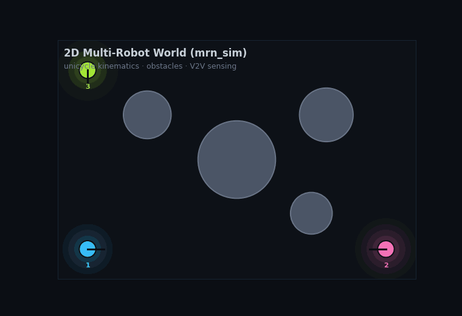
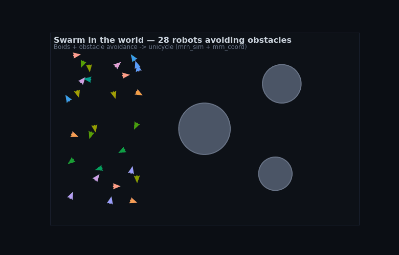
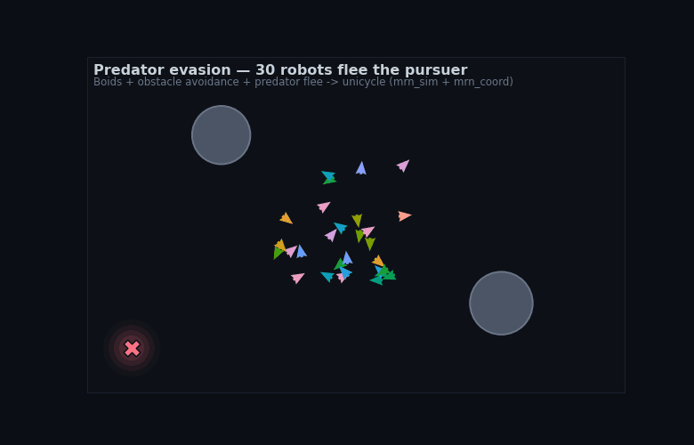
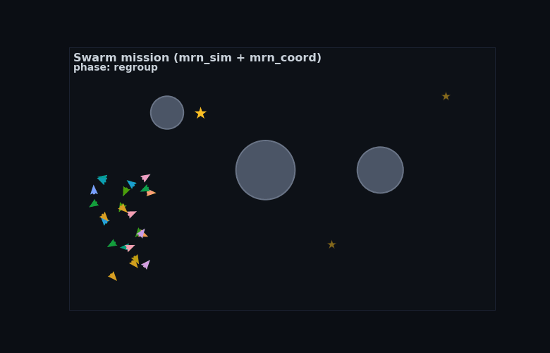
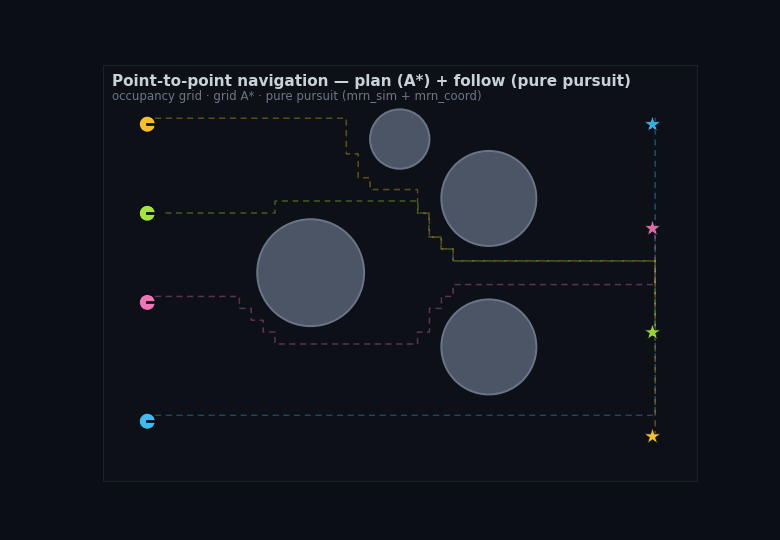
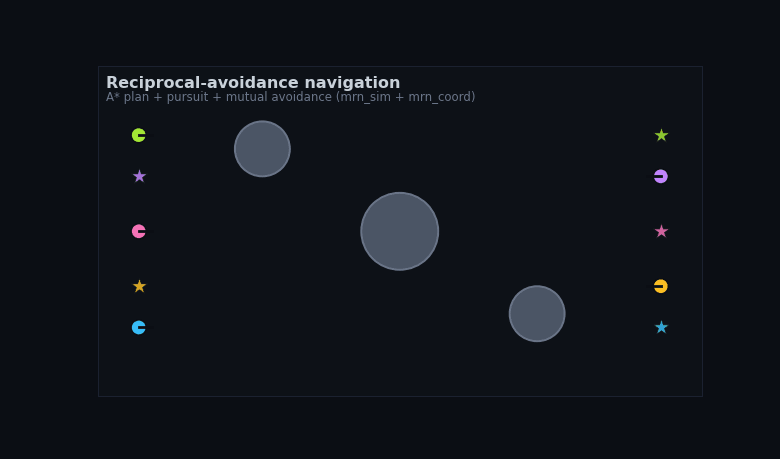
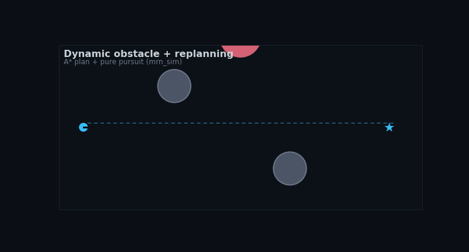

# Simulation (`mrn_sim`)

<p align="center">
  
</p>

<p align="center">
  <em>Driven by the real <code>mrn_sim</code> step (unicycle kinematics + collision); the controller in the demo is a deterministic potential-field waypoint seeker. Regenerate with <code>python3 scripts/make_sim_gif.py</code>.</em>
</p>

`mrn_sim` is the foundation for simulation-based multirobot work: a **true world
model** with real robot states, kinematics, obstacles, and sensor models. Like
the rest of the project it is pure and ROS-free at the core, unit-tested in CI.

The point of a true world model is that it is a **plug-in test-bed**: the
coordination layer's velocity commands drive the robots, and the (noisy) sensor
messages it emits are exactly what a cooperative-localization consumer ingests.

## Benchmark environment (`benchmark.py`)

The most reusable face of `mrn_sim`: a small environment others can plug their
own multi-robot algorithm into and get comparable numbers.

- **`Scenario`** — a declarative spec (world size, obstacles, robots, goals),
  built in Python or loaded from YAML (`load_scenario`). A library lives in
  `mrn_sim/scenarios/` (`around_obstacle`, `crossing`, `doorway`).
- **a policy** — any callable `policy(world) -> {robot_id: (v, omega)}` (your
  planner/controller). Nothing else about it is assumed.
- **`run_scenario(scenario, policy)`** — runs the closed loop on the
  collision-aware world and returns a `BenchmarkResult` with standard,
  reproducible metrics: success, makespan, path length, min obstacle clearance,
  **min inter-robot distance** (collision-freeness), and a collision count.

```bash
ros2 run mrn_sim mrn_sim_bench crossing      # built-in scenario + default policy
ros2 run mrn_sim mrn_sim_bench path/to/your_scenario.yaml
```

```python
from mrn_sim.benchmark import Scenario, run_scenario
def my_policy(world):
    return {rid: (1.0, 0.0) for rid in world.robots}   # your algorithm here
result = run_scenario(Scenario.from_dict(spec), my_policy)
print(result.as_dict())
```

Two built-in policies ship as turnkey baselines (and templates for your own):
`navigate_policy` (A* + pursuit + summed repulsion) and `orca_policy` (A* +
pursuit + **ORCA** reciprocal avoidance, see
[coordination.md](coordination.md)). Both solve the bundled scenarios
collision-free; ORCA is markedly faster and tighter (e.g. `crossing`: makespan
12.3 s vs 18.5 s). Compare them from the CLI:

```bash
ros2 run mrn_sim mrn_sim_bench crossing --policy orca
ros2 run mrn_sim mrn_sim_bench crossing --policy navigate
```

Because both are pure and deterministic, a benchmark result is reproducible and
CI-checkable.

### Validated against the reference RVO2

Our ORCA is a from-scratch Python port of the reference RVO2 C++ library, so the
obvious question is whether the port is *faithful*. `scripts/compare_orca_rvo2.py`
answers it by measurement: it runs identical agents-only scenarios through both
our `mrn_coord.orca` and the reference (`Python-RVO2`, imported as `rvo2`) and
checks that, fed the same state every tick, the two return the same velocity (to
~1e-5 across the suite) and reach the same safety outcome. The checked-in numbers
and the caveats (why a near-symmetric head-on legitimately drifts in trajectory
while staying collision-free; why static obstacles are out of scope) live in
[`benchmarks/orca_rvo2.md`](../benchmarks/orca_rvo2.md).

RVO2 is not on PyPI, so it is an *optional* dependency built from source into a
venv — the core build and test suite never touch it (the equivalence test skips
cleanly when `rvo2` is absent). To run the check locally:

```bash
python3 -m venv /tmp/rvo2-venv && . /tmp/rvo2-venv/bin/activate
pip install --upgrade pip cython setuptools wheel numpy
git clone https://github.com/sybrenstuvel/Python-RVO2.git /tmp/Python-RVO2
pip install --no-build-isolation /tmp/Python-RVO2
python3 scripts/compare_orca_rvo2.py --check       # gated equivalence contract
python3 scripts/compare_orca_rvo2.py --write        # refresh benchmarks/orca_rvo2.md
```

The `orca-rvo2-equivalence` CI job does exactly this on every push, so the port
staying faithful is a guarded contract, not a claim.

### Regression gate

`scripts/benchmark_gate.py` makes that reproducibility a guarded contract. It
runs the bundled scenarios (with `navigate_policy`) and the MovingAI example
(CBS / prioritized), then compares every metric against the checked-in
expectations in `benchmarks/expected_metrics/` — discrete metrics (success,
collisions, goals reached, makespan steps, sum-of-costs) exactly, floats within
a small tolerance.

```bash
python3 scripts/benchmark_gate.py            # check — exits non-zero on a regression
python3 scripts/benchmark_gate.py --update   # rewrite the expectations after an intended change
```

CI runs the gate on every push, so a change that drops a goal, introduces a
collision, or worsens a makespan / sum-of-costs fails the build. When a change
*intentionally* moves the numbers, regenerate with `--update` and commit the
new expectations alongside it.

## Kinematics (`kinematics.py`)

A pose is `(x, y, theta)`. `unicycle_step(pose, v, omega, dt)` advances a
differential-drive robot, integrating with the midpoint heading so a
simultaneous turn-and-drive is clean and pure straight-line motion falls out
when `omega == 0`. `normalize_angle` wraps to `(-pi, pi]`.

## World (`world.py`)

`World` holds the **true** state of every `Robot` (pose + radius), a list of
circular `Obstacle`s, and rectangular bounds. `step(world, commands, dt)`
advances each robot by its `(v, omega)` command and is **collision-aware**: a
proposed pose that leaves the bounds or enters an obstacle is rejected (the
robot holds its position for that step, though an in-place turn still applies).
It returns a new `World` — deterministic, no hidden state.

## Sensors (`sensors.py`)

Geometric sensor models over the true state, producing the measurements the
localization stack consumes. The geometry is pure and noiseless (so it is
exactly testable); `add_gaussian_noise(value, sigma, rng)` layers reproducible
noise on top using a caller-supplied `random.Random`.

- `range_bearing(observer, target_xy)` — range and body-frame bearing (a
  range-bearing radio, like the UWB constraint source).
- `relative_pose_body(observer, target)` — the full SE(2) relative pose of
  another robot in the observer's body frame (what a V2V
  `RelativePoseConstraint` carries).
- `gnss_observation(pose)` — the absolute `(x, y)` of a robot (a GNSS fix).

## ROS node

`mrn_sim_world` wraps the world as a ROS node. It holds the `World`, integrates
the per-robot `geometry_msgs/Twist` commands it receives (`v = linear.x`,
`omega = angular.z`), and publishes:

- `/<id>/mrn/agent_state` (`mrn_msgs/AgentState`) — the per-agent estimate
  (true pose + reproducible GNSS-like noise), which the localization stack and
  `mrn_pose_bridge` already consume;
- `/<id>/ground_truth/pose` (`geometry_msgs/PoseStamped`) — noiseless truth;
- `sim/markers` (`visualization_msgs/MarkerArray`) — robots, obstacles, and
  in-range V2V links for RViz.

```bash
ros2 launch mrn_sim sim_world.launch.py                 # robots stand still
ros2 launch mrn_sim sim_world.launch.py use_rviz:=true  # watch it in RViz
ros2 topic pub /robot_1/cmd_vel geometry_msgs/msg/Twist "{linear: {x: 1.0}}"
```

It also emits **V2V constraints**: for each in-range directed pair it publishes
a `mrn_msgs/RelativePoseConstraint` on `/<id>/mrn/relative_constraints`, built
from the noisy relative-pose observation (`relative_pose_observation`) with a
covariance from the configured sigmas and `source_type = SOURCE_FAKE_GROUND_TRUTH`
(honest: derived from the sim's truth, not a real sensor). These feed the
cooperative-localization graph directly, and are verified to pass
`constraint_gate` — the project's "a constraint source is correct iff its output
passes the gate" rule — in the test suite.

Because it *emits* the localization messages (estimate + V2V constraints) and
*accepts* velocity commands, it is the plant that closes the loop. The
world/proximity/sensor math is the pure, CI-tested core; this node is the thin
shell (agent ids are sanitized into valid topic tokens).

Note the velocity contract: `mrn_sim` is a **unicycle** (`v`, `omega`), whereas
the existing formation controller emits a **holonomic** velocity vector. Closing
a coordination loop *through this world* therefore wants a unicycle-aware
controller (e.g. a path follower for the MAPF planner) — the next step below.
The holonomic loop is already demonstrated with `mrn_coord`'s `mrn_agent_sim`.

## Feeding a localization consumer

The world emits `AgentState` (true pose + reproducible GNSS-like noise; a
`degraded_agents` parameter simulates a GNSS outage with a large position sigma
and `STATUS_DEGRADED`) and, for in-range pairs, V2V `RelativePoseConstraint`
(see "V2V constraints" above). The agent-state messages are stamped with a TTL
so downstream freshness gates accept them — a simulator must emit valid,
non-expired messages.

These are exactly the messages a **cooperative-localization consumer** ingests.
That consumer is the companion repo
[`multirobot-localization`](https://github.com/rsasaki0109/multirobot-localization)
(rosbag-centric, real-data benchmarks); point it at the sim's topics — or record
a bag of them — to run cooperative localization on simulated data. This repo's
scope ends at emitting the contract.

## Swarm in the world

<p align="center">
  
</p>

`mrn_sim.swarm.flock_in_world` flocks a swarm *through this world*: it combines
`mrn_coord`'s Boids (`flock_velocities`), obstacle avoidance
(`obstacle_avoidance`), and `velocity_to_unicycle` with the collision-aware
`world.step`, advancing all robots one deterministic tick. It is the **verifiable
twin of the Gazebo swarm** — the same control loop (Boids → unicycle command →
world step), but pure and deterministic, so CI can assert end-to-end properties:
the run is reproducible, every robot stays in bounds and never enters an
obstacle, and the flock actually moves. Pass a `goal` (the `goal_seek` migration
term) and the flock travels there as a group, flowing around the obstacles —
verified by the flock centroid closing most of the distance to the goal.
`scripts/make_swarm_sim_gif.py` renders the migrating flock (above); regenerate
with `python3 scripts/make_swarm_sim_gif.py`.

Pass a `predator` `(x, y)` and the flock flees it (`predator_evasion`): a strong,
ranged outward push. `scripts/make_predator_gif.py` renders a pursuer chasing
the flock's centroid while the robots scatter away from it and around the
obstacles — verified deterministically (the flock's mean distance from the
predator grows while it stays in bounds).

<p align="center">
  
</p>

The terms compose into a small **mission** (`scripts/make_mission_gif.py`):
scattered robots regroup, migrate through a sequence of waypoints across the
obstacle field, scatter when a predator lunges in, then recover and reach the
final goal. A `leader` index (followers steer to that robot) and multiple
`predators` are also supported. The mission is verified deterministically — the
flock centroid completes the waypoints and reaches the final goal.

<p align="center">
  
</p>

## Point-to-point navigation

`mrn_sim.navigate` is the classic single-robot navigation pipeline, assembled
from pieces already in the repo: `occupancy_from_world` discretizes the world's
circular obstacles into an inflated occupancy grid, `plan_world_path` plans a
shortest path on it with the MAPF grid A* (`plan_path` with no constraints) and
returns world waypoints, and the pure-pursuit follower drives the unicycle robot
along them through the collision-aware `world.step`. Plan → follow → arrive,
around the obstacles. Verified deterministically (the robot reaches its goal and
never enters an obstacle); `scripts/make_nav_gif.py` shows several robots each
navigating to its own goal.

<p align="center">
  
</p>

`navigate_step` adds **reciprocal collision avoidance** for multi-robot
navigation: each robot is pulled toward the carrot on its own path (public
`carrot_point`) while being pushed away from obstacles *and from the other
robots* (`mutual_avoidance`), the combined velocity realized as a unicycle
command. So independent navigators heading to crossing goals sidestep one
another instead of passing through — verified deterministically (all reach their
goals and never come within two robot radii). Reactive avoidance is collision-
free but not deadlock-free, so a symmetric all-cross chokepoint can still stall;
`scripts/make_recip_nav_gif.py` shows lanes plus counter-flow robots weaving past
each other and the obstacles.

<p align="center">
  
</p>

Navigation also handles **dynamic obstacles by replanning**: `path_blocked`
checks whether a moving obstacle has invalidated the current path, and if so the
robot replans from its current pose against the obstacles' current positions
(`plan_world_path`). `scripts/make_replan_gif.py` shows a robot whose straight
path is cut off by a sliding obstacle — it detects the block and routes around
it to the goal (verified: it reaches the goal, replans at least once, and never
enters the obstacle).

<p align="center">
  
</p>

## Kinodynamic planning (`kinodynamic.py`)

The grid A\* above is fast but **blind to the robot's heading and turn radius**:
it returns axis-aligned, 4-connected paths that a unicycle can only follow by
pivoting in place at every corner. `kinodynamic.plan_kinodynamic` plans in the
continuous `(x, y, theta)` state space instead, with a **bounded turning
radius**, so the path is kinematically feasible — smooth, forward-only, with
headings the pure-pursuit follower can actually track.

It is **Hybrid A\***: the open set is keyed by a discretized `(x, y, theta)`
lattice, each expansion rolls out a constant-curvature motion primitive
(`|kappa| <= 1 / turn_radius`) and collision-checks the arc against the world,
and the heuristic combines a holonomic obstacle-aware grid distance (Dijkstra to
the goal cell) with the obstacle-free **Dubins** length — the kinematic lower
bound. Every few expansions the planner also attempts a closed-form Dubins
*analytic-expansion* shot straight to the goal pose, which collapses the search
near the goal and lets it match a requested final heading (`goal_yaw_tol`).

`dubins_path` is the standalone shortest bounded-curvature curve between two
oriented poses (the six words `LSL RSR LSR RSL RLR LRL`); it is the kinematic
primitive both the heuristic and the analytic expansion stand on. Both are pure
and deterministic, depending only on `world` (no `mrn_coord`), and unit-tested:
the Dubins math is checked by *sampling each curve and asserting it lands on the
requested goal pose*, the planned paths are asserted obstacle-free and within
the curvature bound, and an end-to-end test drives the carrot follower along a
planned path to the goal. `plan_kinodynamic(...).waypoints` is a drop-in for the
same pure-pursuit follower the grid planner feeds.

## Local control: DWA (`dwa.py`)

Pure-pursuit steers blindly at the carrot and leans on a separate repulsion term
to dodge obstacles. The **Dynamic Window Approach** (`dwa.dwa_command`) instead
chooses the command by *forward-simulating candidate velocities*: each tick it
samples `(v, omega)` pairs from the **dynamic window** — the velocities
reachable from the current command within one step given the acceleration limits
— rolls each out over a short horizon, discards rollouts that hit an obstacle or
leave the world, and scores the survivors by a weighted sum of goal **heading**,
obstacle **clearance**, and **velocity**. So obstacle avoidance and goal progress
are decided together, under the robot's accel limits.

DWA is a *local* controller: aimed straight at a distant goal behind a symmetric
obstacle it stalls in a local minimum (a documented limitation), so it is paired
with a global planner — feed the carrot on a planned path as its local goal and
it handles smooth, accel-limited, obstacle-reactive tracking, including obstacles
that were not in the plan. Pure and deterministic, depending only on `world` /
`kinematics`; unit-tested for the accel window, obstacle reaction, a braking
fallback when boxed in, and an end-to-end planner-tracking run to the goal.

## Local control: MPC by iLQR (`mpc.py`)

Where DWA *samples* a menu of one-step-constant velocities, MPC *optimizes* a
whole control sequence over a receding horizon. `mpc.mpc_command` minimizes a
smooth cost — distance to the (carrot) goal, control effort, and soft
obstacle/wall penalties — subject to the unicycle dynamics, then applies the
first command and re-solves next tick. The optimizer is **iterative LQR**
(iLQR): roll the controls out, sweep backward building a local quadratic model
of the cost-to-go into a feedback law `du = alpha*k + K*dx` (Levenberg-Marquardt
regularization keeps the control Hessian positive-definite), forward-roll under
it with a line search, repeat to convergence. It is hand-rolled 3x3/2x2 linear
algebra over the model — pure, deterministic, no numpy.

Two touches make it work multi-robot. The other robots are injected as
**time-indexed moving obstacles** — predicted forward along their own planned
paths — so MPC avoids where they *will be*, not just where they are
(`solve_ilqr(..., moving=[...])`). And because two identical robots optimizing
symmetrically can still graze in a tight crossing, a thin **hard safety brake**
sits on top: if the chosen command would breach the collision distance with
another robot's current position, the robot brakes. The soft cost steers
smoothly; the shield guarantees the reciprocal case never actually collides.
Like DWA it is a *local* controller (a head-on symmetric obstacle is a
local-minimum it shares with any gradient method), so it tracks a global plan's
carrot. Unit-tested for accel-limited progress, cost improvement, bending around
an obstacle, warm-start refinement, space-time avoidance of a moving obstacle,
and an end-to-end planner-tracking run.

## Safety filter: Control Barrier Function (`cbf.py`)

A safety filter wraps *any* nominal controller and guarantees collision-freedom
without owning the goal-seeking. `cbf.cbf_filter(pose, u_nom, obstacles)` passes
the nominal command through when it is safe and otherwise returns the **closest**
command that keeps the robot out of collision. The guarantee is a **control
barrier function**: per obstacle, ``h(x) >= 0`` on the safe set, and enforcing
``ḣ(x, u) >= -alpha·h(x)`` makes that set *forward invariant* — once safe, it
stays safe. Those inequalities plus the actuation box bound a polytope of safe
commands, and the filter solves

    minimize ½‖u − u_nom‖²   subject to   A u ≥ b,

a two-variable QP solved exactly by enumerating active sets (the optimum touches
0, 1, or 2 constraints). A first-order CBF on a unicycle is degenerate (`ḣ` is
independent of `omega`, so it could only brake), so the filter regulates a
**look-ahead point** a short distance ahead of the wheel axis, whose velocity
maps invertibly to `(v, omega)` — letting both controls enter `ḣ` so it *steers*
around obstacles. Moving obstacles' velocities enter the barrier rate.
`mpc_policy(..., safety="cbf")` uses it in place of the hard brake: in the
benchmark it stays collision-free while holding *more* inter-robot clearance at
the doorway (it steers apart instead of stopping). Unit-tested for QP optimality
(vs. dense sampling), pass-through when safe, forward invariance under a
head-on approach, and a collision-free doorway run.

## Certified safety shield (`shield.py`)

The look-ahead trick has a tell: the guarantee is about the **point ahead of the
axle**, not the body, so a hard turn can swing the body across the boundary — and
a *continuous-time* CBF condition does not by itself survive a finite step `dt`
and finite `a_max` (the vehicle can be physically unable to brake in time).
`shield.shield_step(state, u_nom, obstacles, dt)` removes the trick and certifies
the **robot body** with two decoupled layers:

- **Braking speed cap (hard).** Against each obstacle the body has
  `remaining = ‖p − o‖ − D` metres to the boundary; the largest speed a
  maximal-deceleration stop fits inside is `v_cap = √(2·a_max·remaining)`.
  Capping the command at the per-obstacle minimum of that, within the
  accel-limited window `|v − v_prev| ≤ a_max·dt`, means a safe command (brake)
  *always exists* — the QP can never trap the robot — and it bounds the body, not
  a look-ahead point. Discrete-robust by construction. For a **moving** obstacle
  closing at `c` the boundary advances during the stop, so the cap tightens to
  the RSS-style safe speed `v_cap = -c + √(c² + 2·a_max·remaining)` (it reduces
  to the static cap when `c = 0`).
- **Look-ahead steering (soft).** The first-order CBF contributes a turn that
  slides *around* an obstacle; it is advisory, and if it ever disagrees with the
  cap, the cap wins — so steering can never talk the body into the obstacle.

The certificate is empirical and falsifiable. `scripts/certify_shield.py` throws
thousands of randomized obstacle fields at three controllers with a nominal
command engineered to crash (steer at the nearest obstacle, full speed): the
attack collides every time unshielded, the look-ahead filter still lets the body
graze the boundary, and the certified shield is collision-free across every
rollout — `--check` (and the benchmark gate's `shield_certify` case) fail the
build on a single body-frame violation. The hardest moving-obstacle case is
covered by `--mode reciprocal`: several shielded robots in *adversarial mutual
pursuit* (each steers at its nearest neighbour, treating the others as moving
obstacles with no shared coordination) never collide, while the same pursuit
unshielded collides every time — reciprocal safety with zero communication,
gated by `shield_certify_reciprocal`. **Safety is not liveness**: a pure safety
filter can deadlock at a symmetric obstacle, so the shield rides *under* the
global plan (`mpc_policy(..., safety="shield")`), which owns routing. Disturbance
/ sensing-noise robustness (an ISS-safe margin under bounded state error) is
future work — the cap is currently certified under exact state. Unit-tested for
body forward-invariance, the static and moving-obstacle braking cap, QP
feasibility when boxed in, the actuation limits, and both the single-robot and
reciprocal adversarial certificates.

## Benchmark comparison

The benchmark environment ships these as drop-in policies — `navigate_policy`
(grid A\* + pursuit), `kinodynamic_policy` (Hybrid A\*), `dwa_policy`
(`planner="grid"|"kino"` + DWA), `mpc_policy` (grid/kino + iLQR MPC, others as
predicted moving obstacles), and `orca_policy` — all sharing the
`policy(world) -> {id: (v, omega)}` contract, so they are directly comparable.
`scripts/compare_planners.py` runs every policy on every bundled scenario (and
CBS / ECBS / prioritized on the MovingAI example) and writes a Markdown report
to [`benchmarks/comparison.md`](../benchmarks/comparison.md). It is pure and
deterministic; the same metrics are regression-gated by
`scripts/benchmark_gate.py`, so a row that changes is a row the gate guards. The
report shows, for instance, that the kinodynamic planner reaches the goal in
fewer steps over a shorter, smoother path than grid A\* at equal-or-better
clearance, that DWA tracks tighter, that MPC's optimized trajectories give the
shortest makespan, and that ORCA finishes fast but with the thinnest clearance.

## Executing a MAPF plan: plan vs. reality (`mapf_exec.py`)

`mapf_exec.execute_mapf_plan(grid, agents, controller=...)` closes the loop
between the discrete coordination layer (`mrn_coord.mapf`) and this continuous
world. A MAPF solver returns paths that are collision-free *on the grid, in
discrete time*; the executor turns them into continuous waypoints, drops the
agents into the world (grid obstacles → circular ones), and drives each robot
along its own planned path — then measures whether the discrete guarantee
survives real discs and unicycle kinematics. Four executions of the *same*
plan:

- `"pursuit"` — free-running pure pursuit that keeps the spatial route but
  drops the *schedule*: robots reach a shared cell at the same wall-clock moment
  and the discs collide. This is the gap the discrete guarantee leaves.
- `"tpg"` — pursuit gated by a **Temporal Plan Graph**: from the plan, for every
  cell, the order agents occupy it; a robot may enter its next cell only once
  the previous occupant has left. The discrete coordination then transfers
  exactly — collision-free by construction (cell size ≥ 2·radius) — at the cost
  of makespan stretch while robots wait out kinematics.
- `"dwa"` — keep the route but treat the other robots as moving obstacles, a
  reactive recovery without the schedule.
- `"shield"` — the *same* schedule-ignoring pursuit nominal, but run under the
  [certified safety shield](#certified-safety-shield-shieldpy): it turns
  pursuit's collisions into **zero**, but at the fully symmetric merge a pure
  safety layer deadlocks (every robot yields) — so it *fails safe* (stops)
  rather than unsafe (collides). A runtime guarantee, not a substitute for the
  schedule.

`benchmarks/comparison.md` runs all four on a 4-way crossing: pursuit collides
and stalls; TPG and DWA both finish collision-free; the shield is collision-free
but deadlocks at the symmetric merge. Try it with
`ros2 run mrn_sim mrn_mapf_sim --solver lacam`. The lesson is the headline of the
whole stack: the discrete plan is necessary but not sufficient — bridging it to
the moving robots takes a schedule-aware executor, a reactive controller, or a
runtime safety guarantee, all of which live here.

## Robust execution under delays: the Switchable ADG (`switchable_adg.py`)

The TPG above gives the right *order* at every shared cell, but a *fixed* order
is brittle: if the robot scheduled to cross a junction first is the one that gets
delayed, everyone behind it stalls for the whole delay, even when the junction is
free. The **Action Dependency Graph** (ADG; Hönig et al.) is the same passing-
order precedence in graph form — acyclic, so executing it is collision-free
*and* deadlock-free whatever the timing. The **Switchable ADG** (Berndt,
Palmieri et al., *Receding-Horizon Re-ordering of Multi-Agent Execution
Schedules*, IROS 2020 / T-RO 2024) makes each passing-order edge **reversible**:
when a ready robot is stuck behind a delayed one, flip the order so it goes first
— **provided the flip keeps the graph acyclic**. Acyclic ⇔ deadlock-free, so the
safety check is a single reachability query; re-ordering recovers the throughput
a fixed order throws away with the *same* hard guarantees.

`build_adg(paths)` extracts the ADG (reusing the TPG milestone extraction);
`simulate(cells, edges, start_delay, switchable=...)` runs a discrete delay-
execution in two modes, so one run pair isolates what re-ordering buys. The
`mapf_switchable_adg` gate pins three things:

- **Win — re-ordering recovers a delay.** On a plus crossing, the robot that
  crosses the centre first is given a short path and then delayed; the fixed ADG
  makes the long-haul robot wait it out (**makespan 15**), the switchable ADG
  flips the single crossing edge so the long robot goes first (**makespan 10**,
  one switch) — `switch_helps_when_first_mover_delayed`.
- **No gratuitous switching.** Delay the *second*-crossing robot instead and a
  flip cannot help: the switchable run fires **zero** switches and matches the
  fixed makespan exactly (`switch_is_noop_when_it_cannot_help`).
- **Deadlock safety is real.** In a head-on single-file corridor *every*
  passing-order reversal would close a cycle, so the acyclicity guard refuses
  them all (zero switches) and the run still finishes on the fixed order —
  `unsafe_reversals_refused`, never a deadlock.

Both modes are collision-free by construction on every run
(`collision_free_by_construction`), and no run ever deadlocks
(`deadlock_free_always`). So the Switchable ADG's place in the execution stack is
the **robustness** layer above the TPG: it keeps the discrete plan's collision-
and deadlock-free guarantees under arbitrary delays while re-ordering away the
stalls a fixed schedule would suffer — exactly where it is safe to.

### Receding-horizon re-ordering — the MILP, not the single flip (`build_sadg`, `simulate_rhc`)

The reactive flip above is *myopic*: it reverses one edge at a time, whenever a
ready robot is stuck behind a delayed one. Letting that one robot jump ahead can
delay another that many more robots wait on, so the *cumulative* completion time
rises even as one robot is helped. The full method of
[Berndt, van Duijkeren, Palmieri, Kleiner & Keviczky, *"Receding Horizon
Re-ordering of Multi-Agent Execution Schedules"* (T-RO 2024)](https://arxiv.org/abs/2312.04190)
instead solves, at every step, a small **integer program** over the switchable
edges in a horizon: choose the acyclic (deadlock-free) orientation that
**minimises the cumulative route-completion time**, predicted by rolling the
schedule out under the observed delays — re-solved as execution proceeds (the
receding horizon). `simulate_rhc(cells, edges, delay, horizon=H)` reproduces it,
enumerating the ≤`H` soonest open switchable edges (the integer program solved
exactly, kept low-dimensional by the horizon) and applying the cheapest acyclic
orientation each tick.

**A correctness subtlety, found the hard way.** `build_adg` records only
*consecutive* passing-order edges, so a cell shared by **three or more** agents
carries the chain `a₁→a₂→a₃` — a total order only *transitively*. Reverse the
middle edge and `a₁`, `a₃` become mutually unconstrained, so a re-ordering can put
both on the cell at once: the reactive greedy on `build_adg` is genuinely **not
collision-free** there (it only ever got validated on 2-agent cells, where the
chain *is* the order). `build_sadg` materialises an edge for **every pair**, so
any acyclic orientation is a true total order at each cell — collision-free under
arbitrary re-ordering. On a cell shared by only two it is identical to
`build_adg`.

The `mapf_rhc_reorder` gate pins:

- **Hard guarantees hold under re-ordering.** Over a 40-plan random battery
  (×one-robot delays, 320 runs), every fixed and every re-ordered run is
  collision-free, deadlock-free and finishes (`hard_guarantees`).
- **Re-ordering reduces cumulative completion.** On a frozen demo plan the
  receding-horizon optimum drops it **26 → 24** with no makespan regression
  (`reorder_reduces_completion`), while a horizon of **1** sees no improvement —
  so it is the deeper **lookahead** that pays (`horizon_helps`).
- **The all-pairs fix is load-bearing.** On a constructed 3-agent-shared-cell
  plan the all-pairs SADG re-orders (a switch fires) and stays collision-free
  where the consecutive-edge reactive greedy executes a **real collision**
  (`all_pairs_fix_is_load_bearing`).

**Honest scope:** `simulate_rhc` is a closed-loop *heuristic* — its per-tick MILP
is exact over the horizon, but committing-then-re-solving is not globally optimal,
so cumulative completion can occasionally end slightly above the fixed order on an
instance the lookahead misreads (a handful out of the 320). The guarantees it
never trades away are the hard ones: collision-free, deadlock-free, finishing.

## Bodied AMR execution: footprint and turning (`amr_footprint.py`)

`mapf_exec` closes the *timing* gap for a disc robot; `amr_footprint.execute_amr`
closes the other one — the gap a **rectangular, differential-drive** body opens.
A MAPF plan proves no two *points* share a cell, but a real autonomous mobile
robot has an orientation and a footprint: it cannot strafe between cells, so it
must **turn in place** before it drives (time the point plan never counts), and
its rectangle **sweeps area** that the cell model ignored. The executor replays a
plan *synchronized to its own discrete schedule* (so timing is controlled for —
only the body is under test), driving each step as a turn-then-drive phase, and
reports the makespan stretch and the footprint clearance (signed: negative where
bodies overlap, via a separating-axis polygon distance).

Sweeping the aisle width on a six-AMR warehouse lifelong plan
(`ros2 run mrn_sim mrn_amr_footprint`, footprint 0.7 × 0.45 m) shows both gaps
cleanly:

| cell (m) | turn fraction | makespan stretch | min robot clearance | footprint collisions |
| --: | --: | --: | --: | --: |
| 1.6 | 0.36 | 1.56× | +0.32 m | 0 |
| 1.3 | 0.41 | 1.69× | +0.13 m | 0 |
| 1.0 | 0.47 | 1.90× | −0.08 m | 7 |
| 0.8 | 0.53 | 2.12× | −0.18 m | 108 |

Turning alone stretches the wall-clock 1.6–2.1× over the plan's implied time, and
below roughly a one-metre aisle the body overlaps a shelf or a neighbour where the
discrete plan called it safe — so a warehouse laid out for *point* MAPF needs
aisles wide enough for the *body*, and a schedule whose timing accounts for the
turns. Pure and deterministic; the contract is the same as everywhere else.

## Roadmap

This is the world core, its ROS node, the localization integration, and a
verifiable swarm. Planned next:

- a unicycle path-follower so a MAPF plan can be driven through this world,
  closing world → localization → planning → world in ROS;
- swarm-scale runs (tens to hundreds of agents) for emergent behaviors;
- an optional Gazebo (`gz sim`) adapter for full 3D physics, kept out of the
  pure/CI core.
